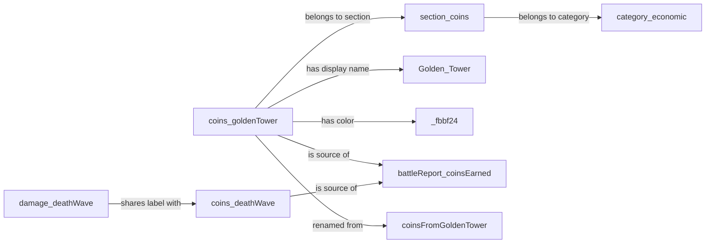

# 3g. Concrete code samples

> Part of the Field Graph Architecture spec.
> [< Prev: 3f. File tree impact](./03f-file-tree-impact.md) | [Index (00-table-of-contents.md)](./00-table-of-contents.md) | [Next: 3h. Pros, cons, honest critique >](./03h-pros-cons-honest-critique.md)

---

_Part of §3 (Evaluation). See [3a](./03a-adding-a-new-v29-field.md) for the parent intro._

**Edge-type taxonomy as a discriminated union:**

```typescript
// src/shared/domain/field-graph/types.ts

export type NodeId = string;

export type NodeKind = 'Field' | 'Section' | 'Category' | 'View' | 'Schema';

export interface Node {
  readonly id: NodeId;
  readonly kind: NodeKind;
  readonly tags?: readonly string[];
}

export type Edge =
  | { type: 'BELONGS_TO_SECTION'; from: NodeId; to: NodeId }
  | { type: 'BELONGS_TO_CATEGORY'; from: NodeId; to: NodeId }
  | { type: 'IS_SOURCE_OF'; from: NodeId; to: NodeId }
  | { type: 'IS_DERIVED_FROM'; from: NodeId; to: NodeId }
  | { type: 'RENAMED_FROM'; from: NodeId; to: NodeId; atSchema: NodeId /* Schema node */ }
  | { type: 'APPEARS_IN_VIEW'; from: NodeId; to: NodeId }
  | { type: 'HAS_DISPLAY_NAME'; from: NodeId; to: string }
  | { type: 'HAS_COLOR'; from: NodeId; to: `#${string}` }
  | { type: 'SHARES_LABEL_WITH'; from: NodeId; to: NodeId }
  | { type: 'PARTICIPATES_IN_COMPOSITE_KEY'; from: NodeId; to: NodeId }
  | { type: 'REPLACED_BY'; from: NodeId; to: NodeId; atSchema: NodeId }
  | { type: 'INTENTIONALLY_DROPPED_IN_SCHEMA'; from: NodeId; to: NodeId }
  | { type: 'IS_CORRELATED_WITH'; from: NodeId; to: NodeId };

export type EdgeType = Edge['type'];
```

**Helper constructors:**

```typescript
// src/shared/domain/field-graph/builder.ts

export const fieldNode = (id: NodeId, tags?: string[]): Node =>
  ({ id, kind: 'Field', tags });
export const sectionNode = (id: NodeId): Node => ({ id, kind: 'Section' });
export const categoryNode = (id: NodeId): Node => ({ id, kind: 'Category' });
export const viewNode = (id: NodeId): Node => ({ id, kind: 'View' });
export const schemaNode = (id: NodeId): Node => ({ id, kind: 'Schema' });

export function edge<T extends EdgeType>(
  from: NodeId,
  type: T,
  to: NodeId | string,
  meta?: { atSchema?: NodeId },
): Extract<Edge, { type: T }> {
  return { type, from, to, ...meta } as Extract<Edge, { type: T }>;
}
```

**A real slice of the graph — ~40 edges covering Battle Report, Coins (with source edges), Damage, Enemies, and a few renames:**

```typescript
// src/shared/domain/field-graph/nodes/sections.ts
export const SECTIONS = [
  sectionNode('section:battleReport'),
  sectionNode('section:coins'),
  sectionNode('section:damage'),
  sectionNode('section:totalEnemies'),
  sectionNode('section:records'),
  categoryNode('category:economic'),
  categoryNode('category:combat'),
  categoryNode('category:meta'),
];

// src/shared/domain/field-graph/edges/belongs-to-section.ts
export const BELONGS_TO_SECTION_EDGES = [
  // Battle Report
  edge('battleReport_tier', 'BELONGS_TO_SECTION', 'section:battleReport'),
  edge('battleReport_wave', 'BELONGS_TO_SECTION', 'section:battleReport'),
  edge('battleReport_realTime', 'BELONGS_TO_SECTION', 'section:battleReport'),
  edge('battleReport_coinsEarned', 'BELONGS_TO_SECTION', 'section:battleReport'),
  edge('battleReport_coinsPerHour', 'BELONGS_TO_SECTION', 'section:battleReport'),
  edge('battleReport_cellsEarned', 'BELONGS_TO_SECTION', 'section:battleReport'),
  edge('battleReport_cellsPerHour', 'BELONGS_TO_SECTION', 'section:battleReport'),
  // Coins
  edge('coins_goldenTower', 'BELONGS_TO_SECTION', 'section:coins'),
  edge('coins_deathWave', 'BELONGS_TO_SECTION', 'section:coins'),
  edge('coins_spotlight', 'BELONGS_TO_SECTION', 'section:coins'),
  edge('coins_goldenBot', 'BELONGS_TO_SECTION', 'section:coins'),
  edge('coins_blackHole', 'BELONGS_TO_SECTION', 'section:coins'),
  // Damage
  edge('damage_damageDealt', 'BELONGS_TO_SECTION', 'section:damage'),
  edge('damage_deathWave', 'BELONGS_TO_SECTION', 'section:damage'),
  edge('damage_chainLightning', 'BELONGS_TO_SECTION', 'section:damage'),
  edge('damage_orbs', 'BELONGS_TO_SECTION', 'section:damage'),
  // Section -> Category roll-ups
  edge('section:battleReport', 'BELONGS_TO_CATEGORY', 'category:meta'),
  edge('section:coins', 'BELONGS_TO_CATEGORY', 'category:economic'),
  edge('section:damage', 'BELONGS_TO_CATEGORY', 'category:combat'),
];

// src/shared/domain/field-graph/edges/is-source-of.ts
// These edges replace the hand-authored COIN_FIELDS and DAMAGE_FIELDS arrays.
export const IS_SOURCE_OF_EDGES = [
  // Coin sources -> battleReport_coinsEarned
  edge('coins_goldenTower', 'IS_SOURCE_OF', 'battleReport_coinsEarned'),
  edge('coins_deathWave', 'IS_SOURCE_OF', 'battleReport_coinsEarned'),
  edge('coins_spotlight', 'IS_SOURCE_OF', 'battleReport_coinsEarned'),
  edge('coins_goldenBot', 'IS_SOURCE_OF', 'battleReport_coinsEarned'),
  edge('coins_blackHole', 'IS_SOURCE_OF', 'battleReport_coinsEarned'),
  edge('coins_coinsFetched', 'IS_SOURCE_OF', 'battleReport_coinsEarned'),
  edge('coins_waveSkip', 'IS_SOURCE_OF', 'battleReport_coinsEarned'),
  edge('coins_goldenCombo', 'IS_SOURCE_OF', 'battleReport_coinsEarned'),
  // Damage sources -> damage_damageDealt
  edge('damage_deathWave', 'IS_SOURCE_OF', 'damage_damageDealt'),
  edge('damage_chainLightning', 'IS_SOURCE_OF', 'damage_damageDealt'),
  edge('damage_orbs', 'IS_SOURCE_OF', 'damage_damageDealt'),
  edge('damage_thorns', 'IS_SOURCE_OF', 'damage_damageDealt'),
];

// src/shared/domain/field-graph/edges/is-derived-from.ts
export const IS_DERIVED_FROM_EDGES = [
  // Per-hour fields are derived from total + duration (display-time fallback)
  edge('battleReport_coinsPerHour', 'IS_DERIVED_FROM', 'battleReport_coinsEarned'),
  edge('battleReport_coinsPerHour', 'IS_DERIVED_FROM', 'battleReport_realTime'),
  edge('battleReport_cellsPerHour', 'IS_DERIVED_FROM', 'battleReport_cellsEarned'),
  edge('battleReport_cellsPerHour', 'IS_DERIVED_FROM', 'battleReport_realTime'),
];

// src/shared/domain/field-graph/edges/renamed-from.ts
// These edges replace V2_TO_V3_FIELD_MAP entirely.
export const RENAMED_FROM_EDGES = [
  edge('coins_goldenTower', 'RENAMED_FROM', 'coinsFromGoldenTower', { atSchema: 'schema:v3' }),
  edge('coins_deathWave', 'RENAMED_FROM', 'coinsFromDeathWave', { atSchema: 'schema:v3' }),
  edge('coins_blackHole', 'RENAMED_FROM', 'coinsFromBlackHole', { atSchema: 'schema:v3' }),
  edge('coins_blackHole', 'RENAMED_FROM', 'coinsFromBlackhole', { atSchema: 'schema:v3' }),
  edge('coins_orbs', 'RENAMED_FROM', 'coinsFromOrb', { atSchema: 'schema:v3' }),
  edge('coins_orbs', 'RENAMED_FROM', 'coinsFromOrbs', { atSchema: 'schema:v3' }),
  edge('battleReport_coinsEarned', 'RENAMED_FROM', 'coinsEarned', { atSchema: 'schema:v3' }),
  edge('battleReport_tier', 'RENAMED_FROM', 'tier', { atSchema: 'schema:v3' }),
];
```

**The query API:**

```typescript
// src/shared/domain/field-graph/query.ts

export interface GraphQuery {
  edgeType?: EdgeType;
  from?: NodeId;
  to?: NodeId;
}

export class FieldGraph {
  private readonly byType = new Map<EdgeType, Edge[]>();
  private readonly byFrom = new Map<NodeId, Edge[]>();
  private readonly byTo = new Map<NodeId, Edge[]>();
  private readonly nodes = new Map<NodeId, Node>();

  // Memoized traversals
  private readonly sourcesOfCache = new Map<NodeId, NodeId[]>();
  private readonly viewsThatUseCache = new Map<NodeId, NodeId[]>();

  constructor(nodes: readonly Node[], edges: readonly Edge[]) {
    for (const n of nodes) this.nodes.set(n.id, n);
    for (const e of edges) this.index(e);
    Object.freeze(this);
  }

  sourcesOf(totalField: NodeId): readonly NodeId[] {
    return this.memo(this.sourcesOfCache, totalField, () =>
      (this.byTo.get(totalField) ?? [])
        .filter((e) => e.type === 'IS_SOURCE_OF')
        .map((e) => e.from),
    );
  }

  sectionOf(field: NodeId): NodeId | undefined {
    return (this.byFrom.get(field) ?? [])
      .find((e) => e.type === 'BELONGS_TO_SECTION')
      ?.to;
  }

  legacyKeysFor(field: NodeId): readonly NodeId[] {
    // Walk RENAMED_FROM transitively in case of rename chains
    const out: NodeId[] = [];
    const frontier = [field];
    while (frontier.length > 0) {
      const cur = frontier.pop()!;
      for (const e of this.byFrom.get(cur) ?? []) {
        if (e.type === 'RENAMED_FROM') {
          out.push(e.to);
          frontier.push(e.to);
        }
      }
    }
    return out;
  }

  viewsThatUse(field: NodeId): readonly NodeId[] {
    return this.memo(this.viewsThatUseCache, field, () =>
      (this.byFrom.get(field) ?? [])
        .filter((e) => e.type === 'APPEARS_IN_VIEW')
        .map((e) => e.to),
    );
  }

  derivationInputs(field: NodeId): readonly NodeId[] {
    return (this.byFrom.get(field) ?? [])
      .filter((e) => e.type === 'IS_DERIVED_FROM')
      .map((e) => e.to);
  }

  displayNameOf(field: NodeId): string | undefined {
    return (this.byFrom.get(field) ?? [])
      .find((e) => e.type === 'HAS_DISPLAY_NAME')?.to as string | undefined;
  }

  colorOf(field: NodeId): `#${string}` | undefined {
    return (this.byFrom.get(field) ?? [])
      .find((e) => e.type === 'HAS_COLOR')?.to as `#${string}` | undefined;
  }

  query(q: GraphQuery): readonly Edge[] {
    let candidates: readonly Edge[] = q.edgeType
      ? (this.byType.get(q.edgeType) ?? [])
      : Array.from(this.byType.values()).flat();
    if (q.from) candidates = candidates.filter((e) => e.from === q.from);
    if (q.to) candidates = candidates.filter((e) => e.to === q.to);
    return candidates;
  }

  // ... indexing, memoization helpers omitted for brevity
}
```

**Consumer refactor — before and after:**

```typescript
// BEFORE: src/shared/domain/fields/breakdown-sources/coin-sources.ts
export const COIN_FIELDS: FieldConfig[] = [
  { fieldName: 'coins_deathWave', displayName: 'Death Wave', color: '#ef4444' },
  { fieldName: 'coins_goldenTower', displayName: 'Golden Tower', color: '#fbbf24' },
  // ... 12 more hand-authored rows
];

// AFTER: same file, same export, now derived
import { graph } from '@/shared/domain/field-graph';

export const COIN_FIELDS: FieldConfig[] = graph
  .sourcesOf('battleReport_coinsEarned')
  .map((fieldName) => ({
    fieldName,
    displayName: graph.displayNameOf(fieldName) ?? fieldName,
    color: graph.colorOf(fieldName) ?? '#94a3b8',
  }));
```

Downstream `COINS_EARNED_CATEGORY`, `COINS_EARNED_CONFIG`, and the source-analysis view are untouched. They still see the same `FieldConfig[]`. The array is just computed rather than literal.

**Migration-safety example — `V2_TO_V3_FIELD_MAP` becomes a graph query:**

```typescript
// BEFORE: src/shared/domain/migrations/v2-to-v3-field-map.ts
export const V2_TO_V3_FIELD_MAP: Record<string, string> = {
  coinsFromGoldenTower: 'coins_goldenTower',
  coinsFromDeathWave: 'coins_deathWave',
  // ... 150+ hand-authored lines
};

// AFTER: same file, same export, derived from RENAMED_FROM edges
import { graph } from '@/shared/domain/field-graph';

export const V2_TO_V3_FIELD_MAP: Record<string, string> = Object.fromEntries(
  graph
    .query({ edgeType: 'RENAMED_FROM' })
    .map((e) => [e.to, e.from]), // legacy -> canonical
);
```

This means the runtime migrator does not change. The *source of truth* for renames moved from a flat dictionary into edges that live next to the field nodes. When a reviewer reads `coins_goldenTower`'s file, the rename history is right there.

**Visualization — `npm run graph:viz` outputs a Mermaid diagram for debugging:**

```typescript
// scripts/graph-viz.mjs
import { graph } from '../src/shared/domain/field-graph/index.ts';

const filter = process.argv[2] ?? 'coins';  // filter by section or field prefix
const edges = graph.query({}).filter((e) =>
  e.from.includes(filter) || String(e.to).includes(filter),
);

console.log('```mermaid');
console.log('graph LR');
for (const e of edges) {
  const label = e.type.replace(/_/g, ' ').toLowerCase();
  console.log(`  ${id(e.from)} -->|${label}| ${id(e.to)}`);
}
console.log('```');

function id(s) { return s.replace(/[^a-zA-Z0-9_]/g, '_'); }
```

Running `npm run graph:viz coins` produces:



Paste into any Markdown renderer, or pipe to `dot` via a `--format=dot` flag. A reviewer can see the relationships without reading eight files. On a PR that changes edges, a bot can post the diff of the graph as a diagram. **This is the killer feature of the approach** — the data structure *is* the documentation, and the documentation is queryable.

---

> [< Prev: 3f. File tree impact](./03f-file-tree-impact.md) | [Index (00-table-of-contents.md)](./00-table-of-contents.md) | [Next: 3h. Pros, cons, honest critique >](./03h-pros-cons-honest-critique.md)
