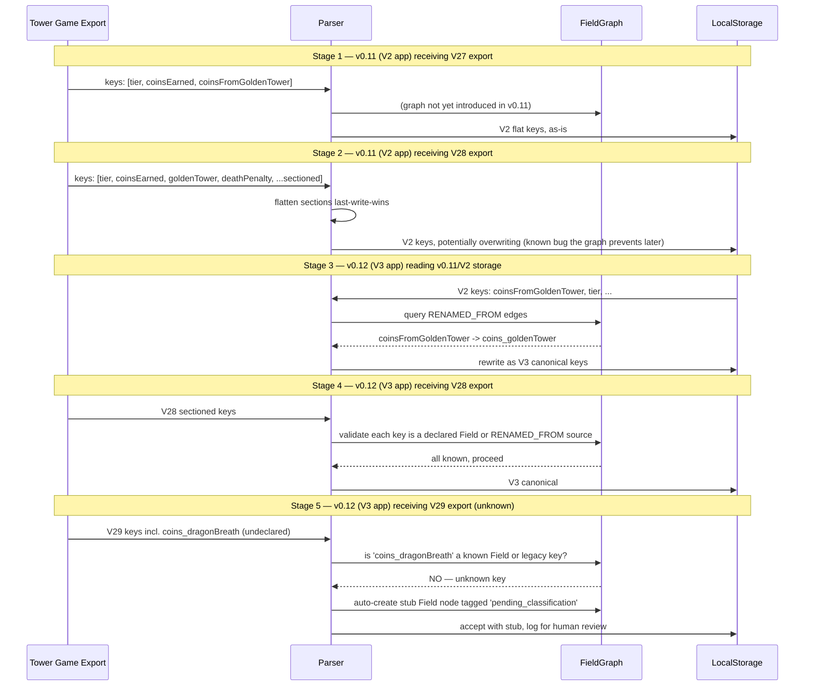

# 9. Cross-cutting concerns

> Part of the Field Graph Architecture spec.
> [< Prev: 8. Clarifying the mental model](./08-clarifying-the-mental-model.md) | [Index (00-table-of-contents.md)](./00-table-of-contents.md) | [Next: 10. Pattern-enforcing test library >](./10-pattern-enforcing-test-library.md)

---

Eight concerns from the parent exploration's section 7. Each is answered concretely below.

### 9.1. Aggregation impact

The app's aggregation surface is substantial. `prepareFieldPerDayData` sums any field by day. `prepareFieldPerWeekData` / `PerMonth` / `PerYear` do the same at coarser windows. Tier-stats aggregates by tier. Tier-trends computes hourly rates. The question is: does the graph help these paths or just sit next to them?

**It helps when the input to an aggregation is itself a *set of fields derived from a relationship*.** Concrete example: "sum all coin-source contributions to `battleReport_coinsEarned` for farm runs in the last 30 days, grouped by day." Today:

```typescript
// BEFORE — the field list is a hand-authored import
import { COIN_FIELDS } from '@/shared/domain/fields/breakdown-sources/coin-sources';

function sumCoinSourcesByDay(runs: ParsedGameRun[]): Map<string, number> {
  const farmRuns = runs.filter((r) => r.runType === 'farm');
  const last30 = farmRuns.filter(
    (r) => r.timestamp.getTime() > Date.now() - 30 * 24 * 60 * 60 * 1000,
  );

  const dailyGroups = groupRunsByDateKey(
    last30,
    (ts) => format(startOfDay(ts), 'yyyy-MM-dd'),
  );

  const result = new Map<string, number>();
  for (const [dayKey, dayRuns] of dailyGroups) {
    const total = dayRuns.reduce((sum, run) => {
      // Iterate the hand-authored COIN_FIELDS array
      const perRun = COIN_FIELDS.reduce((s, cfg) => {
        const v = extractFieldValue(run, cfg.fieldName);
        return s + (v ?? 0);
      }, 0);
      return sum + perRun;
    }, 0);
    result.set(dayKey, total);
  }
  return result;
}
```

With the graph, the field list *is* a query. Adding `coins_dragonBreath` to the edges automatically flows through this aggregation — no import change, no coin-sources edit:

```typescript
// AFTER — the field list is a graph query
import { graph } from '@/shared/domain/field-graph';

function sumCoinSourcesByDay(runs: ParsedGameRun[]): Map<string, number> {
  const coinFieldKeys = graph.sourcesOf('battleReport_coinsEarned'); // dynamic
  const farmRuns = runs.filter((r) => r.runType === 'farm');
  const last30 = farmRuns.filter(
    (r) => r.timestamp.getTime() > Date.now() - 30 * 24 * 60 * 60 * 1000,
  );

  const dailyGroups = groupRunsByDateKey(
    last30,
    (ts) => format(startOfDay(ts), 'yyyy-MM-dd'),
  );

  const result = new Map<string, number>();
  for (const [dayKey, dayRuns] of dailyGroups) {
    const total = dayRuns.reduce((sum, run) => {
      const perRun = coinFieldKeys.reduce((s, key) => {
        const v = extractFieldValue(run, key);
        return s + (v ?? 0);
      }, 0);
      return sum + perRun;
    }, 0);
    result.set(dayKey, total);
  }
  return result;
}
```

The structure of the aggregation didn't change. What changed is that the field list is no longer a static literal the caller maintains — it's a property of the graph. This is the key pattern: **date grouping stays where it is; field-set composition moves into graph queries**. Every aggregation path that currently imports `COIN_FIELDS`, `DAMAGE_FIELDS`, `ENEMY_KILL_FIELDS` becomes a one-line `graph.sourcesOf(...)` or `graph.fieldsInSection(...)` call. The aggregation code itself stays purely about dates and sums.

It does NOT help the aggregations whose input is a single named field (`prepareFieldPerDayData(runs, 'battleReport_coinsEarned')`). Those take a field key and sum — the graph has nothing to say. That's fine; the graph's job isn't to replace math, it's to replace hand-authored field lists.

### 9.2. Cross-version lifecycle

The graph shines here because `RENAMED_FROM`, `REPLACED_BY`, and `INTENTIONALLY_DROPPED_IN_SCHEMA` edges encode version history as queryable data. The five stages from the index doc:



**What each edge type does per stage:**

- `RENAMED_FROM` is queried in stage 3 to rewrite V2 storage keys to V3 canonical. `graph.legacyKeysFor('coins_goldenTower')` returns `['coinsFromGoldenTower']`; the parser uses the inverse index (`graph.canonicalKeyFor('coinsFromGoldenTower')`) to rewrite. Multi-hop renames (V2 → V3 → V4) walk transitively.
- `INTENTIONALLY_DROPPED_IN_SCHEMA` prevents false alarms in stage 3. When the parser encounters `coinsStolen` in V2 storage, it queries `graph.isDroppedIn('coinsStolen', 'schema:v3')` and silently discards rather than logging "unknown field."
- `REPLACED_BY` handles shape changes in stage 3. `damage` → `damage_damageDealt` is a rename; `someComplexField` → `{a, b, c}` is a replacement. The edge carries a `migrate` function pointer (or a reference to a migrator id declared elsewhere) that the parser invokes.

**The V29 unknown-field question.** Auto-creating a stub node tagged `pending_classification` is the right default because:

1. It prevents data loss. The value is stored under its reported key, never dropped.
2. It surfaces discoverability. `graph.query({ from: '', tag: 'pending_classification' })` returns every unknown field the app has seen, feeding a human review UI.
3. It integrates with the invariant tests. An invariant fires: "no node should remain `pending_classification` for more than one release" — the test fails once V29 is observed but the developer forgot to declare the field properly.

Stub creation is one pure function:

```typescript
function ensureFieldNode(graph: FieldGraph, key: string): void {
  if (graph.hasNode(key)) return;
  graph.addNodeAtRuntime(fieldNode(key, ['pending_classification']));
  console.warn(`[FieldGraph] unknown field '${key}' — stub created pending classification`);
}
```

The stub gets `BELONGS_TO_SECTION section:unknown` by default, which renders it in a "Newly Detected" group in the UI rather than hiding it in "Miscellaneous."

### 9.3. Debuggability

Bug scenario: `coins_goldenTower` shows 0 on run-details for a specific run.

**Status quo debug path.** Open `coin-sources.ts` — confirm `coins_goldenTower` is listed. Open `supportedFields.json` — confirm present. Open `section-config.ts` — confirm the coins section renders it. Open the parser — walk through why the value came out as 0. Open `v2-to-v3-field-map.ts` — check whether the run is V2 and the rename mapping ran. Open the run-details component — check color/label wiring. That's seven files to build a mental model of the pipeline before any actual investigation begins.

**Graph debug path.** One command:

```
$ npm run graph:describe coins_goldenTower
```

```markdown
# coins_goldenTower

**Kind**: Field
**Tags**: (none)
**Data type**: number (via HAS_DATA_TYPE)

## Display
- Display name: "Golden Tower"
- Color: #fbbf24

## Classification
- Section: section:coins
- Category: category:economic (via section:coins)

## Relationships
### Outgoing
- IS_SOURCE_OF           -> battleReport_coinsEarned
- RENAMED_FROM           -> coinsFromGoldenTower (atSchema schema:v3)
- APPEARS_IN_VIEW        -> view:run-details.coins-earned
- APPEARS_IN_VIEW        -> view:source-analysis.coins
- APPEARS_IN_VIEW        -> view:field-analytics
- SHARES_LABEL_WITH      -> damage_goldenTower
- SHARES_LABEL_WITH      -> killedWithEffectActive_goldenTower

### Incoming
(no incoming edges)

## Declared in
- nodes/fields.ts:127
- edges/belongs-to-section.ts:42
- edges/display.ts:18
- edges/is-source-of.ts:15
- edges/renamed-from.ts:9
- edges/appears-in-view.ts:{33, 61, 94}

## Runtime sanity
- 687 runs scanned
- 664 have a non-null `coins_goldenTower` value (96.6%)
- 23 runs have value=0 or null
  - 21 are farm runs on tiers 1-3 (expected: no Golden Tower unlocked)
  - 2 are tournament runs with tier=12 — anomaly, inspect
```

That output answers "is the pipeline wired correctly?" in under a second. If the bug is pipeline (missing edge, wrong section), it's visible. If the bug is data (specific run has a real 0), the "Runtime sanity" footer narrows it to two suspicious runs.

The strengths the user loved compound here: the visualizer (`npm run graph:viz coins_goldenTower`) produces the same info as a Mermaid diagram; the pattern-enforcing tests ensure the graph's shape is correct so `graph:describe` is trustworthy; the edges-as-text-files layout means an AI can grep the six source locations at the bottom of the output and show them without running the app.

### 9.4. Adding a new capability

New capability: a Velocity Chart — a new chart view that plots *rate of change* of any summable numeric field across time. "Show velocity of `battleReport_coinsEarned` per day" computes `delta(total_day_N) - delta(total_day_N-1)`.

**Under the graph model.** The capability is one new View node plus `APPEARS_IN_VIEW` edges for every qualifying field.

```typescript
// nodes/views.ts
viewNode('view:velocity-chart'),

// edges/appears-in-view.ts — new section at bottom
// Every summable numeric field qualifies. Query-driven:
...graph.nodesOfType('Field')
  .filter((f) => graph.dataTypeOf(f.id) === 'number')
  .filter((f) => graph.isSummable(f.id))          // derived from edge kinds, not a new edge
  .map((f) => edge(f.id, 'APPEARS_IN_VIEW', 'view:velocity-chart')),
```

Even better, `APPEARS_IN_VIEW` doesn't have to be manually authored — the view component asks the graph at render time: "give me every summable numeric field." No edges declared, no fan-out. The capability is a *query*, not a *registration*.

```typescript
// src/features/analysis/velocity-chart/velocity-chart.tsx
function VelocityChart() {
  const fields = graph.query({
    nodeKind: 'Field',
    dataType: 'number',
    excludingTags: ['not-velocity-eligible'],
  });
  return <MultiFieldChart fields={fields} kind="velocity" />;
}
```

**Contrast with the tag system (approach 8).** A new tag `#velocity-eligible` is added. Every numeric-summable field is opened and the tag is added. For ~120 fields that's 120 edits. The graph avoids this because the capability is derivable from existing edges (`HAS_DATA_TYPE number` + `IS_SOURCE_OF` presence + no `IS_DERIVED_FROM`).

**Contrast with file-per-field-composable (approach 5).** Each field file adds a method: `velocityEligible(): boolean`. ~120 files touched. Worse: the capability's *logic* is now distributed across 120 files, so changing the rule ("actually, also exclude `time`-typed fields") requires 120 edits again.

**The graph's real advantage: capabilities can be derived, not declared.** The question "which fields qualify for this chart?" is answered by graph properties already in place. The tag system and composable systems require *re-declaring* the set for each new capability. The graph makes capabilities emergent.

When a capability *can't* be derived (e.g. "fields the marketing team wants to highlight"), you fall back to a tag or an explicit `APPEARS_IN_VIEW` edge. Both are still within the graph. The tag system is a subset of the graph, so the graph never does worse than tags — it just has more expressive options for derivable capabilities.

### 9.5. Runtime type-mismatch

Scenario: V29 ships `battleReport_cellsEarned` as `"177.92K (est)"` instead of the number `182301.28`. The graph declares `HAS_DATA_TYPE number`. What happens?

The parser has one place where raw values meet the graph — the import boundary. The graph's `HAS_DATA_TYPE` edge drives a validator:

```typescript
// src/shared/domain/field-graph/runtime-validation.ts
export function validateFieldValue(
  key: string,
  raw: unknown,
): { ok: true; value: unknown } | { ok: false; error: TypeMismatchError } {
  const declared = graph.dataTypeOf(key);
  if (!declared) return { ok: true, value: raw }; // unknown field: pass through

  switch (declared) {
    case 'number':
      if (typeof raw === 'number') return { ok: true, value: raw };
      // Number-like strings are a known game behavior — try parsing
      const parsed = parseShorthandNumber(raw);
      if (parsed !== null) return { ok: true, value: parsed };
      return { ok: false, error: new TypeMismatchError(key, 'number', raw) };

    case 'duration':
      if (typeof raw === 'number') return { ok: true, value: raw };
      const seconds = parseDurationString(raw);
      if (seconds !== null) return { ok: true, value: seconds };
      return { ok: false, error: new TypeMismatchError(key, 'duration', raw) };

    case 'date':
      const d = parseFlexibleDate(raw);
      if (d) return { ok: true, value: d };
      return { ok: false, error: new TypeMismatchError(key, 'date', raw) };

    case 'string':
      return { ok: true, value: String(raw) };
  }
}
```

For `"177.92K (est)"`: `parseShorthandNumber` strips `"(est)"` if the parser is tolerant, returns `177920`. If tolerance is off, the validator returns `{ ok: false }` and the parser logs the mismatch against the graph:

```
[import] TYPE_MISMATCH on battleReport_cellsEarned
  declared: number
  received: "177.92K (est)"
  parsed:   177920 (with tolerant mode)
  action:   accepted with warning; flagged run for manual review
```

The `HAS_DATA_TYPE` edge makes this *one centralized validation boundary* instead of scattered `typeof` checks in individual feature code. When the game changes a type, one edge declaration changes, and the validator + every consumer adapts. Without the graph, each feature that reads the field duplicates the type assumption and breaks independently.

Bonus: the invariant test `every Field has exactly one HAS_DATA_TYPE edge` ensures no field can ship to production without a declared runtime type. The answer to "what is this field supposed to be?" is always in the graph.

### 9.6. Specific-field references

Real cases where the code legitimately references specific fields by name: `battleReport_battleDate` must be present for V3 composite keys, duplicate-detection composes `tier | wave | battleDate`, localization parses `battleReport_battleDate` with a date formatter.

The graph exposes these not as string literals scattered through the codebase, but as *edges pointing at well-known special nodes*.

**Required-for-import invariant.** Introduce a `RequirementSet` node kind (or overload Category) and `IS_REQUIRED_IN` edges:

```typescript
// nodes/requirements.ts
requirementNode('requirement:v3-import'),
requirementNode('requirement:duplicate-detection'),

// edges/requirements.ts
edge('battleReport_tier', 'IS_REQUIRED_IN', 'requirement:v3-import'),
edge('battleReport_wave', 'IS_REQUIRED_IN', 'requirement:v3-import'),
edge('battleReport_battleDate', 'IS_REQUIRED_IN', 'requirement:v3-import'),
```

The import gate consumes the query:

```typescript
// parser
const required = graph.fieldsRequiredIn('requirement:v3-import');
for (const key of required) {
  if (!(key in parsedRun.fields)) {
    errors.push(`missing required field: ${key}`);
  }
}
```

**Composite-key participation.** The current `generateCompositeKey` in `duplicate-detection.ts` hardcodes `run.tier`, `run.wave`, and `run.fields.battleReport_battleDate ?? run.fields.battleDate`. The graph reframes this as a `compositeKey:primary` node with `PARTICIPATES_IN_COMPOSITE_KEY` edges:

```typescript
// nodes/composite-keys.ts
compositeKeyNode('compositeKey:primary'),

// edges/composite-keys.ts
edge('battleReport_tier', 'PARTICIPATES_IN_COMPOSITE_KEY', 'compositeKey:primary'),
edge('battleReport_wave', 'PARTICIPATES_IN_COMPOSITE_KEY', 'compositeKey:primary'),
edge('battleReport_battleDate', 'PARTICIPATES_IN_COMPOSITE_KEY', 'compositeKey:primary'),
```

`generateCompositeKey` then walks the graph, still falling back to V2 legacy keys via `RENAMED_FROM`:

```typescript
export function generateCompositeKey(run: ParsedGameRun): string {
  const parts = graph
    .fieldsInCompositeKey('compositeKey:primary')
    .map((key) => {
      const value =
        run.fields[key]?.value ??
        graph.legacyKeysFor(key)
          .map((legacy) => run.fields[legacy]?.value)
          .find((v) => v !== undefined) ??
        0;
      return formatForCompositeKey(key, value, graph.dataTypeOf(key));
    });
  return parts.join('|');
}
```

This replaces four hard-coded field names with one graph query, handles V2 legacy keys via `RENAMED_FROM` without extra code, and lets a future developer change the composite key by editing edges instead of patching the function body. Adding a fourth component to the composite key is one edge declaration.

**Localization-aware date parsing.** `battleReport_battleDate` is identified in the graph as `HAS_DATA_TYPE date`. The parser's date-handling branch finds it via `graph.nodesOfType('Field').filter((f) => graph.dataTypeOf(f.id) === 'date')` — no hardcoded key. Adding a second date field (e.g. `battleReport_endTimestamp`) requires zero parser changes, only an edge.

### 9.7. Branch-fresh vs in-place

**Honest answer: in-place on v0.12, not fresh-branch.** The graph is a bigger conceptual shift than invariants or tags, but the migration plan (section 5 above) is explicitly step-wise. Fresh-branch carries two costs that outweigh any clean-slate benefit:

- Loss of parallel development. v0.12 ships user-visible features (Velocity Chart, migration safety, etc.). A fresh branch stalls those while the graph is built.
- Dual-maintenance penalty. For the weeks the graph branch exists, every feature PR on the main branch has to be ported. In a 150-field app this eats the savings the graph is supposed to produce.

The graph's *point* is that it coexists with the legacy files during migration. The `BEFORE → AFTER` pattern in section 3g shows this: `COIN_FIELDS` keeps its export shape, its body becomes a graph query, consumers don't change. That is fundamentally an in-place approach.

**PR sequence (in-place), with LOC estimates:**

| PR | Scope | Approx LOC | Revertible? |
|----|-------|-----------|-------------|
| 1 | Build the FieldGraph core (types, builder, query API, 20 invariant tests) | +800 / -0 | Yes |
| 2 | Declare ~20 coin-source edges; rewrite `COIN_FIELDS` as graph query | +150 / -30 | Yes |
| 3 | Declare ~25 damage-source edges; rewrite `DAMAGE_FIELDS` | +180 / -40 | Yes |
| 4 | Declare `RENAMED_FROM` edges; rewrite `V2_TO_V3_FIELD_MAP` derivation | +250 / -220 | Yes |
| 5 | Declare `HAS_DISPLAY_NAME` / `HAS_COLOR` for coins; consumers use graph | +200 / -80 | Yes |
| 6 | Declare View nodes + `APPEARS_IN_VIEW`; `section-config.ts` becomes derived | +400 / -350 | Partial (harder) |
| 7 | Declare composite-key edges; `generateCompositeKey` uses graph | +80 / -20 | Yes |
| 8 | Add `npm run graph:{viz,describe,orphans,diff,explain}` CLI | +350 / -0 | Yes |
| 9 | Delete legacy `COIN_FIELDS`, `DAMAGE_FIELDS` bodies once no consumers | +20 / -400 | No (cleanup) |

Total: **~2400 LOC added, ~1140 LOC removed** across 9 PRs, shippable one per week or tighter.

**Fresh-branch estimate (for comparison):** ~3200 LOC added, ~2000 LOC removed in one big-bang PR, plus ~4 weeks of porting parallel feature work. Strictly worse unless the team is small enough to freeze feature development, which is not the case here.

**Recommendation: in-place, 9-PR sequence, start with PR 1 + PR 2 only.** If after PR 2 the team doesn't feel the value proposition, revert PR 2 (PR 1 has zero consumers so it's dead code and fine to sit). The graph is optional scaffolding until consumers depend on it.

### 9.8. Runtime discoverability (CLI/UI)

This is the section the user was most excited about. Five commands and one in-app route, designed from the start for AI agent consumption.

**`npm run graph:describe <key>`** — full node profile including all outgoing and incoming edges, source locations, and runtime sanity. Example output is in section 9.3. Machine-readable output via `--json` flag so AI agents can parse it directly:

```bash
$ npm run graph:describe coins_goldenTower --json
{ "id": "coins_goldenTower", "kind": "Field", "displayName": "Golden Tower", ... }
```

**`npm run graph:viz [--format=mermaid|dot|json] [--filter=...]`** — visualization. `--filter` accepts a field prefix, a section id, an edge type, or a node id. Default format is Mermaid for paste-into-PR-comments; DOT for Graphviz pipelines; JSON for tooling.

```bash
$ npm run graph:viz --filter=section:coins --format=mermaid > coins-graph.md
$ npm run graph:viz --filter=RENAMED_FROM --format=dot | dot -Tpng > renames.png
```

**`npm run graph:orphans`** — surfaces dangling state:

```
$ npm run graph:orphans
Nodes with no edges (dead code candidates):
  - coins_hypotheticalFuture (Field)

Edges pointing at missing nodes (should have failed at build — bug check):
  (none)

Fields with no APPEARS_IN_VIEW edge (hidden from all UIs):
  - counts_thunderBotStuns
  - records_mostCellsFromWaveSkip

Fields tagged 'pending_classification' > 1 release (needs review):
  - coins_dragonBreath (seen in V29 imports since 2026-04-10)
```

**`npm run graph:diff <old-sha> <new-sha>`** — delta between two commits:

```
$ npm run graph:diff main feature/velocity-chart
Added nodes: view:velocity-chart
Added edges:
  + APPEARS_IN_VIEW coins_goldenTower -> view:velocity-chart
  + APPEARS_IN_VIEW coins_deathWave   -> view:velocity-chart
  + ... 118 more APPEARS_IN_VIEW edges
Removed: (none)
Changed: (none)
```

On CI this runs automatically on PRs and posts the diff as a PR comment. A reviewer sees graph deltas without opening source.

**`npm run graph:explain <field-a> <field-b>`** — shortest edge path between two nodes, humanized:

```
$ npm run graph:explain coins_goldenTower view:source-analysis.coins
Path (1 edge):
  coins_goldenTower --[APPEARS_IN_VIEW]--> view:source-analysis.coins
Plain English:
  "coins_goldenTower appears in the source-analysis coins view."

$ npm run graph:explain coins_goldenTower category:economic
Path (3 edges):
  coins_goldenTower --[BELONGS_TO_SECTION]-->
  section:coins     --[BELONGS_TO_CATEGORY]-->
  category:economic
Plain English:
  "coins_goldenTower belongs to section:coins, which rolls up to category:economic."

$ npm run graph:explain coinsFromGoldenTower battleReport_coinsEarned
Path (2 edges):
  coinsFromGoldenTower <--[RENAMED_FROM]--
  coins_goldenTower    --[IS_SOURCE_OF]-->
  battleReport_coinsEarned
Plain English:
  "coinsFromGoldenTower is the V2 name of coins_goldenTower, which is a source of battleReport_coinsEarned."
```

**AI-discoverability angle.** Each of these is a runtime command an AI agent can invoke before making a change. An agent asked "add a new coin source" can run `graph:describe battleReport_coinsEarned` to find the pattern, `graph:viz --filter=section:coins` to see the layout, and `graph:explain new-field battleReport_coinsEarned` after editing to verify the path exists. The commands double as AI self-verification tooling. Pair with a short `AGENTS.md` section pointing at them and the agent's context cost for a field change drops from "read seven files" to "run one command."

**In-app `/settings/fields/graph` route.** Interactive visualization for human users:

- Left panel: filter by section, category, edge type, tag.
- Center: force-directed graph (React Flow or vis.js) rendered from the same edge data the CLI uses. Nodes click-to-expand, edges tooltip with relationship metadata.
- Right panel: selected-node inspector identical to `graph:describe` output.
- Top bar: search box that does `graph.findNode(query)` with fuzzy matching.
- Export buttons: "Copy Mermaid", "Copy JSON", "Download DOT" — the same outputs as the CLI.

This is where the graph goes from "data structure" to "product feature." Power users can see their imports' field coverage, understand why a field is grouped where it is, and spot `pending_classification` fields before the dev team does. The UI renders from the same frozen graph the app uses, so nothing about this view can drift from runtime behavior.

---

> [< Prev: 8. Clarifying the mental model](./08-clarifying-the-mental-model.md) | [Index (00-table-of-contents.md)](./00-table-of-contents.md) | [Next: 10. Pattern-enforcing test library >](./10-pattern-enforcing-test-library.md)
