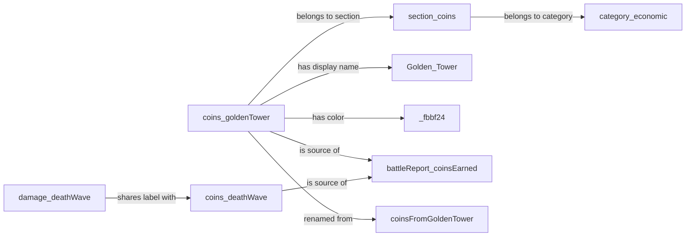
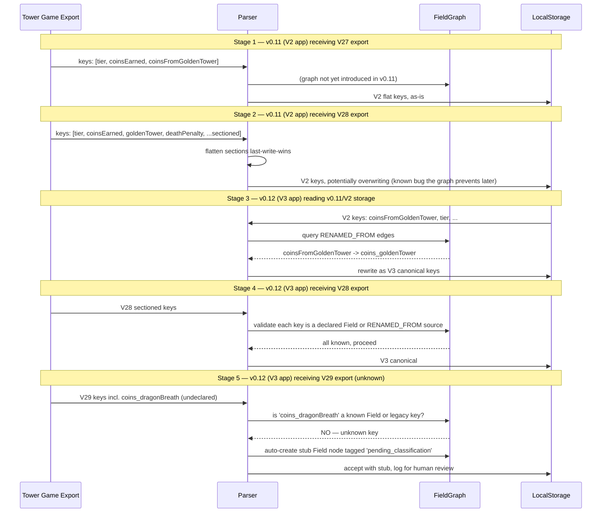

> **Status: historical reference.** This is the original monolithic architecture doc read by the author to commit to the relationship-graph approach. The working spec — split into per-section files for easier AI-agent context loading — lives at [`../architecture/`](../architecture/00-table-of-contents.md). Changes during implementation happen in the split files; this monolith is kept unchanged as a snapshot of the decision-time design.

---

# Approach 7: Relationship Graph / Node-Based Registry

**Status:** Deep-dive · **Parent:** [EXPLORATION-field-registry-architecture.md](../EXPLORATION-field-registry-architecture.md)
**Effort:** Medium–Large · **Payoff:** High · **Novelty:** High

---

## 1. Abstract & motivation

Every other approach in this exploration treats a field as a *record with properties* — a row with columns like `displayName`, `color`, `section`. That model implicitly assumes the pain is "fields have attributes that live in the wrong files." But the pain the user actually described is different: "I almost need like a graph over relationships if that makes sense... there's like hierarchy and relationship and they might not be overlapping concepts." The insight underneath that statement is that *the relationships between fields are the thing that drifts*, not the fields themselves. `coins_goldenTower` has a stable meaning. What doesn't stay consistent is that it *is a source of* `battleReport_coinsEarned`, *belongs to* the Coins section, *was renamed from* `coinsFromGoldenTower`, *shares a label with* `damage_goldenTower` under different taxonomies, and *appears in* the run-details, source-analysis, and tier-stats views. Each of those is an edge. Each is currently encoded as a property on the wrong side of the relationship, hand-maintained in a different file.

The relationship-graph approach promotes relationships to first-class citizens. Fields, sections, categories, views, and schema versions become **nodes**. Every statement that currently lives as "a property on field X pointing at Y" becomes a **typed directional edge** in a graph. Instead of `COIN_FIELDS` being a hand-authored array that has to agree with `supportedFields.json`, the array is the *result of a graph query*: "give me every field node with an `IS_SOURCE_OF` edge to `battleReport_coinsEarned`." Instead of `v2-to-v3-field-map.ts` being a flat dictionary that has to agree with `supportedFields.json`, it is a set of `RENAMED_FROM` edges. Instead of the run-details section config being a hand-authored grouping that has to agree with the source-analysis color palette, it is a `BELONGS_TO_SECTION` edge plus a `HAS_COLOR` edge. One declaration, queried many ways. The migration, the rename history, the view membership, the source-of-total relationship — all live in the same substrate, all reachable from a single query API.

This is the highest-ceiling, highest-setup-cost option in this exploration. It wins decisively when relationships dominate the problem. It is unambiguous overkill if the relationships are actually simple and the current drift is cosmetic.

## 2. How it works

The mental model is a labeled property graph: a set of nodes of different types, connected by typed directional edges, queryable by a small API. All of this is pure TypeScript — there is no database, no runtime dependency, no separate tool. The graph is a plain object built up from declarative edge literals at module load time, indexed once, and frozen.

### Node types

Five node kinds cover the domain. Each has a stable string id and a discriminated type.

- **Field**: A game data concept like `coins_goldenTower`. The id IS the V3 canonical key.
- **Section**: A UI grouping like `Coins`, `Battle Report`, `Damage Blocked`. Ids like `section:coins`.
- **Category**: A coarser bucket like `Economic`, `Combat`, `Records`. Ids like `category:economic`.
- **View**: A UI surface that renders fields, like the run-details card or the source-analysis chart. Ids like `view:run-details.battle-report` or `view:source-analysis.coins`.
- **Schema**: A tower-tracking storage-schema revision for migration edges. Ids like `schema:v2`, `schema:v3`. (Tower *game* versions like V27/V28 are a separate axis — see §17.)

### Edge types

Every edge carries a `type` discriminant, a `from` node id, a `to` node id, and optional metadata specific to that edge type. The full taxonomy:

| Edge type | Semantics | Example |
|---|---|---|
| `BELONGS_TO_SECTION` | Field is grouped under a UI section | `coins_goldenTower` → `section:coins` |
| `BELONGS_TO_CATEGORY` | Section (or field) rolls up to a coarser category | `section:coins` → `category:economic` |
| `IS_SOURCE_OF` | Field contributes to a total | `coins_goldenTower` → `battleReport_coinsEarned` |
| `IS_DERIVED_FROM` | Field is computed from other fields | `battleReport_cellsPerHour` → {`battleReport_cellsEarned`, `battleReport_realTime`} |
| `RENAMED_FROM` | V3 field was known as V2 field in older data | `coins_goldenTower` → `coinsFromGoldenTower` (in `schema:v2`) |
| `APPEARS_IN_VIEW` | Field is rendered by this view | `battleReport_tier` → `view:run-details.battle-report` |
| `HAS_DISPLAY_NAME` | Field's default human-facing label | `coins_goldenTower` → `"Golden Tower"` |
| `HAS_COLOR` | Field's default chart color | `coins_goldenTower` → `#fbbf24` |
| `SHARES_LABEL_WITH` | Sibling fields that represent the same game concept in different taxonomies | `damage_deathWave` ↔ `coins_deathWave` |
| `PARTICIPATES_IN_COMPOSITE_KEY` | Field is part of duplicate-detection key | `battleReport_tier` → `compositeKey:primary` |
| `REPLACED_BY` | V2 concept superseded by a V3 concept with different shape | `damage` → `damage_damageDealt` |
| `INTENTIONALLY_DROPPED_IN_SCHEMA` | Field exists in older data but has no V3 analog | `coinsStolen` → `schema:v3` |
| `IS_CORRELATED_WITH` | Analytical hint; no runtime meaning, useful for UI "related fields" | `counts_wavesSkipped` ↔ `records_largestWaveSkip` |

`SHARES_LABEL_WITH` and `IS_CORRELATED_WITH` are symmetric by convention — the indexer stores them in both directions. The rest are directional.

### Shape

```
                           Section:coins
                                ^
                                | BELONGS_TO_SECTION
                                |
                   +---- Field:coins_goldenTower ----+
      HAS_COLOR    |                                 |  RENAMED_FROM (in schema:v2)
     "#fbbf24"     |                                 v
                   |                           Field:coinsFromGoldenTower
                   | IS_SOURCE_OF
                   v
         Field:battleReport_coinsEarned
                   ^
                   | IS_DERIVED_FROM (for per-hour)
                   |
         Field:battleReport_coinsPerHour
                   |
                   | APPEARS_IN_VIEW
                   v
         View:run-details.coins-earned
                   |
                   | BELONGS_TO_CATEGORY
                   v
              Category:economic
```

Every relationship the user cares about is an edge. Fields have no properties; their properties ARE edges (`HAS_DISPLAY_NAME`, `HAS_COLOR`) to string or color terminals.

### Query API

The query layer is a thin typed facade over an indexed edge table. Calls are synchronous, memoized, and return plain arrays so the results feel like hand-authored config.

```typescript
graph.sourcesOf('battleReport_coinsEarned');
// → ['coins_goldenTower', 'coins_deathWave', 'coins_spotlight', ...]

graph.sectionOf('coins_goldenTower');
// → 'section:coins'

graph.legacyKeysFor('coins_goldenTower');
// → ['coinsFromGoldenTower']  (by walking RENAMED_FROM)

graph.viewsThatUse('battleReport_tier');
// → ['view:run-details.battle-report', 'view:tier-stats-chart',
//    'view:duplicate-detection.composite-key']

graph.derivationInputs('battleReport_cellsPerHour');
// → ['battleReport_cellsEarned', 'battleReport_realTime']

graph.displayNameOf('coins_goldenTower');  // → 'Golden Tower'
graph.colorOf('coins_goldenTower');        // → '#fbbf24'

graph.query({ edgeType: 'RENAMED_FROM' });
// → every legacy-to-canonical pair, replaces V2_TO_V3_FIELD_MAP
```

## 3. Evaluation

### 3a. Adding a new V29 field

Adding `coins_dragonBreath` (a new coin source in a hypothetical V29):

1. Open `field-graph/coins.ts`. Add one field-node declaration and its edges:
   ```typescript
   fieldNode('coins_dragonBreath'),
   edge('coins_dragonBreath', 'HAS_DISPLAY_NAME', 'Dragon Breath'),
   edge('coins_dragonBreath', 'HAS_COLOR', '#7dd3fc'),
   edge('coins_dragonBreath', 'BELONGS_TO_SECTION', 'section:coins'),
   edge('coins_dragonBreath', 'IS_SOURCE_OF', 'battleReport_coinsEarned'),
   ```
2. Nothing else. `COIN_FIELDS` is the result of `graph.sourcesOf('battleReport_coinsEarned')`, so the breakdown chart, source analysis, run-details coins section, and color palette all pick the field up on next render. An invariant test (see 3e) catches the missing `APPEARS_IN_VIEW` edges for any view that wants explicit opt-in rather than source-derived membership.

No other file is touched. Compare this to the status quo, where the same change requires edits in `supportedFields.json`, `coin-sources.ts`, and verification in `section-config.ts`, `v2-to-v3-field-map.ts`, and the source-analysis color mapper.

### 3b. Renaming a field (V28 → V29)

The game renames `coins_spotlight` to `coins_spotlightBeam`:

1. Rename the node declaration:
   ```typescript
   fieldNode('coins_spotlightBeam'),
   edge('coins_spotlightBeam', 'HAS_DISPLAY_NAME', 'Spotlight Beam'),
   edge('coins_spotlightBeam', 'RENAMED_FROM', 'coins_spotlight', { atSchema: 'schema:v4' }),
   ```
2. The old field node becomes a *ghost node* that only exists as the target of a `RENAMED_FROM` edge. Import-time migration walks `RENAMED_FROM` edges to map old keys to new. The chart, section config, and color palette resolve by new key.
3. `graph.legacyKeysFor('coins_spotlightBeam')` returns `['coins_spotlight']`. If a second rename happens later, the chain is walked transitively.

The rename history is first-class data. A dev tool `npm run graph:rename-history coins_spotlightBeam` prints the full chain without anyone hand-maintaining a changelog.

### 3c. Adding a new UI view

Suppose a new view `tier-stats-advanced` is added that renders tier, wave, real-time, and cells-per-hour:

1. Declare the view node and its edges in `field-graph/views.ts`:
   ```typescript
   viewNode('view:tier-stats-advanced'),
   edge('battleReport_tier', 'APPEARS_IN_VIEW', 'view:tier-stats-advanced'),
   edge('battleReport_wave', 'APPEARS_IN_VIEW', 'view:tier-stats-advanced'),
   edge('battleReport_realTime', 'APPEARS_IN_VIEW', 'view:tier-stats-advanced'),
   edge('battleReport_cellsPerHour', 'APPEARS_IN_VIEW', 'view:tier-stats-advanced'),
   ```
2. The view component calls `graph.fieldsInView('view:tier-stats-advanced')` and renders. The color and display name for each field come from the graph, not from the component.

Critically, `graph.viewsThatUse('battleReport_tier')` now includes the new view without touching any field file. Discoverability grows automatically as views are added.

### 3d. Discoverability — "where is `coins_goldenTower` used?"

One query:

```typescript
graph.describe('coins_goldenTower');
// {
//   displayName: 'Golden Tower',
//   color: '#fbbf24',
//   section: 'section:coins',
//   category: 'category:economic',
//   isSourceOf: ['battleReport_coinsEarned'],
//   derivedFrom: [],
//   renamedFrom: ['coinsFromGoldenTower'],
//   appearsInViews: [
//     'view:run-details.coins-earned',
//     'view:source-analysis.coins',
//     'view:field-analytics',
//   ],
//   sharesLabelWith: ['damage_goldenTower', 'killedWithEffectActive_goldenTower'],
//   correlatedWith: [],
//   participatesInCompositeKey: [],
// }
```

This replaces the current discovery workflow — grep the repo, open seven files, build the mental model yourself — with a single function call. A dev command `npm run graph:describe coins_goldenTower` prints the same thing to the terminal.

### 3e. Silent-break modes

The current status quo breaks silently when a field ships to storage but no section-config file claims it, and the field falls into the "Miscellaneous" bucket unnoticed. The graph has an analogous failure mode — a field with no `BELONGS_TO_SECTION` edge — but because the graph is *declarative and typed*, invariant tests on the graph itself catch it:

```typescript
it('every Field node has exactly one BELONGS_TO_SECTION edge', () => {
  for (const field of graph.nodesOfType('Field')) {
    const sections = graph.edgesFrom(field.id, 'BELONGS_TO_SECTION');
    expect(sections, `${field.id} must belong to a section`).toHaveLength(1);
  }
});

it('every coin-source field has an IS_SOURCE_OF edge to battleReport_coinsEarned', () => {
  const coinSources = graph.edgesTo('battleReport_coinsEarned', 'IS_SOURCE_OF');
  expect(coinSources.length).toBeGreaterThan(0);
  for (const field of graph.nodesInSection('section:coins')) {
    const isSource = graph.hasEdge(field.id, 'IS_SOURCE_OF', 'battleReport_coinsEarned');
    // Allow explicit opt-out via tag
    if (!graph.hasTag(field.id, 'not-in-total')) {
      expect(isSource, `${field.id} in section:coins must be IS_SOURCE_OF coinsEarned`).toBe(true);
    }
  }
});
```

The drift isn't caught by "a new file forgot to include the new field." It's caught by "the graph's structural invariants were violated." The tests sit at the graph edge, not at every consumer pair.

### 3f. File tree impact

```
src/shared/domain/field-graph/
  index.ts                     // exports the built, frozen graph + query API
  types.ts                     // node and edge discriminated unions
  builder.ts                   // build / index / memoize
  query.ts                     // the graph.query API
  nodes/
    fields.ts                  // all Field nodes, grouped by section
    sections.ts                // Section + Category nodes
    views.ts                   // View nodes
    schemas.ts                 // Schema nodes (tower-tracking storage schemas)
  edges/
    belongs-to-section.ts      // all BELONGS_TO_SECTION edges
    is-source-of.ts            // all IS_SOURCE_OF edges (replaces COIN_FIELDS array)
    is-derived-from.ts         // all IS_DERIVED_FROM edges
    renamed-from.ts            // replaces V2_TO_V3_FIELD_MAP
    appears-in-view.ts         // replaces section-config.ts membership lists
    display.ts                 // HAS_DISPLAY_NAME + HAS_COLOR edges
    correlations.ts            // SHARES_LABEL_WITH + IS_CORRELATED_WITH
    composite-keys.ts          // PARTICIPATES_IN_COMPOSITE_KEY
    versioning.ts              // REPLACED_BY + INTENTIONALLY_DROPPED_IN_SCHEMA
  __tests__/
    graph-invariants.test.ts   // structural invariants
    query-api.test.ts          // query API correctness
```

The existing `breakdown-sources/coin-sources.ts`, `breakdown-sources/damage-sources.ts`, `migrations/v2-to-v3-field-map.ts`, and `section-config.ts` do not disappear immediately — they become *derived views* over the graph. Each re-exports the same shape it always did, built at module load via `graph.sourcesOf(...)` / `graph.query(...)`. Consumers are untouched. Once the new declarations are the source of truth, the old files can be deleted.

### 3g. Concrete code samples

**Edge-type taxonomy as a discriminated union:**

```typescript
// src/shared/domain/field-graph/types.ts

export type NodeId = string;

export type NodeKind = 'Field' | 'Section' | 'Category' | 'View' | 'Schema';

export interface Node {
  readonly id: NodeId;
  readonly kind: NodeKind;
  readonly tags?: readonly string[];
}

export type Edge =
  | { type: 'BELONGS_TO_SECTION'; from: NodeId; to: NodeId }
  | { type: 'BELONGS_TO_CATEGORY'; from: NodeId; to: NodeId }
  | { type: 'IS_SOURCE_OF'; from: NodeId; to: NodeId }
  | { type: 'IS_DERIVED_FROM'; from: NodeId; to: NodeId }
  | { type: 'RENAMED_FROM'; from: NodeId; to: NodeId; atSchema: NodeId /* Schema node */ }
  | { type: 'APPEARS_IN_VIEW'; from: NodeId; to: NodeId }
  | { type: 'HAS_DISPLAY_NAME'; from: NodeId; to: string }
  | { type: 'HAS_COLOR'; from: NodeId; to: `#${string}` }
  | { type: 'SHARES_LABEL_WITH'; from: NodeId; to: NodeId }
  | { type: 'PARTICIPATES_IN_COMPOSITE_KEY'; from: NodeId; to: NodeId }
  | { type: 'REPLACED_BY'; from: NodeId; to: NodeId; atSchema: NodeId }
  | { type: 'INTENTIONALLY_DROPPED_IN_SCHEMA'; from: NodeId; to: NodeId }
  | { type: 'IS_CORRELATED_WITH'; from: NodeId; to: NodeId };

export type EdgeType = Edge['type'];
```

**Helper constructors:**

```typescript
// src/shared/domain/field-graph/builder.ts

export const fieldNode = (id: NodeId, tags?: string[]): Node =>
  ({ id, kind: 'Field', tags });
export const sectionNode = (id: NodeId): Node => ({ id, kind: 'Section' });
export const categoryNode = (id: NodeId): Node => ({ id, kind: 'Category' });
export const viewNode = (id: NodeId): Node => ({ id, kind: 'View' });
export const schemaNode = (id: NodeId): Node => ({ id, kind: 'Schema' });

export function edge<T extends EdgeType>(
  from: NodeId,
  type: T,
  to: NodeId | string,
  meta?: { atSchema?: NodeId },
): Extract<Edge, { type: T }> {
  return { type, from, to, ...meta } as Extract<Edge, { type: T }>;
}
```

**A real slice of the graph — ~40 edges covering Battle Report, Coins (with source edges), Damage, Enemies, and a few renames:**

```typescript
// src/shared/domain/field-graph/nodes/sections.ts
export const SECTIONS = [
  sectionNode('section:battleReport'),
  sectionNode('section:coins'),
  sectionNode('section:damage'),
  sectionNode('section:totalEnemies'),
  sectionNode('section:records'),
  categoryNode('category:economic'),
  categoryNode('category:combat'),
  categoryNode('category:meta'),
];

// src/shared/domain/field-graph/edges/belongs-to-section.ts
export const BELONGS_TO_SECTION_EDGES = [
  // Battle Report
  edge('battleReport_tier', 'BELONGS_TO_SECTION', 'section:battleReport'),
  edge('battleReport_wave', 'BELONGS_TO_SECTION', 'section:battleReport'),
  edge('battleReport_realTime', 'BELONGS_TO_SECTION', 'section:battleReport'),
  edge('battleReport_coinsEarned', 'BELONGS_TO_SECTION', 'section:battleReport'),
  edge('battleReport_coinsPerHour', 'BELONGS_TO_SECTION', 'section:battleReport'),
  edge('battleReport_cellsEarned', 'BELONGS_TO_SECTION', 'section:battleReport'),
  edge('battleReport_cellsPerHour', 'BELONGS_TO_SECTION', 'section:battleReport'),
  // Coins
  edge('coins_goldenTower', 'BELONGS_TO_SECTION', 'section:coins'),
  edge('coins_deathWave', 'BELONGS_TO_SECTION', 'section:coins'),
  edge('coins_spotlight', 'BELONGS_TO_SECTION', 'section:coins'),
  edge('coins_goldenBot', 'BELONGS_TO_SECTION', 'section:coins'),
  edge('coins_blackHole', 'BELONGS_TO_SECTION', 'section:coins'),
  // Damage
  edge('damage_damageDealt', 'BELONGS_TO_SECTION', 'section:damage'),
  edge('damage_deathWave', 'BELONGS_TO_SECTION', 'section:damage'),
  edge('damage_chainLightning', 'BELONGS_TO_SECTION', 'section:damage'),
  edge('damage_orbs', 'BELONGS_TO_SECTION', 'section:damage'),
  // Section -> Category roll-ups
  edge('section:battleReport', 'BELONGS_TO_CATEGORY', 'category:meta'),
  edge('section:coins', 'BELONGS_TO_CATEGORY', 'category:economic'),
  edge('section:damage', 'BELONGS_TO_CATEGORY', 'category:combat'),
];

// src/shared/domain/field-graph/edges/is-source-of.ts
// These edges replace the hand-authored COIN_FIELDS and DAMAGE_FIELDS arrays.
export const IS_SOURCE_OF_EDGES = [
  // Coin sources -> battleReport_coinsEarned
  edge('coins_goldenTower', 'IS_SOURCE_OF', 'battleReport_coinsEarned'),
  edge('coins_deathWave', 'IS_SOURCE_OF', 'battleReport_coinsEarned'),
  edge('coins_spotlight', 'IS_SOURCE_OF', 'battleReport_coinsEarned'),
  edge('coins_goldenBot', 'IS_SOURCE_OF', 'battleReport_coinsEarned'),
  edge('coins_blackHole', 'IS_SOURCE_OF', 'battleReport_coinsEarned'),
  edge('coins_coinsFetched', 'IS_SOURCE_OF', 'battleReport_coinsEarned'),
  edge('coins_waveSkip', 'IS_SOURCE_OF', 'battleReport_coinsEarned'),
  edge('coins_goldenCombo', 'IS_SOURCE_OF', 'battleReport_coinsEarned'),
  // Damage sources -> damage_damageDealt
  edge('damage_deathWave', 'IS_SOURCE_OF', 'damage_damageDealt'),
  edge('damage_chainLightning', 'IS_SOURCE_OF', 'damage_damageDealt'),
  edge('damage_orbs', 'IS_SOURCE_OF', 'damage_damageDealt'),
  edge('damage_thorns', 'IS_SOURCE_OF', 'damage_damageDealt'),
];

// src/shared/domain/field-graph/edges/is-derived-from.ts
export const IS_DERIVED_FROM_EDGES = [
  // Per-hour fields are derived from total + duration (display-time fallback)
  edge('battleReport_coinsPerHour', 'IS_DERIVED_FROM', 'battleReport_coinsEarned'),
  edge('battleReport_coinsPerHour', 'IS_DERIVED_FROM', 'battleReport_realTime'),
  edge('battleReport_cellsPerHour', 'IS_DERIVED_FROM', 'battleReport_cellsEarned'),
  edge('battleReport_cellsPerHour', 'IS_DERIVED_FROM', 'battleReport_realTime'),
];

// src/shared/domain/field-graph/edges/renamed-from.ts
// These edges replace V2_TO_V3_FIELD_MAP entirely.
export const RENAMED_FROM_EDGES = [
  edge('coins_goldenTower', 'RENAMED_FROM', 'coinsFromGoldenTower', { atSchema: 'schema:v3' }),
  edge('coins_deathWave', 'RENAMED_FROM', 'coinsFromDeathWave', { atSchema: 'schema:v3' }),
  edge('coins_blackHole', 'RENAMED_FROM', 'coinsFromBlackHole', { atSchema: 'schema:v3' }),
  edge('coins_blackHole', 'RENAMED_FROM', 'coinsFromBlackhole', { atSchema: 'schema:v3' }),
  edge('coins_orbs', 'RENAMED_FROM', 'coinsFromOrb', { atSchema: 'schema:v3' }),
  edge('coins_orbs', 'RENAMED_FROM', 'coinsFromOrbs', { atSchema: 'schema:v3' }),
  edge('battleReport_coinsEarned', 'RENAMED_FROM', 'coinsEarned', { atSchema: 'schema:v3' }),
  edge('battleReport_tier', 'RENAMED_FROM', 'tier', { atSchema: 'schema:v3' }),
];
```

**The query API:**

```typescript
// src/shared/domain/field-graph/query.ts

export interface GraphQuery {
  edgeType?: EdgeType;
  from?: NodeId;
  to?: NodeId;
}

export class FieldGraph {
  private readonly byType = new Map<EdgeType, Edge[]>();
  private readonly byFrom = new Map<NodeId, Edge[]>();
  private readonly byTo = new Map<NodeId, Edge[]>();
  private readonly nodes = new Map<NodeId, Node>();

  // Memoized traversals
  private readonly sourcesOfCache = new Map<NodeId, NodeId[]>();
  private readonly viewsThatUseCache = new Map<NodeId, NodeId[]>();

  constructor(nodes: readonly Node[], edges: readonly Edge[]) {
    for (const n of nodes) this.nodes.set(n.id, n);
    for (const e of edges) this.index(e);
    Object.freeze(this);
  }

  sourcesOf(totalField: NodeId): readonly NodeId[] {
    return this.memo(this.sourcesOfCache, totalField, () =>
      (this.byTo.get(totalField) ?? [])
        .filter((e) => e.type === 'IS_SOURCE_OF')
        .map((e) => e.from),
    );
  }

  sectionOf(field: NodeId): NodeId | undefined {
    return (this.byFrom.get(field) ?? [])
      .find((e) => e.type === 'BELONGS_TO_SECTION')
      ?.to;
  }

  legacyKeysFor(field: NodeId): readonly NodeId[] {
    // Walk RENAMED_FROM transitively in case of rename chains
    const out: NodeId[] = [];
    const frontier = [field];
    while (frontier.length > 0) {
      const cur = frontier.pop()!;
      for (const e of this.byFrom.get(cur) ?? []) {
        if (e.type === 'RENAMED_FROM') {
          out.push(e.to);
          frontier.push(e.to);
        }
      }
    }
    return out;
  }

  viewsThatUse(field: NodeId): readonly NodeId[] {
    return this.memo(this.viewsThatUseCache, field, () =>
      (this.byFrom.get(field) ?? [])
        .filter((e) => e.type === 'APPEARS_IN_VIEW')
        .map((e) => e.to),
    );
  }

  derivationInputs(field: NodeId): readonly NodeId[] {
    return (this.byFrom.get(field) ?? [])
      .filter((e) => e.type === 'IS_DERIVED_FROM')
      .map((e) => e.to);
  }

  displayNameOf(field: NodeId): string | undefined {
    return (this.byFrom.get(field) ?? [])
      .find((e) => e.type === 'HAS_DISPLAY_NAME')?.to as string | undefined;
  }

  colorOf(field: NodeId): `#${string}` | undefined {
    return (this.byFrom.get(field) ?? [])
      .find((e) => e.type === 'HAS_COLOR')?.to as `#${string}` | undefined;
  }

  query(q: GraphQuery): readonly Edge[] {
    let candidates: readonly Edge[] = q.edgeType
      ? (this.byType.get(q.edgeType) ?? [])
      : Array.from(this.byType.values()).flat();
    if (q.from) candidates = candidates.filter((e) => e.from === q.from);
    if (q.to) candidates = candidates.filter((e) => e.to === q.to);
    return candidates;
  }

  // ... indexing, memoization helpers omitted for brevity
}
```

**Consumer refactor — before and after:**

```typescript
// BEFORE: src/shared/domain/fields/breakdown-sources/coin-sources.ts
export const COIN_FIELDS: FieldConfig[] = [
  { fieldName: 'coins_deathWave', displayName: 'Death Wave', color: '#ef4444' },
  { fieldName: 'coins_goldenTower', displayName: 'Golden Tower', color: '#fbbf24' },
  // ... 12 more hand-authored rows
];

// AFTER: same file, same export, now derived
import { graph } from '@/shared/domain/field-graph';

export const COIN_FIELDS: FieldConfig[] = graph
  .sourcesOf('battleReport_coinsEarned')
  .map((fieldName) => ({
    fieldName,
    displayName: graph.displayNameOf(fieldName) ?? fieldName,
    color: graph.colorOf(fieldName) ?? '#94a3b8',
  }));
```

Downstream `COINS_EARNED_CATEGORY`, `COINS_EARNED_CONFIG`, and the source-analysis view are untouched. They still see the same `FieldConfig[]`. The array is just computed rather than literal.

**Migration-safety example — `V2_TO_V3_FIELD_MAP` becomes a graph query:**

```typescript
// BEFORE: src/shared/domain/migrations/v2-to-v3-field-map.ts
export const V2_TO_V3_FIELD_MAP: Record<string, string> = {
  coinsFromGoldenTower: 'coins_goldenTower',
  coinsFromDeathWave: 'coins_deathWave',
  // ... 150+ hand-authored lines
};

// AFTER: same file, same export, derived from RENAMED_FROM edges
import { graph } from '@/shared/domain/field-graph';

export const V2_TO_V3_FIELD_MAP: Record<string, string> = Object.fromEntries(
  graph
    .query({ edgeType: 'RENAMED_FROM' })
    .map((e) => [e.to, e.from]), // legacy -> canonical
);
```

This means the runtime migrator does not change. The *source of truth* for renames moved from a flat dictionary into edges that live next to the field nodes. When a reviewer reads `coins_goldenTower`'s file, the rename history is right there.

**Visualization — `npm run graph:viz` outputs a Mermaid diagram for debugging:**

```typescript
// scripts/graph-viz.mjs
import { graph } from '../src/shared/domain/field-graph/index.ts';

const filter = process.argv[2] ?? 'coins';  // filter by section or field prefix
const edges = graph.query({}).filter((e) =>
  e.from.includes(filter) || String(e.to).includes(filter),
);

console.log('```mermaid');
console.log('graph LR');
for (const e of edges) {
  const label = e.type.replace(/_/g, ' ').toLowerCase();
  console.log(`  ${id(e.from)} -->|${label}| ${id(e.to)}`);
}
console.log('```');

function id(s) { return s.replace(/[^a-zA-Z0-9_]/g, '_'); }
```

Running `npm run graph:viz coins` produces:



Paste into any Markdown renderer, or pipe to `dot` via a `--format=dot` flag. A reviewer can see the relationships without reading eight files. On a PR that changes edges, a bot can post the diff of the graph as a diagram. **This is the killer feature of the approach** — the data structure *is* the documentation, and the documentation is queryable.

### 3h. Pros, cons, honest critique

**Pros**

- **Relationships are first-class.** Every relationship the user described — source-of, derived-from, renamed-from, appears-in-view, shares-label — has a dedicated edge type. No more hand-maintained arrays that encode a relationship implicitly.
- **Discoverability is a query.** `graph.describe(field)` returns everything about a field in one call. For humans, `npm run graph:describe` does the same at the terminal.
- **Rename safety.** Rename history is walkable. The current hand-authored `V2_TO_V3_FIELD_MAP` becomes a derived view over `RENAMED_FROM` edges. Multi-hop renames (V2 → V3 → V4) work without any additional code.
- **Structural invariants replace pairwise invariants.** Instead of "coin-sources.ts must agree with supportedFields.json must agree with section-config.ts," the test is "every Field node has exactly one BELONGS_TO_SECTION edge." One assertion covers every file-pair the old system maintained.
- **Graph visualization.** The Mermaid/DOT output is real debugging value that no other approach offers cheaply.
- **Unifies migrations, display, derivation, grouping.** They all live in the same substrate. Adding a new kind of relationship is one new entry in the edge discriminated union plus one new query method.

**Cons**

- **Learning curve.** "Which edge do I use?" is a real question. A new contributor who wants to add `coins_dragonBreath` has to know that `IS_SOURCE_OF` exists, that `BELONGS_TO_SECTION` exists, that `HAS_COLOR` is an edge and not a property. Good naming and good docs help, but there is an unavoidable onboarding step.
- **Edge proliferation.** Each new kind of relationship adds a case to the union, a method to the query API, and an invariant test. Over two years, the taxonomy could grow to 20+ edge types. At some point the graph becomes harder to reason about than the files it replaced.
- **Runtime cost.** Every query walks an index. Aggressive memoization keeps this fast, but the cost is real — especially for chart code that calls `graph.colorOf(fieldName)` in a render loop. Solution: pre-compute a flat lookup table once at module load, export it alongside the query API, let hot paths use the flat table.
- **The "graph database in a dict" problem.** At some point you are reinventing a graph DB in TypeScript. If the edge count grows past ~2000 and you start wanting path queries, transitive closures, aggregation, you will hit the limits of this hand-rolled implementation. At that point the question is: port to [cozo](https://github.com/cozodb/cozo) / [DuckDB](https://duckdb.org/) in-browser, or admit that the problem was never big enough to justify the graph in the first place.
- **Over-engineering risk.** If the relationships were always simple — a field belongs to one section, has one color, has one total — then a flat manifest (approach 2) or algorithmic derivation (approach 6) does the job with a fraction of the setup cost. The graph pays off only when relationships are the dominant axis of change.
- **Debugging is different.** `console.log(COIN_FIELDS)` showed you the answer. `console.log(graph.sourcesOf('battleReport_coinsEarned'))` shows the answer only if the graph built successfully. A bad edge declaration can produce confusing empty arrays rather than loud errors. Mitigation: strict `constructor` validation that errors on dangling edges at startup.

**Is this a graph DB in disguise?**

Honestly, yes. The question is whether the scale and query complexity justify tool support. Back-of-envelope for this app: ~150 field nodes, ~10 section nodes, ~15 view nodes, ~200 rename edges, ~50 source edges, ~150 display-name edges, ~150 color edges, ~400 appears-in-view edges. Total: ~1000 edges, maybe doubles to ~2000 over three years. That is well within "index and walk in memory with no measurable cost." The line is crossed if and when: (a) the graph needs to answer transitive or path queries (e.g., "find all fields reachable from X via any combination of edges"), (b) the graph is queried by non-code consumers, (c) the graph has cycles that need cycle-detection as part of normal queries. None of those look close for this app.

### 3i. When this wins / loses

**Wins when:**
- Relationships are the dominant axis of change. Adding a V29 rename edge, a new view that queries existing fields, or a new "source of" relationship happens more often than adding a field.
- Discoverability is the top-reported pain. "Where is this field used?" is a frequent question.
- Multiple views / features overlap on the same fields with different framings (color palette, grouping, label).
- Migration history matters and needs to be walkable by tooling.

**Loses when:**
- Fields and their properties are mostly flat. Most fields have one section, one color, one total. A manifest with properties wins.
- The team is small and the learning curve of "which edge do I use" dominates.
- Derived display names and colors are enough (approach 6 — algorithmic derivation — solves 80% of the drift at 10% of the cost).
- Performance-sensitive hot paths dominate the UI, and the added indirection per color/name lookup is measurable.

## 4. Combinations

### Graph + Algorithmic derivation (approach 6)

The graph captures what you *can't* derive. Display names that match `capitalize(camelSplit(fieldKey.after('_')))` don't need an explicit `HAS_DISPLAY_NAME` edge — the derivation function produces `"Golden Tower"` from `coins_goldenTower`. Only fields with exceptions (e.g., `"Guardian Fetched"` for `coins_coinsFetched`) need an edge. The graph shrinks by half. The invariant test becomes: "if a field has no `HAS_DISPLAY_NAME` edge, the derivation function produces a human-readable label; if it does, the edge wins." This is likely the best real-world combination: derive the easy cases, use graph edges for the exceptions and the relationships that can't be derived at all.

### Graph + Trait/Tag (approach 8)

Tags are *flat* edges to a special node type — effectively `edge(field, 'HAS_TAG', 'tag:coin-source')`. The graph generalizes the tag system: where tag systems can only answer "does X have tag Y," graphs can answer "is X connected to Y via any path." For this app, most questions are one-hop, so tags cover them. The graph is the escape hatch when tags are insufficient — e.g., `IS_DERIVED_FROM` carries operand order that a tag can't express. The realistic hybrid: use tags for flat capability questions ("is this a coin source?"), use graph edges for structured relationships ("which fields feed this total?").

### Graph + Invariant tests (approach 1)

Invariants become edge-existence assertions on the graph rather than file-pair assertions. Instead of "every key in supportedFields.json must appear in COIN_FIELDS or excludes," the test is "every Field node in section:coins has an IS_SOURCE_OF edge to battleReport_coinsEarned unless tagged `not-in-total`." The test surface shrinks because the graph's structure encodes most contracts implicitly. Invariants that survive are the ones about *graph shape*: no dangling edges, exactly-one-of constraints, connectivity.

## 5. Migration plan

This approach has a high ceiling but does not require a big-bang migration. The path:

**Step 1 — Express ONE relationship as edges.**
Pick `IS_SOURCE_OF coinsEarned`. Author the ~14 edges. Build a minimal `FieldGraph` class with one query method: `sourcesOf(totalField)`. Nothing else moves.

**Step 2 — Replace the consumer.**
Rewrite `COIN_FIELDS` as a derived array from `graph.sourcesOf('battleReport_coinsEarned')`. The hand-authored display name and color still live in the existing file, looked up from the graph via an interim map. Downstream consumers (run-details, source-analysis) are untouched because the array shape is preserved. Ship this. Measure nothing has regressed.

**Step 3 — Migrate display names and colors.**
Add `HAS_DISPLAY_NAME` and `HAS_COLOR` edges for the coin fields. The consumer's lookup map is replaced by `graph.displayNameOf` / `graph.colorOf`. Commit.

**Step 4 — Add the first structural invariant test.**
"Every field in section:coins is IS_SOURCE_OF battleReport_coinsEarned unless tagged `not-in-total`." Watch CI for drift.

**Step 5 — Migrate the V2→V3 rename map.**
Author `RENAMED_FROM` edges for coins fields. Rewrite `V2_TO_V3_FIELD_MAP` as a derived object over the RENAMED_FROM edge query. Verify the migration runtime still produces identical output for all sample data. This is the highest-value migration because it brings rename history into the same file as the field — reviewers see it in one place.

**Step 6 — Expand to damage, then to the remaining sections.**
Follow the same pattern for `damage_damageDealt` sources, then `totalEnemies_totalEnemies` sources. At this point `COIN_FIELDS`, `DAMAGE_FIELDS`, and the enemy breakdowns in `section-config.ts` are all derived.

**Step 7 — Migrate views.**
Add `View` nodes and `APPEARS_IN_VIEW` edges for each view in `section-config.ts`. The view configs become derived. Invariant: every view renders at least one field; every Field node appears in at least one view OR has a `not-in-ui` tag.

**Step 8 — Add the visualization command.**
`npm run graph:viz <filter>` prints a Mermaid diagram. Add to CI as an artifact so PRs that change edges produce a visual diff.

**Step 9 — Delete the original files.**
Once every consumer reads from the graph, delete `coin-sources.ts`, `damage-sources.ts`, and the `v2-to-v3-field-map.ts` hand-authored body (keep the file, re-export from graph). The edges in `field-graph/edges/*.ts` are now the sole source of truth.

Each step is a single PR, each step is independently revertible, and each step ships value on its own. If at any point the team decides the ceiling isn't worth the cost, the partially-migrated state is a perfectly valid end point — some relationships are in the graph, others remain in their legacy files, and both coexist. That "graceful stop" property is important: the graph is not a commitment to migrate everything, only a commitment to migrate the relationships that hurt.

## 8. Clarifying the mental model

Section 2 described nodes and edges abstractly. This section grounds the abstraction in literal object shapes — the exact thing that sits in memory after the graph builds — so a reviewer can internalize the structure before evaluating the cross-cutting concerns in section 9.

### 8.1. In-memory JSON representation

A node is a tagged record with an id and a kind. Fields carry no other data; their "properties" are outgoing edges.

```typescript
const fieldNode: Node = {
  id: 'coins_goldenTower',
  kind: 'Field',
  tags: [],                          // optional capability tags like 'summary-field', 'not-in-total'
};

const sectionNode: Node = {
  id: 'section:coins',
  kind: 'Section',
};

const viewNode: Node = {
  id: 'view:run-details.coins-earned',
  kind: 'View',
};

const schemaNode: Node = {
  id: 'schema:v3',
  kind: 'Schema',
};
```

An edge is a tagged record with a type, a `from` node id, a `to` node id (or terminal string for display/color edges), and optional type-specific metadata.

```typescript
const structuralEdge: Edge = {
  type: 'IS_SOURCE_OF',
  from: 'coins_goldenTower',
  to: 'battleReport_coinsEarned',
};

const renameEdge: Edge = {
  type: 'RENAMED_FROM',
  from: 'coins_goldenTower',
  to: 'coinsFromGoldenTower',
  atSchema: 'schema:v3',            // edge-specific metadata: which storage schema adopted the rename
};

const displayEdge: Edge = {
  type: 'HAS_DISPLAY_NAME',
  from: 'coins_goldenTower',
  to: 'Golden Tower',                // terminal string, not a node id
};

const colorEdge: Edge = {
  type: 'HAS_COLOR',
  from: 'coins_goldenTower',
  to: '#fbbf24',
};
```

The graph is just two arrays — `Node[]` and `Edge[]` — indexed by the builder into fast lookup maps. Nothing else. A ~40-entry snapshot, using real field names, looks like this in memory after all declarations load:

```json
[
  { "kind": "node", "id": "section:battleReport", "nodeKind": "Section" },
  { "kind": "node", "id": "section:coins", "nodeKind": "Section" },
  { "kind": "node", "id": "section:damage", "nodeKind": "Section" },
  { "kind": "node", "id": "category:economic", "nodeKind": "Category" },
  { "kind": "node", "id": "category:combat", "nodeKind": "Category" },
  { "kind": "node", "id": "schema:v2", "nodeKind": "Schema" },
  { "kind": "node", "id": "schema:v3", "nodeKind": "Schema" },
  { "kind": "node", "id": "view:run-details.battle-report", "nodeKind": "View" },
  { "kind": "node", "id": "view:run-details.coins-earned", "nodeKind": "View" },
  { "kind": "node", "id": "view:source-analysis.coins", "nodeKind": "View" },
  { "kind": "node", "id": "battleReport_tier", "nodeKind": "Field" },
  { "kind": "node", "id": "battleReport_wave", "nodeKind": "Field" },
  { "kind": "node", "id": "battleReport_realTime", "nodeKind": "Field" },
  { "kind": "node", "id": "battleReport_coinsEarned", "nodeKind": "Field" },
  { "kind": "node", "id": "battleReport_coinsPerHour", "nodeKind": "Field" },
  { "kind": "node", "id": "battleReport_cellsEarned", "nodeKind": "Field" },
  { "kind": "node", "id": "battleReport_battleDate", "nodeKind": "Field" },
  { "kind": "node", "id": "coins_goldenTower", "nodeKind": "Field" },
  { "kind": "node", "id": "coins_deathWave", "nodeKind": "Field" },
  { "kind": "node", "id": "coins_blackHole", "nodeKind": "Field" },
  { "kind": "node", "id": "damage_damageDealt", "nodeKind": "Field" },
  { "kind": "node", "id": "damage_deathWave", "nodeKind": "Field" },
  { "kind": "edge", "type": "BELONGS_TO_SECTION", "from": "battleReport_tier", "to": "section:battleReport" },
  { "kind": "edge", "type": "BELONGS_TO_SECTION", "from": "battleReport_coinsEarned", "to": "section:battleReport" },
  { "kind": "edge", "type": "BELONGS_TO_SECTION", "from": "coins_goldenTower", "to": "section:coins" },
  { "kind": "edge", "type": "BELONGS_TO_SECTION", "from": "coins_deathWave", "to": "section:coins" },
  { "kind": "edge", "type": "BELONGS_TO_SECTION", "from": "coins_blackHole", "to": "section:coins" },
  { "kind": "edge", "type": "BELONGS_TO_SECTION", "from": "damage_damageDealt", "to": "section:damage" },
  { "kind": "edge", "type": "BELONGS_TO_CATEGORY", "from": "section:coins", "to": "category:economic" },
  { "kind": "edge", "type": "BELONGS_TO_CATEGORY", "from": "section:damage", "to": "category:combat" },
  { "kind": "edge", "type": "IS_SOURCE_OF", "from": "coins_goldenTower", "to": "battleReport_coinsEarned" },
  { "kind": "edge", "type": "IS_SOURCE_OF", "from": "coins_deathWave", "to": "battleReport_coinsEarned" },
  { "kind": "edge", "type": "IS_SOURCE_OF", "from": "coins_blackHole", "to": "battleReport_coinsEarned" },
  { "kind": "edge", "type": "IS_DERIVED_FROM", "from": "battleReport_coinsPerHour", "to": "battleReport_coinsEarned" },
  { "kind": "edge", "type": "IS_DERIVED_FROM", "from": "battleReport_coinsPerHour", "to": "battleReport_realTime" },
  { "kind": "edge", "type": "RENAMED_FROM", "from": "coins_goldenTower", "to": "coinsFromGoldenTower", "atSchema": "schema:v3" },
  { "kind": "edge", "type": "RENAMED_FROM", "from": "coins_blackHole", "to": "coinsFromBlackHole", "atSchema": "schema:v3" },
  { "kind": "edge", "type": "RENAMED_FROM", "from": "coins_blackHole", "to": "coinsFromBlackhole", "atSchema": "schema:v3" },
  { "kind": "edge", "type": "HAS_DISPLAY_NAME", "from": "coins_goldenTower", "to": "Golden Tower" },
  { "kind": "edge", "type": "HAS_COLOR", "from": "coins_goldenTower", "to": "#fbbf24" },
  { "kind": "edge", "type": "APPEARS_IN_VIEW", "from": "coins_goldenTower", "to": "view:source-analysis.coins" },
  { "kind": "edge", "type": "APPEARS_IN_VIEW", "from": "battleReport_coinsEarned", "to": "view:run-details.battle-report" },
  { "kind": "edge", "type": "PARTICIPATES_IN_COMPOSITE_KEY", "from": "battleReport_tier", "to": "compositeKey:primary" },
  { "kind": "edge", "type": "PARTICIPATES_IN_COMPOSITE_KEY", "from": "battleReport_wave", "to": "compositeKey:primary" },
  { "kind": "edge", "type": "PARTICIPATES_IN_COMPOSITE_KEY", "from": "battleReport_battleDate", "to": "compositeKey:primary" },
  { "kind": "edge", "type": "SHARES_LABEL_WITH", "from": "coins_deathWave", "to": "damage_deathWave" }
]
```

(The `"kind": "node"` / `"kind": "edge"` wrapper is only for this mixed display — the runtime keeps them in separate arrays.)

### 8.2. Node kinds vs. edge kinds

Nodes are the *things*. Edges are the *relationships*. Five node kinds, thirteen edge kinds:

| Node kinds | | Edge kinds | |
|---|---|---|---|
| **Field** | A game data concept (`coins_goldenTower`). Id is the V3 canonical key. | `BELONGS_TO_SECTION` | Field is grouped under a UI section. |
| **Section** | A UI grouping (`section:coins`). | `BELONGS_TO_CATEGORY` | Section rolls up to a coarser category. |
| **Category** | A coarse bucket (`category:economic`). | `IS_SOURCE_OF` | Field contributes to a total (e.g. `coins_goldenTower → battleReport_coinsEarned`). |
| **View** | A UI surface that renders fields (`view:run-details.coins-earned`). | `IS_DERIVED_FROM` | Field is computed from other fields (e.g. `coinsPerHour` from `coinsEarned + realTime`). |
| **Schema** | A tower-tracking storage-schema revision for migration edges (`schema:v2`, `schema:v3`). Not to be confused with the Tower *game* version. | `RENAMED_FROM` | V3 canonical field was known as a legacy key in an older schema (carries `atSchema` metadata). |
| | | `APPEARS_IN_VIEW` | Field is rendered by a specific view. |
| | | `HAS_DISPLAY_NAME` | Field's human-facing label (edge target is a terminal string). |
| | | `HAS_COLOR` | Field's default chart color (edge target is a hex string). |
| | | `HAS_DATA_TYPE` | Field's runtime value type (`number`, `string`, `duration`, `date`). |
| | | `SHARES_LABEL_WITH` | Sibling fields representing the same game concept across taxonomies. |
| | | `PARTICIPATES_IN_COMPOSITE_KEY` | Field is part of a composite identifier (duplicate-detection, future partition keys). |
| | | `REPLACED_BY` | V2 concept superseded by a V3 concept with different shape. |
| | | `INTENTIONALLY_DROPPED_IN_SCHEMA` | Field exists in older data but has no analog after this schema. |
| | | `IS_CORRELATED_WITH` | Analytical hint; powers "related fields" UI but has no runtime behavior. |

The mental rule: **nouns are nodes, verbs are edges**. If you catch yourself adding a property to a node, ask whether it's really an edge to a terminal or to another node.

### 8.3. Are invalid relationships prevented?

Yes, at graph-build time. The builder performs three validations before freezing the graph:

1. Every `from` id must match a declared node of the expected kind for that edge type.
2. Every `to` id (when it's a node id, not a terminal string) must match a declared node of the expected kind.
3. Every referenced `atSchema` id must match a declared `Schema` node.

Attempting to declare an edge referencing `coins_dragonBreath` without first declaring the node fails loudly:

```typescript
// edges/display.ts — WRONG, coins_dragonBreath node was never declared
edge('coins_dragonBreath', 'HAS_DISPLAY_NAME', 'Dragon Breath');
```

```
FieldGraphBuildError: dangling edge reference
  edge: HAS_DISPLAY_NAME from 'coins_dragonBreath' to 'Dragon Breath'
  reason: 'coins_dragonBreath' is not a declared Field node
  fix: declare fieldNode('coins_dragonBreath') in nodes/fields.ts before adding display edges
```

The unit test that enforces this sits in `__tests__/graph-invariants.test.ts`:

```typescript
it('rejects edges that reference undeclared nodes', () => {
  expect(() =>
    new FieldGraph(
      [sectionNode('section:coins')],
      [edge('coins_dragonBreath', 'HAS_DISPLAY_NAME', 'Dragon Breath')],
    ),
  ).toThrow(/dangling edge reference.*coins_dragonBreath/);
});

it('rejects BELONGS_TO_SECTION edges whose target is not a Section node', () => {
  expect(() =>
    new FieldGraph(
      [fieldNode('coins_goldenTower'), fieldNode('section:coins')], // wrong kind
      [edge('coins_goldenTower', 'BELONGS_TO_SECTION', 'section:coins')],
    ),
  ).toThrow(/BELONGS_TO_SECTION.*target must be a Section node/);
});

it('rejects RENAMED_FROM edges whose `atSchema` references a missing Schema node', () => {
  expect(() =>
    new FieldGraph(
      [fieldNode('coins_goldenTower'), fieldNode('coinsFromGoldenTower')],
      [edge('coins_goldenTower', 'RENAMED_FROM', 'coinsFromGoldenTower', { atSchema: 'schema:v99' })],
    ),
  ).toThrow(/RENAMED_FROM.*atSchema.*schema:v99/);
});
```

These run at module-load time in CI and at `graph.build()` time at app startup. A typo in a field name becomes a build-time error, not a silent empty chart.

### 8.4. Two files declaring the same relationship

Two legitimate shapes and one bug shape:

**Bug shape — over-declaration of a single-membership relationship.**
`BELONGS_TO_SECTION` is defined as *single-valued* (a field belongs to exactly one section). If two files both declare `coins_goldenTower → section:X` and `coins_goldenTower → section:Y`, that is a contradiction. The invariant test catches it:

```typescript
it('every Field has at most one BELONGS_TO_SECTION edge', () => {
  for (const field of graph.nodesOfType('Field')) {
    const sections = graph.edgesFrom(field.id, 'BELONGS_TO_SECTION');
    expect(
      sections,
      `${field.id} has ${sections.length} BELONGS_TO_SECTION edges: ${sections.map((e) => e.to).join(', ')}`,
    ).toHaveLength(1);
  }
});
```

CI fails with a message that names the conflicting file pair, because the builder tracks edge provenance (`__source: 'edges/belongs-to-section.ts:42'`).

**Legitimate shape — redundant declaration of an idempotent edge.**
If two files both declare `coins_goldenTower IS_SOURCE_OF battleReport_coinsEarned`, that is merely duplication — the relationship is the same. The builder de-dupes edges by `(type, from, to, since)` tuple before indexing, so the query result is unchanged. A soft warning logs duplicates at build time so the author can clean up, but it does not fail CI:

```
FieldGraph: duplicate edge detected (safe, de-duped)
  IS_SOURCE_OF coins_goldenTower -> battleReport_coinsEarned
  declared in: edges/is-source-of.ts:15, edges/coins-legacy.ts:8
```

**Legitimate shape — genuinely multi-valued edges.**
Some edge kinds are *intentionally* multi-valued. A field can appear in many views (`APPEARS_IN_VIEW`). A field can be derived from multiple inputs (`IS_DERIVED_FROM`). A field can have multiple rename predecessors (`coins_blackHole` was called both `coinsFromBlackHole` and `coinsFromBlackhole` in V2 data). For these edge types, the invariant is `.toHaveLength(atLeastOne)` or no cardinality check at all. Each edge type declares its cardinality in a small table:

```typescript
export const EDGE_CARDINALITY: Record<EdgeType, 'one' | 'many' | 'at-least-one'> = {
  BELONGS_TO_SECTION: 'one',
  BELONGS_TO_CATEGORY: 'one',
  HAS_DISPLAY_NAME: 'one',
  HAS_COLOR: 'one',
  HAS_DATA_TYPE: 'one',
  IS_SOURCE_OF: 'many',
  IS_DERIVED_FROM: 'many',
  APPEARS_IN_VIEW: 'at-least-one', // per the "every field is used in at least one view" invariant
  RENAMED_FROM: 'many',
  SHARES_LABEL_WITH: 'many',
  PARTICIPATES_IN_COMPOSITE_KEY: 'many',
  REPLACED_BY: 'many',
  INTENTIONALLY_DROPPED_IN_SCHEMA: 'one',
  IS_CORRELATED_WITH: 'many',
};
```

The invariant test walks this table and applies the right assertion per edge type. Over-declaration of single-valued edges becomes the one-line test at the top of this subsection.

## 9. Cross-cutting concerns

Eight concerns from the parent exploration's section 7. Each is answered concretely below.

### 9.1. Aggregation impact

The app's aggregation surface is substantial. `prepareFieldPerDayData` sums any field by day. `prepareFieldPerWeekData` / `PerMonth` / `PerYear` do the same at coarser windows. Tier-stats aggregates by tier. Tier-trends computes hourly rates. The question is: does the graph help these paths or just sit next to them?

**It helps when the input to an aggregation is itself a *set of fields derived from a relationship*.** Concrete example: "sum all coin-source contributions to `battleReport_coinsEarned` for farm runs in the last 30 days, grouped by day." Today:

```typescript
// BEFORE — the field list is a hand-authored import
import { COIN_FIELDS } from '@/shared/domain/fields/breakdown-sources/coin-sources';

function sumCoinSourcesByDay(runs: ParsedGameRun[]): Map<string, number> {
  const farmRuns = runs.filter((r) => r.runType === 'farm');
  const last30 = farmRuns.filter(
    (r) => r.timestamp.getTime() > Date.now() - 30 * 24 * 60 * 60 * 1000,
  );

  const dailyGroups = groupRunsByDateKey(
    last30,
    (ts) => format(startOfDay(ts), 'yyyy-MM-dd'),
  );

  const result = new Map<string, number>();
  for (const [dayKey, dayRuns] of dailyGroups) {
    const total = dayRuns.reduce((sum, run) => {
      // Iterate the hand-authored COIN_FIELDS array
      const perRun = COIN_FIELDS.reduce((s, cfg) => {
        const v = extractFieldValue(run, cfg.fieldName);
        return s + (v ?? 0);
      }, 0);
      return sum + perRun;
    }, 0);
    result.set(dayKey, total);
  }
  return result;
}
```

With the graph, the field list *is* a query. Adding `coins_dragonBreath` to the edges automatically flows through this aggregation — no import change, no coin-sources edit:

```typescript
// AFTER — the field list is a graph query
import { graph } from '@/shared/domain/field-graph';

function sumCoinSourcesByDay(runs: ParsedGameRun[]): Map<string, number> {
  const coinFieldKeys = graph.sourcesOf('battleReport_coinsEarned'); // dynamic
  const farmRuns = runs.filter((r) => r.runType === 'farm');
  const last30 = farmRuns.filter(
    (r) => r.timestamp.getTime() > Date.now() - 30 * 24 * 60 * 60 * 1000,
  );

  const dailyGroups = groupRunsByDateKey(
    last30,
    (ts) => format(startOfDay(ts), 'yyyy-MM-dd'),
  );

  const result = new Map<string, number>();
  for (const [dayKey, dayRuns] of dailyGroups) {
    const total = dayRuns.reduce((sum, run) => {
      const perRun = coinFieldKeys.reduce((s, key) => {
        const v = extractFieldValue(run, key);
        return s + (v ?? 0);
      }, 0);
      return sum + perRun;
    }, 0);
    result.set(dayKey, total);
  }
  return result;
}
```

The structure of the aggregation didn't change. What changed is that the field list is no longer a static literal the caller maintains — it's a property of the graph. This is the key pattern: **date grouping stays where it is; field-set composition moves into graph queries**. Every aggregation path that currently imports `COIN_FIELDS`, `DAMAGE_FIELDS`, `ENEMY_KILL_FIELDS` becomes a one-line `graph.sourcesOf(...)` or `graph.fieldsInSection(...)` call. The aggregation code itself stays purely about dates and sums.

It does NOT help the aggregations whose input is a single named field (`prepareFieldPerDayData(runs, 'battleReport_coinsEarned')`). Those take a field key and sum — the graph has nothing to say. That's fine; the graph's job isn't to replace math, it's to replace hand-authored field lists.

### 9.2. Cross-version lifecycle

The graph shines here because `RENAMED_FROM`, `REPLACED_BY`, and `INTENTIONALLY_DROPPED_IN_SCHEMA` edges encode version history as queryable data. The five stages from the index doc:



**What each edge type does per stage:**

- `RENAMED_FROM` is queried in stage 3 to rewrite V2 storage keys to V3 canonical. `graph.legacyKeysFor('coins_goldenTower')` returns `['coinsFromGoldenTower']`; the parser uses the inverse index (`graph.canonicalKeyFor('coinsFromGoldenTower')`) to rewrite. Multi-hop renames (V2 → V3 → V4) walk transitively.
- `INTENTIONALLY_DROPPED_IN_SCHEMA` prevents false alarms in stage 3. When the parser encounters `coinsStolen` in V2 storage, it queries `graph.isDroppedIn('coinsStolen', 'schema:v3')` and silently discards rather than logging "unknown field."
- `REPLACED_BY` handles shape changes in stage 3. `damage` → `damage_damageDealt` is a rename; `someComplexField` → `{a, b, c}` is a replacement. The edge carries a `migrate` function pointer (or a reference to a migrator id declared elsewhere) that the parser invokes.

**The V29 unknown-field question.** Auto-creating a stub node tagged `pending_classification` is the right default because:

1. It prevents data loss. The value is stored under its reported key, never dropped.
2. It surfaces discoverability. `graph.query({ from: '', tag: 'pending_classification' })` returns every unknown field the app has seen, feeding a human review UI.
3. It integrates with the invariant tests. An invariant fires: "no node should remain `pending_classification` for more than one release" — the test fails once V29 is observed but the developer forgot to declare the field properly.

Stub creation is one pure function:

```typescript
function ensureFieldNode(graph: FieldGraph, key: string): void {
  if (graph.hasNode(key)) return;
  graph.addNodeAtRuntime(fieldNode(key, ['pending_classification']));
  console.warn(`[FieldGraph] unknown field '${key}' — stub created pending classification`);
}
```

The stub gets `BELONGS_TO_SECTION section:unknown` by default, which renders it in a "Newly Detected" group in the UI rather than hiding it in "Miscellaneous."

### 9.3. Debuggability

Bug scenario: `coins_goldenTower` shows 0 on run-details for a specific run.

**Status quo debug path.** Open `coin-sources.ts` — confirm `coins_goldenTower` is listed. Open `supportedFields.json` — confirm present. Open `section-config.ts` — confirm the coins section renders it. Open the parser — walk through why the value came out as 0. Open `v2-to-v3-field-map.ts` — check whether the run is V2 and the rename mapping ran. Open the run-details component — check color/label wiring. That's seven files to build a mental model of the pipeline before any actual investigation begins.

**Graph debug path.** One command:

```
$ npm run graph:describe coins_goldenTower
```

```markdown
# coins_goldenTower

**Kind**: Field
**Tags**: (none)
**Data type**: number (via HAS_DATA_TYPE)

## Display
- Display name: "Golden Tower"
- Color: #fbbf24

## Classification
- Section: section:coins
- Category: category:economic (via section:coins)

## Relationships
### Outgoing
- IS_SOURCE_OF           -> battleReport_coinsEarned
- RENAMED_FROM           -> coinsFromGoldenTower (atSchema schema:v3)
- APPEARS_IN_VIEW        -> view:run-details.coins-earned
- APPEARS_IN_VIEW        -> view:source-analysis.coins
- APPEARS_IN_VIEW        -> view:field-analytics
- SHARES_LABEL_WITH      -> damage_goldenTower
- SHARES_LABEL_WITH      -> killedWithEffectActive_goldenTower

### Incoming
(no incoming edges)

## Declared in
- nodes/fields.ts:127
- edges/belongs-to-section.ts:42
- edges/display.ts:18
- edges/is-source-of.ts:15
- edges/renamed-from.ts:9
- edges/appears-in-view.ts:{33, 61, 94}

## Runtime sanity
- 687 runs scanned
- 664 have a non-null `coins_goldenTower` value (96.6%)
- 23 runs have value=0 or null
  - 21 are farm runs on tiers 1-3 (expected: no Golden Tower unlocked)
  - 2 are tournament runs with tier=12 — anomaly, inspect
```

That output answers "is the pipeline wired correctly?" in under a second. If the bug is pipeline (missing edge, wrong section), it's visible. If the bug is data (specific run has a real 0), the "Runtime sanity" footer narrows it to two suspicious runs.

The strengths the user loved compound here: the visualizer (`npm run graph:viz coins_goldenTower`) produces the same info as a Mermaid diagram; the pattern-enforcing tests ensure the graph's shape is correct so `graph:describe` is trustworthy; the edges-as-text-files layout means an AI can grep the six source locations at the bottom of the output and show them without running the app.

### 9.4. Adding a new capability

New capability: a Velocity Chart — a new chart view that plots *rate of change* of any summable numeric field across time. "Show velocity of `battleReport_coinsEarned` per day" computes `delta(total_day_N) - delta(total_day_N-1)`.

**Under the graph model.** The capability is one new View node plus `APPEARS_IN_VIEW` edges for every qualifying field.

```typescript
// nodes/views.ts
viewNode('view:velocity-chart'),

// edges/appears-in-view.ts — new section at bottom
// Every summable numeric field qualifies. Query-driven:
...graph.nodesOfType('Field')
  .filter((f) => graph.dataTypeOf(f.id) === 'number')
  .filter((f) => graph.isSummable(f.id))          // derived from edge kinds, not a new edge
  .map((f) => edge(f.id, 'APPEARS_IN_VIEW', 'view:velocity-chart')),
```

Even better, `APPEARS_IN_VIEW` doesn't have to be manually authored — the view component asks the graph at render time: "give me every summable numeric field." No edges declared, no fan-out. The capability is a *query*, not a *registration*.

```typescript
// src/features/analysis/velocity-chart/velocity-chart.tsx
function VelocityChart() {
  const fields = graph.query({
    nodeKind: 'Field',
    dataType: 'number',
    excludingTags: ['not-velocity-eligible'],
  });
  return <MultiFieldChart fields={fields} kind="velocity" />;
}
```

**Contrast with the tag system (approach 8).** A new tag `#velocity-eligible` is added. Every numeric-summable field is opened and the tag is added. For ~120 fields that's 120 edits. The graph avoids this because the capability is derivable from existing edges (`HAS_DATA_TYPE number` + `IS_SOURCE_OF` presence + no `IS_DERIVED_FROM`).

**Contrast with file-per-field-composable (approach 5).** Each field file adds a method: `velocityEligible(): boolean`. ~120 files touched. Worse: the capability's *logic* is now distributed across 120 files, so changing the rule ("actually, also exclude `time`-typed fields") requires 120 edits again.

**The graph's real advantage: capabilities can be derived, not declared.** The question "which fields qualify for this chart?" is answered by graph properties already in place. The tag system and composable systems require *re-declaring* the set for each new capability. The graph makes capabilities emergent.

When a capability *can't* be derived (e.g. "fields the marketing team wants to highlight"), you fall back to a tag or an explicit `APPEARS_IN_VIEW` edge. Both are still within the graph. The tag system is a subset of the graph, so the graph never does worse than tags — it just has more expressive options for derivable capabilities.

### 9.5. Runtime type-mismatch

Scenario: V29 ships `battleReport_cellsEarned` as `"177.92K (est)"` instead of the number `182301.28`. The graph declares `HAS_DATA_TYPE number`. What happens?

The parser has one place where raw values meet the graph — the import boundary. The graph's `HAS_DATA_TYPE` edge drives a validator:

```typescript
// src/shared/domain/field-graph/runtime-validation.ts
export function validateFieldValue(
  key: string,
  raw: unknown,
): { ok: true; value: unknown } | { ok: false; error: TypeMismatchError } {
  const declared = graph.dataTypeOf(key);
  if (!declared) return { ok: true, value: raw }; // unknown field: pass through

  switch (declared) {
    case 'number':
      if (typeof raw === 'number') return { ok: true, value: raw };
      // Number-like strings are a known game behavior — try parsing
      const parsed = parseShorthandNumber(raw);
      if (parsed !== null) return { ok: true, value: parsed };
      return { ok: false, error: new TypeMismatchError(key, 'number', raw) };

    case 'duration':
      if (typeof raw === 'number') return { ok: true, value: raw };
      const seconds = parseDurationString(raw);
      if (seconds !== null) return { ok: true, value: seconds };
      return { ok: false, error: new TypeMismatchError(key, 'duration', raw) };

    case 'date':
      const d = parseFlexibleDate(raw);
      if (d) return { ok: true, value: d };
      return { ok: false, error: new TypeMismatchError(key, 'date', raw) };

    case 'string':
      return { ok: true, value: String(raw) };
  }
}
```

For `"177.92K (est)"`: `parseShorthandNumber` strips `"(est)"` if the parser is tolerant, returns `177920`. If tolerance is off, the validator returns `{ ok: false }` and the parser logs the mismatch against the graph:

```
[import] TYPE_MISMATCH on battleReport_cellsEarned
  declared: number
  received: "177.92K (est)"
  parsed:   177920 (with tolerant mode)
  action:   accepted with warning; flagged run for manual review
```

The `HAS_DATA_TYPE` edge makes this *one centralized validation boundary* instead of scattered `typeof` checks in individual feature code. When the game changes a type, one edge declaration changes, and the validator + every consumer adapts. Without the graph, each feature that reads the field duplicates the type assumption and breaks independently.

Bonus: the invariant test `every Field has exactly one HAS_DATA_TYPE edge` ensures no field can ship to production without a declared runtime type. The answer to "what is this field supposed to be?" is always in the graph.

### 9.6. Specific-field references

Real cases where the code legitimately references specific fields by name: `battleReport_battleDate` must be present for V3 composite keys, duplicate-detection composes `tier | wave | battleDate`, localization parses `battleReport_battleDate` with a date formatter.

The graph exposes these not as string literals scattered through the codebase, but as *edges pointing at well-known special nodes*.

**Required-for-import invariant.** Introduce a `RequirementSet` node kind (or overload Category) and `IS_REQUIRED_IN` edges:

```typescript
// nodes/requirements.ts
requirementNode('requirement:v3-import'),
requirementNode('requirement:duplicate-detection'),

// edges/requirements.ts
edge('battleReport_tier', 'IS_REQUIRED_IN', 'requirement:v3-import'),
edge('battleReport_wave', 'IS_REQUIRED_IN', 'requirement:v3-import'),
edge('battleReport_battleDate', 'IS_REQUIRED_IN', 'requirement:v3-import'),
```

The import gate consumes the query:

```typescript
// parser
const required = graph.fieldsRequiredIn('requirement:v3-import');
for (const key of required) {
  if (!(key in parsedRun.fields)) {
    errors.push(`missing required field: ${key}`);
  }
}
```

**Composite-key participation.** The current `generateCompositeKey` in `duplicate-detection.ts` hardcodes `run.tier`, `run.wave`, and `run.fields.battleReport_battleDate ?? run.fields.battleDate`. The graph reframes this as a `compositeKey:primary` node with `PARTICIPATES_IN_COMPOSITE_KEY` edges:

```typescript
// nodes/composite-keys.ts
compositeKeyNode('compositeKey:primary'),

// edges/composite-keys.ts
edge('battleReport_tier', 'PARTICIPATES_IN_COMPOSITE_KEY', 'compositeKey:primary'),
edge('battleReport_wave', 'PARTICIPATES_IN_COMPOSITE_KEY', 'compositeKey:primary'),
edge('battleReport_battleDate', 'PARTICIPATES_IN_COMPOSITE_KEY', 'compositeKey:primary'),
```

`generateCompositeKey` then walks the graph, still falling back to V2 legacy keys via `RENAMED_FROM`:

```typescript
export function generateCompositeKey(run: ParsedGameRun): string {
  const parts = graph
    .fieldsInCompositeKey('compositeKey:primary')
    .map((key) => {
      const value =
        run.fields[key]?.value ??
        graph.legacyKeysFor(key)
          .map((legacy) => run.fields[legacy]?.value)
          .find((v) => v !== undefined) ??
        0;
      return formatForCompositeKey(key, value, graph.dataTypeOf(key));
    });
  return parts.join('|');
}
```

This replaces four hard-coded field names with one graph query, handles V2 legacy keys via `RENAMED_FROM` without extra code, and lets a future developer change the composite key by editing edges instead of patching the function body. Adding a fourth component to the composite key is one edge declaration.

**Localization-aware date parsing.** `battleReport_battleDate` is identified in the graph as `HAS_DATA_TYPE date`. The parser's date-handling branch finds it via `graph.nodesOfType('Field').filter((f) => graph.dataTypeOf(f.id) === 'date')` — no hardcoded key. Adding a second date field (e.g. `battleReport_endTimestamp`) requires zero parser changes, only an edge.

### 9.7. Branch-fresh vs in-place

**Honest answer: in-place on v0.12, not fresh-branch.** The graph is a bigger conceptual shift than invariants or tags, but the migration plan (section 5 above) is explicitly step-wise. Fresh-branch carries two costs that outweigh any clean-slate benefit:

- Loss of parallel development. v0.12 ships user-visible features (Velocity Chart, migration safety, etc.). A fresh branch stalls those while the graph is built.
- Dual-maintenance penalty. For the weeks the graph branch exists, every feature PR on the main branch has to be ported. In a 150-field app this eats the savings the graph is supposed to produce.

The graph's *point* is that it coexists with the legacy files during migration. The `BEFORE → AFTER` pattern in section 3g shows this: `COIN_FIELDS` keeps its export shape, its body becomes a graph query, consumers don't change. That is fundamentally an in-place approach.

**PR sequence (in-place), with LOC estimates:**

| PR | Scope | Approx LOC | Revertible? |
|----|-------|-----------|-------------|
| 1 | Build the FieldGraph core (types, builder, query API, 20 invariant tests) | +800 / -0 | Yes |
| 2 | Declare ~20 coin-source edges; rewrite `COIN_FIELDS` as graph query | +150 / -30 | Yes |
| 3 | Declare ~25 damage-source edges; rewrite `DAMAGE_FIELDS` | +180 / -40 | Yes |
| 4 | Declare `RENAMED_FROM` edges; rewrite `V2_TO_V3_FIELD_MAP` derivation | +250 / -220 | Yes |
| 5 | Declare `HAS_DISPLAY_NAME` / `HAS_COLOR` for coins; consumers use graph | +200 / -80 | Yes |
| 6 | Declare View nodes + `APPEARS_IN_VIEW`; `section-config.ts` becomes derived | +400 / -350 | Partial (harder) |
| 7 | Declare composite-key edges; `generateCompositeKey` uses graph | +80 / -20 | Yes |
| 8 | Add `npm run graph:{viz,describe,orphans,diff,explain}` CLI | +350 / -0 | Yes |
| 9 | Delete legacy `COIN_FIELDS`, `DAMAGE_FIELDS` bodies once no consumers | +20 / -400 | No (cleanup) |

Total: **~2400 LOC added, ~1140 LOC removed** across 9 PRs, shippable one per week or tighter.

**Fresh-branch estimate (for comparison):** ~3200 LOC added, ~2000 LOC removed in one big-bang PR, plus ~4 weeks of porting parallel feature work. Strictly worse unless the team is small enough to freeze feature development, which is not the case here.

**Recommendation: in-place, 9-PR sequence, start with PR 1 + PR 2 only.** If after PR 2 the team doesn't feel the value proposition, revert PR 2 (PR 1 has zero consumers so it's dead code and fine to sit). The graph is optional scaffolding until consumers depend on it.

### 9.8. Runtime discoverability (CLI/UI)

This is the section the user was most excited about. Five commands and one in-app route, designed from the start for AI agent consumption.

**`npm run graph:describe <key>`** — full node profile including all outgoing and incoming edges, source locations, and runtime sanity. Example output is in section 9.3. Machine-readable output via `--json` flag so AI agents can parse it directly:

```bash
$ npm run graph:describe coins_goldenTower --json
{ "id": "coins_goldenTower", "kind": "Field", "displayName": "Golden Tower", ... }
```

**`npm run graph:viz [--format=mermaid|dot|json] [--filter=...]`** — visualization. `--filter` accepts a field prefix, a section id, an edge type, or a node id. Default format is Mermaid for paste-into-PR-comments; DOT for Graphviz pipelines; JSON for tooling.

```bash
$ npm run graph:viz --filter=section:coins --format=mermaid > coins-graph.md
$ npm run graph:viz --filter=RENAMED_FROM --format=dot | dot -Tpng > renames.png
```

**`npm run graph:orphans`** — surfaces dangling state:

```
$ npm run graph:orphans
Nodes with no edges (dead code candidates):
  - coins_hypotheticalFuture (Field)

Edges pointing at missing nodes (should have failed at build — bug check):
  (none)

Fields with no APPEARS_IN_VIEW edge (hidden from all UIs):
  - counts_thunderBotStuns
  - records_mostCellsFromWaveSkip

Fields tagged 'pending_classification' > 1 release (needs review):
  - coins_dragonBreath (seen in V29 imports since 2026-04-10)
```

**`npm run graph:diff <old-sha> <new-sha>`** — delta between two commits:

```
$ npm run graph:diff main feature/velocity-chart
Added nodes: view:velocity-chart
Added edges:
  + APPEARS_IN_VIEW coins_goldenTower -> view:velocity-chart
  + APPEARS_IN_VIEW coins_deathWave   -> view:velocity-chart
  + ... 118 more APPEARS_IN_VIEW edges
Removed: (none)
Changed: (none)
```

On CI this runs automatically on PRs and posts the diff as a PR comment. A reviewer sees graph deltas without opening source.

**`npm run graph:explain <field-a> <field-b>`** — shortest edge path between two nodes, humanized:

```
$ npm run graph:explain coins_goldenTower view:source-analysis.coins
Path (1 edge):
  coins_goldenTower --[APPEARS_IN_VIEW]--> view:source-analysis.coins
Plain English:
  "coins_goldenTower appears in the source-analysis coins view."

$ npm run graph:explain coins_goldenTower category:economic
Path (3 edges):
  coins_goldenTower --[BELONGS_TO_SECTION]-->
  section:coins     --[BELONGS_TO_CATEGORY]-->
  category:economic
Plain English:
  "coins_goldenTower belongs to section:coins, which rolls up to category:economic."

$ npm run graph:explain coinsFromGoldenTower battleReport_coinsEarned
Path (2 edges):
  coinsFromGoldenTower <--[RENAMED_FROM]--
  coins_goldenTower    --[IS_SOURCE_OF]-->
  battleReport_coinsEarned
Plain English:
  "coinsFromGoldenTower is the V2 name of coins_goldenTower, which is a source of battleReport_coinsEarned."
```

**AI-discoverability angle.** Each of these is a runtime command an AI agent can invoke before making a change. An agent asked "add a new coin source" can run `graph:describe battleReport_coinsEarned` to find the pattern, `graph:viz --filter=section:coins` to see the layout, and `graph:explain new-field battleReport_coinsEarned` after editing to verify the path exists. The commands double as AI self-verification tooling. Pair with a short `AGENTS.md` section pointing at them and the agent's context cost for a field change drops from "read seven files" to "run one command."

**In-app `/settings/fields/graph` route.** Interactive visualization for human users:

- Left panel: filter by section, category, edge type, tag.
- Center: force-directed graph (React Flow or vis.js) rendered from the same edge data the CLI uses. Nodes click-to-expand, edges tooltip with relationship metadata.
- Right panel: selected-node inspector identical to `graph:describe` output.
- Top bar: search box that does `graph.findNode(query)` with fuzzy matching.
- Export buttons: "Copy Mermaid", "Copy JSON", "Download DOT" — the same outputs as the CLI.

This is where the graph goes from "data structure" to "product feature." Power users can see their imports' field coverage, understand why a field is grouped where it is, and spot `pending_classification` fields before the dev team does. The UI renders from the same frozen graph the app uses, so nothing about this view can drift from runtime behavior.

## 10. Pattern-enforcing test library

The user specifically loved section 3e's testing style — a small number of pattern-enforcing tests that cover every field instead of one-test-per-field. This section expands that idea into a complete test file demonstrating ~10 invariant assertions. Each test is a graph query; each test catches an entire class of drift.

```typescript
// src/shared/domain/field-graph/__tests__/graph-invariants.test.ts
import { describe, it, expect } from 'vitest';
import { graph } from '@/shared/domain/field-graph';
import supportedFieldsJson from '@/../sampleData/supportedFields.json';

const supportedFields = new Set<string>(supportedFieldsJson.fields);

describe('FieldGraph structural invariants', () => {
  it('every Field node has exactly one BELONGS_TO_SECTION edge (unless tagged internal)', () => {
    const violations: string[] = [];
    for (const field of graph.nodesOfType('Field')) {
      if (field.tags?.includes('internal')) continue;
      const sections = graph.edgesFrom(field.id, 'BELONGS_TO_SECTION');
      if (sections.length !== 1) {
        violations.push(
          `${field.id}: ${sections.length} section edges (${sections.map((e) => e.to).join(', ')})`,
        );
      }
    }
    expect(violations, violations.join('\n')).toEqual([]);
  });

  it('every Section node has at least 3 Field members', () => {
    const thin: Array<{ section: string; count: number }> = [];
    for (const section of graph.nodesOfType('Section')) {
      const members = graph.edgesTo(section.id, 'BELONGS_TO_SECTION');
      if (members.length < 3) {
        thin.push({ section: section.id, count: members.length });
      }
    }
    expect(thin, `thinly populated sections: ${JSON.stringify(thin)}`).toEqual([]);
  });

  it('every IS_SOURCE_OF edge target has HAS_DATA_TYPE number', () => {
    const badTargets: string[] = [];
    for (const edge of graph.query({ edgeType: 'IS_SOURCE_OF' })) {
      const targetType = graph.dataTypeOf(edge.to);
      if (targetType !== 'number') {
        badTargets.push(`${edge.from} -> ${edge.to} (target type: ${targetType ?? 'none'})`);
      }
    }
    expect(badTargets, badTargets.join('\n')).toEqual([]);
  });

  it('every RENAMED_FROM source key is NOT in the V3 supportedFields.json (legacy-only)', () => {
    const shadowing: string[] = [];
    for (const edge of graph.query({ edgeType: 'RENAMED_FROM' })) {
      const legacyKey = edge.to;
      if (supportedFields.has(legacyKey)) {
        shadowing.push(
          `${edge.from} RENAMED_FROM ${legacyKey} — but ${legacyKey} is still a V3 canonical key`,
        );
      }
    }
    expect(shadowing, shadowing.join('\n')).toEqual([]);
  });

  it('RENAMED_FROM has no cycles', () => {
    for (const field of graph.nodesOfType('Field')) {
      const seen = new Set<string>([field.id]);
      const frontier = [field.id];
      while (frontier.length) {
        const cur = frontier.pop()!;
        for (const e of graph.edgesFrom(cur, 'RENAMED_FROM')) {
          expect(seen.has(e.to), `rename cycle through ${field.id}: ${[...seen, e.to].join(' -> ')}`)
            .toBe(false);
          seen.add(e.to);
          frontier.push(e.to);
        }
      }
    }
  });

  it('every Field node has exactly one HAS_DATA_TYPE edge', () => {
    const missing: string[] = [];
    for (const field of graph.nodesOfType('Field')) {
      const types = graph.edgesFrom(field.id, 'HAS_DATA_TYPE');
      if (types.length !== 1) {
        missing.push(`${field.id}: ${types.length} HAS_DATA_TYPE edges`);
      }
    }
    expect(missing, missing.join('\n')).toEqual([]);
  });

  it('every APPEARS_IN_VIEW edge points at a declared View node', () => {
    const bogus: string[] = [];
    for (const edge of graph.query({ edgeType: 'APPEARS_IN_VIEW' })) {
      const target = graph.getNode(edge.to);
      if (!target || target.kind !== 'View') {
        bogus.push(`${edge.from} APPEARS_IN_VIEW ${edge.to} — not a View node`);
      }
    }
    expect(bogus, bogus.join('\n')).toEqual([]);
  });

  it('every Field in section:coins IS_SOURCE_OF battleReport_coinsEarned (unless tagged not-in-total)', () => {
    const expected = graph.fieldsInSection('section:coins');
    const missing: string[] = [];
    for (const field of expected) {
      if (graph.hasTag(field, 'not-in-total')) continue;
      if (!graph.hasEdge(field, 'IS_SOURCE_OF', 'battleReport_coinsEarned')) {
        missing.push(field);
      }
    }
    expect(missing, `coin fields missing IS_SOURCE_OF: ${missing.join(', ')}`).toEqual([]);
  });

  it('every Field appears in at least one View (unless tagged storage-only)', () => {
    const orphaned: string[] = [];
    for (const field of graph.nodesOfType('Field')) {
      if (field.tags?.includes('storage-only')) continue;
      if (field.tags?.includes('pending_classification')) continue; // stub, allowed
      const views = graph.edgesFrom(field.id, 'APPEARS_IN_VIEW');
      if (views.length === 0) {
        orphaned.push(field.id);
      }
    }
    expect(orphaned, `fields with no view: ${orphaned.join(', ')}`).toEqual([]);
  });

  it('every V3 field either has a RENAMED_FROM edge OR is SHIPPED_IN_SCHEMA v3+', () => {
    const unattributed: string[] = [];
    for (const field of graph.nodesOfType('Field')) {
      if (field.tags?.includes('pending_classification')) continue;
      const hasRename = graph.edgesFrom(field.id, 'RENAMED_FROM').length > 0;
      const shipSchema = graph.shippedInSchema(field.id);
      const shipsInV3Plus = shipSchema === 'schema:v3';
      if (!hasRename && !shipsInV3Plus) {
        unattributed.push(field.id);
      }
    }
    expect(unattributed, `fields with no provenance: ${unattributed.join(', ')}`).toEqual([]);
  });

  it('every node id is unique across kinds', () => {
    const seen = new Map<string, string>();
    for (const node of graph.allNodes()) {
      const existing = seen.get(node.id);
      if (existing && existing !== node.kind) {
        throw new Error(`id collision: ${node.id} is both ${existing} and ${node.kind}`);
      }
      seen.set(node.id, node.kind);
    }
  });
});
```

Twelve tests. Together they cover:

- **Schema correctness** (1, 6, 7, 12): every field has one section, one data type, no duplicate ids; every view reference is valid.
- **Structural health** (2, 9): sections aren't anemic, fields aren't orphaned.
- **Migration safety** (4, 5, 10): legacy keys don't shadow canonical, rename chains don't cycle, every field has provenance.
- **Domain rules** (3, 8): coin totals are numeric; coin-section fields feed the coin total unless explicitly opted out.

If the app grows to 300 fields, these tests still take milliseconds and catch the same classes of bug. That's the leverage: **five-to-fifteen graph queries replace hundreds of pairwise file-consistency tests**, and new invariants are as cheap as one new `it` block. The test surface grows with edge types, not with field count — which is exactly the scaling property the user hoped for.

## 11. Internal app-fields — how the graph handles them

Sections 1–10 treated "fields" as synonymous with "game-data keys" — things the Tower export produces like `coins_goldenTower` or `battleReport_tier`. The app has a second, smaller class of fields that behave quite differently: the five underscore-prefixed keys that live alongside game data in every `ParsedGameRun`. These are the internal app-fields:

| Name | Origin | Shape | Notes |
|------|--------|-------|-------|
| `_date` | Derived from `battleReport_battleDate` at parse time (fallback to paste timestamp) | ISO date string | CSV header `_Date`. Legacy V1 users had this as `date`. |
| `_time` | Derived from `battleReport_battleDate` at parse time | `HH:mm` string | CSV header `_Time`. Paired with `_date`. |
| `_notes` | User input via single-entry modal, or pulled from clipboard marker | string | CSV header `_Notes`. Must be CSV-escaped. |
| `_runType` | User-selected OR auto-detected from tier string (`+` suffix → tournament) | Enum: `'farm' \| 'tournament' \| 'milestone'` | CSV header `_Run Type`. |
| `_rank` | User input; **only valid when `_runType === 'tournament'`** | number-like string | CSV header `_Rank`. Cleared on run-type change. |

They are declared in `src/shared/domain/fields/internal-field-config.ts` and referenced by at least 41 files (the `RunType.*` grep in section 12.5). They participate in duplicate-detection, CSV round-trip, run-details display, and every analytics page's filter bar. They behave differently from game fields in four ways the graph has to accommodate:

1. **They are not in the V3 canonical key space.** They carry no `v3_` prefix and never will. `RENAMED_FROM` edges targeting a game export are irrelevant; their provenance is the app itself, not a version of the game.
2. **They have constrained enum values.** `_runType` is not a free-form string — it is one of three literals. `_rank` is numeric but conditional on `_runType`.
3. **Some of them are derived from other fields.** `_date` and `_time` are computed from `battleReport_battleDate`. Today that derivation is hardcoded in `src/features/analysis/shared/parsing/data-parser.ts` at the call site `deriveDateTimeFromBattleDate(battleDate)`.
4. **They have legacy V1 forms that are schema-specific, not game-version-specific.** The V1 app stored `date`, `time`, `notes`, `runType`, `rank` (no underscore); those names migrate via `LEGACY_FIELD_MIGRATIONS` in `internal-field-config.ts`. The rename is internal to the tower tracking app (its storage schema evolved) rather than driven by a Tower game version change.

The graph can express all four concerns with the existing edge taxonomy plus two targeted additions. Nothing about internal fields requires a parallel system — they fit into the graph cleanly with distinct tags and a new edge type.

### 11.1. Graph representation

**The choice: use `kind: 'Field'` nodes with a tag, plus an `IS_INTERNAL_FIELD` edge — both.**

The instinct is to introduce a new `kind: 'InternalField'` node type. I think that's wrong for this codebase. The node kind answers "what *is* this thing?" The edge answers "what *role* does it play?" An internal field is still a field — it has a display name, a data type, a section, and it appears in views — so all the existing edge machinery applies. Introducing a new kind would force every query to either branch on kind (`graph.nodesOfType('Field') + graph.nodesOfType('InternalField')`) or accept that half the existing invariants silently skip internal fields. That's worse than a tag + edge combo.

So internal fields are `Field` nodes with:
- The tag `'internal'` (already referenced in section 10's invariants — `if (field.tags?.includes('internal')) continue`).
- An outgoing `IS_INTERNAL_FIELD` edge pointing at a new `InternalFieldSet` node, `internal:app-metadata`. This gives us a queryable collection without needing `graph.query({ tag: 'internal' })` (which is weaker because tags can be added ad-hoc; an edge to a known node is a structural contract).

Adding `IS_INTERNAL_FIELD` as a new edge type costs one line in the `Edge` discriminated union, one case in the cardinality table, and one invariant test. It's a small addition.

```typescript
// src/shared/domain/field-graph/nodes/internal-fields.ts
import { fieldNode, internalFieldSetNode } from '../builder';

export const INTERNAL_FIELD_SET = internalFieldSetNode('internal:app-metadata');

export const INTERNAL_FIELD_NODES = [
  fieldNode('_date',    ['internal']),
  fieldNode('_time',    ['internal']),
  fieldNode('_notes',   ['internal']),
  fieldNode('_runType', ['internal']),
  fieldNode('_rank',    ['internal', 'tournament-only']),
];
```

```typescript
// src/shared/domain/field-graph/edges/internal-fields.ts
export const INTERNAL_FIELD_EDGES = [
  // Membership in the internal-field set
  edge('_date',    'IS_INTERNAL_FIELD', 'internal:app-metadata'),
  edge('_time',    'IS_INTERNAL_FIELD', 'internal:app-metadata'),
  edge('_notes',   'IS_INTERNAL_FIELD', 'internal:app-metadata'),
  edge('_runType', 'IS_INTERNAL_FIELD', 'internal:app-metadata'),
  edge('_rank',    'IS_INTERNAL_FIELD', 'internal:app-metadata'),

  // CSV header overrides (edges to terminal strings, same pattern as HAS_DISPLAY_NAME)
  edge('_date',    'HAS_CSV_HEADER', '_Date'),
  edge('_time',    'HAS_CSV_HEADER', '_Time'),
  edge('_notes',   'HAS_CSV_HEADER', '_Notes'),
  edge('_runType', 'HAS_CSV_HEADER', '_Run Type'),
  edge('_rank',    'HAS_CSV_HEADER', '_Rank'),

  // Data types
  edge('_date',    'HAS_DATA_TYPE', 'date'),
  edge('_time',    'HAS_DATA_TYPE', 'string'),    // 'HH:mm' is a formatted string, not a Date
  edge('_notes',   'HAS_DATA_TYPE', 'string'),
  edge('_runType', 'HAS_DATA_TYPE', 'string'),    // constrained via HAS_VALUE_ENUM below
  edge('_rank',    'HAS_DATA_TYPE', 'number'),

  // Display names (match UI labels today)
  edge('_date',    'HAS_DISPLAY_NAME', 'Date'),
  edge('_time',    'HAS_DISPLAY_NAME', 'Time'),
  edge('_notes',   'HAS_DISPLAY_NAME', 'Notes'),
  edge('_runType', 'HAS_DISPLAY_NAME', 'Run Type'),
  edge('_rank',    'HAS_DISPLAY_NAME', 'Rank'),

  // Legacy V1 app-form names (renamed before v0.12)
  edge('_date',    'RENAMED_FROM', 'date',        { atSchema: 'schema:v2' }),
  edge('_time',    'RENAMED_FROM', 'time',        { atSchema: 'schema:v2' }),
  edge('_notes',   'RENAMED_FROM', 'notes',       { atSchema: 'schema:v2' }),
  edge('_runType', 'RENAMED_FROM', 'runType',     { atSchema: 'schema:v2' }),
  edge('_runType', 'RENAMED_FROM', 'run_type',    { atSchema: 'schema:v2' }),
  edge('_rank',    'RENAMED_FROM', 'rank',        { atSchema: 'schema:v2' }),
  edge('_rank',    'RENAMED_FROM', 'placement',   { atSchema: 'schema:v2' }),
];
```

Note two things:
- `HAS_CSV_HEADER` is a new edge type to terminal strings. It's needed because internal-field CSV headers don't follow the default rule (game fields use their V3 key or a derived capitalization; internal fields use the `_Date` / `_Run Type` form from `INTERNAL_FIELD_MAPPINGS`). Rather than special-case internal fields in the CSV exporter, we add one edge type that *every* field can use to override its CSV header. Most game fields won't declare it; internal fields will.
- `RENAMED_FROM` works fine for internal-field storage renames by pointing `atSchema` at the storage schema that introduced them (`schema:v2` here — when the internal-field underscore convention arrived). The edge type is the same as for game-field renames; what differs is which schema node the edge's `atSchema` metadata targets. The `RENAMED_FROM` substrate is agnostic to whether the rename was triggered by a Tower game version or an internal app refactor — both live in the same substrate, and both are queryable via schema-aware filters.

### 11.2. Enum-value expressiveness

`_runType` has a constrained set of legal values. Today this lives in four places:
- `RunType` TypeScript enum in `src/shared/domain/run-types/types.ts` (three members).
- `mapExplicitRunType` switch in `run-type-detection.ts` (three cases).
- `mapUrlTypeToRunType` switch in `run-type-defaults.ts` (three cases + default).
- `getRunTypeDisplayLabel` switch in `run-type-filter.ts` (three cases).

Adding a fourth value (`'dissonance'` — see section 12) requires edits to all four. This is a textbook case for the graph model.

**The choice: new node kind `EnumValue` with `HAS_VALUE_ENUM` and `ACCEPTS_VALUE` edges.**

Why not a flat `HAS_VALUE_ENUM` edge whose target is a terminal string? Because enum values themselves carry attributes — display labels ("Farm" vs "farm"), colors (green for farm, amber for tournament, purple for milestone — see `run-type-display.ts`), sub-filters (tournament-only rank field), and filter-UI membership. If the target is a terminal string, every attribute has to hang off the field node or be inferred from the string. That re-creates the same "which switch statement owns this?" problem the graph is supposed to solve.

Treating enum values as first-class nodes lets each value carry its own edges:

```typescript
// src/shared/domain/field-graph/types.ts — add a new node kind
export type NodeKind = 'Field' | 'Section' | 'Category' | 'View' | 'Schema'
                     | 'InternalFieldSet' | 'EnumValue';

// And two new edge types
export type Edge =
  // ... existing ...
  | { type: 'IS_INTERNAL_FIELD'; from: NodeId; to: NodeId }
  | { type: 'HAS_CSV_HEADER'; from: NodeId; to: string }
  | { type: 'HAS_VALUE_ENUM'; from: NodeId; to: NodeId /* EnumValue */ }
  | { type: 'ACCEPTS_VALUE'; from: NodeId /* Field */; to: NodeId /* EnumValue */ };
```

Why both `HAS_VALUE_ENUM` and `ACCEPTS_VALUE`? They serve different queries.
- `HAS_VALUE_ENUM`: points from an enum-value to... nothing new is needed here, actually. Let me collapse this — a single `ACCEPTS_VALUE` edge from `Field → EnumValue` is sufficient. An `EnumValue` node that no field accepts is a dead node, caught by the orphan check.

Revised:

```typescript
// Only one new edge type needed for enums
| { type: 'ACCEPTS_VALUE'; from: NodeId /* Field */; to: NodeId /* EnumValue */ };
```

Full representation of `_runType` with its three current values:

```typescript
// src/shared/domain/field-graph/nodes/enum-values.ts
export const RUN_TYPE_VALUES = [
  enumValueNode('enum:runType.farm'),
  enumValueNode('enum:runType.tournament'),
  enumValueNode('enum:runType.milestone'),
];

// src/shared/domain/field-graph/edges/enum-values.ts
export const ENUM_VALUE_EDGES = [
  // Field -> enum-value membership
  edge('_runType', 'ACCEPTS_VALUE', 'enum:runType.farm'),
  edge('_runType', 'ACCEPTS_VALUE', 'enum:runType.tournament'),
  edge('_runType', 'ACCEPTS_VALUE', 'enum:runType.milestone'),

  // Per-value attributes
  edge('enum:runType.farm',       'HAS_DISPLAY_NAME', 'Farm'),
  edge('enum:runType.farm',       'HAS_COLOR',        '#10b981'),   // green
  edge('enum:runType.farm',       'HAS_STRING_VALUE', 'farm'),      // wire value

  edge('enum:runType.tournament', 'HAS_DISPLAY_NAME', 'Tournament'),
  edge('enum:runType.tournament', 'HAS_COLOR',        '#f59e0b'),   // amber
  edge('enum:runType.tournament', 'HAS_STRING_VALUE', 'tournament'),

  edge('enum:runType.milestone',  'HAS_DISPLAY_NAME', 'Milestone'),
  edge('enum:runType.milestone',  'HAS_COLOR',        '#8b5cf6'),   // purple
  edge('enum:runType.milestone',  'HAS_STRING_VALUE', 'milestone'),
];
```

The in-memory JSON (analogous to section 8.1):

```json
[
  { "kind": "node", "id": "_runType", "nodeKind": "Field", "tags": ["internal"] },
  { "kind": "node", "id": "enum:runType.farm",       "nodeKind": "EnumValue" },
  { "kind": "node", "id": "enum:runType.tournament", "nodeKind": "EnumValue" },
  { "kind": "node", "id": "enum:runType.milestone",  "nodeKind": "EnumValue" },
  { "kind": "edge", "type": "ACCEPTS_VALUE",    "from": "_runType", "to": "enum:runType.farm" },
  { "kind": "edge", "type": "ACCEPTS_VALUE",    "from": "_runType", "to": "enum:runType.tournament" },
  { "kind": "edge", "type": "ACCEPTS_VALUE",    "from": "_runType", "to": "enum:runType.milestone" },
  { "kind": "edge", "type": "HAS_DISPLAY_NAME", "from": "enum:runType.farm",       "to": "Farm" },
  { "kind": "edge", "type": "HAS_COLOR",        "from": "enum:runType.farm",       "to": "#10b981" },
  { "kind": "edge", "type": "HAS_STRING_VALUE", "from": "enum:runType.farm",       "to": "farm" },
  { "kind": "edge", "type": "HAS_DISPLAY_NAME", "from": "enum:runType.tournament", "to": "Tournament" },
  { "kind": "edge", "type": "HAS_COLOR",        "from": "enum:runType.tournament", "to": "#f59e0b" },
  { "kind": "edge", "type": "HAS_STRING_VALUE", "from": "enum:runType.tournament", "to": "tournament" },
  { "kind": "edge", "type": "HAS_DISPLAY_NAME", "from": "enum:runType.milestone",  "to": "Milestone" },
  { "kind": "edge", "type": "HAS_COLOR",        "from": "enum:runType.milestone",  "to": "#8b5cf6" },
  { "kind": "edge", "type": "HAS_STRING_VALUE", "from": "enum:runType.milestone",  "to": "milestone" }
]
```

Query API additions:

```typescript
// src/shared/domain/field-graph/query.ts
acceptedValuesFor(field: NodeId): readonly NodeId[] {
  return (this.byFrom.get(field) ?? [])
    .filter((e) => e.type === 'ACCEPTS_VALUE')
    .map((e) => e.to);
}

displayLabelForValue(enumValueId: NodeId): string {
  return this.displayNameOf(enumValueId) ?? enumValueId;
}

stringValueOf(enumValueId: NodeId): string {
  return (this.byFrom.get(enumValueId) ?? [])
    .find((e) => e.type === 'HAS_STRING_VALUE')?.to as string
    ?? enumValueId;
}
```

Consumer refactor (`getRunTypeDisplayLabel` from `run-type-filter.ts`):

```typescript
// BEFORE
export function getRunTypeDisplayLabel(runType: RunTypeValue): string {
  switch (runType) {
    case RunType.TOURNAMENT: return 'Tournament';
    case RunType.FARM:       return 'Farm';
    case RunType.MILESTONE:  return 'Milestone';
    default:                 return 'Unknown';
  }
}

// AFTER
export function getRunTypeDisplayLabel(runType: RunTypeValue): string {
  const enumId = `enum:runType.${runType}`;
  return graph.displayLabelForValue(enumId);
}
```

Same for `getRunTypeColor` (from `run-type-display.ts`). Both functions become one-liners that delegate to the graph. The `RunType` TypeScript enum in `types.ts` is still useful for compile-time safety — keep it, but make it a derived constant computed from `graph.acceptedValuesFor('_runType').map(graph.stringValueOf)` in a codegen step. Or just keep the manual enum and add an invariant test that asserts the TS enum matches the graph enum. The second option is cheaper to maintain.

### 11.3. Derivation as a first-class edge

`IS_DERIVED_FROM` already exists in the taxonomy (section 2). Today it's used only as semantic metadata — section 3g shows it declared for `battleReport_coinsPerHour`, but no parser code consumes it. The internal fields `_date` and `_time` are a perfect use case for making this edge type *functionally* consumed.

Today, `src/features/analysis/shared/parsing/data-parser.ts` hardcodes the derivation:

```typescript
// current code, around line 225
if (battleDateField && validationResult.isValid) {
  const { date, time } = deriveDateTimeFromBattleDate(battleDate);
  fields._date = createInternalField('_date', date);
  fields._time = createInternalField('_time', time);
}
```

The field names `_date` / `_time` / `battleReport_battleDate` are all strings buried in the parser. If a future schema renames the source or adds a second derived field (e.g. `_dayOfWeek`), this code changes.

In the graph model, the derivation edges look like this:

```typescript
// src/shared/domain/field-graph/edges/derivations.ts
export const DERIVATION_EDGES = [
  edge('_date', 'IS_DERIVED_FROM', 'battleReport_battleDate', { deriver: 'deriver:dateFromBattleDate' }),
  edge('_time', 'IS_DERIVED_FROM', 'battleReport_battleDate', { deriver: 'deriver:timeFromBattleDate' }),
  // Existing game-field derivations (from section 3g) continue to work
  edge('battleReport_coinsPerHour', 'IS_DERIVED_FROM', 'battleReport_coinsEarned'),
  edge('battleReport_coinsPerHour', 'IS_DERIVED_FROM', 'battleReport_realTime'),
];
```

The `{ deriver: 'deriver:dateFromBattleDate' }` metadata points at a registered pure function. The registry is small:

```typescript
// src/shared/domain/field-graph/derivers.ts
export const DERIVERS: Record<string, (inputs: Record<string, GameRunField | undefined>) => string | number | undefined> = {
  'deriver:dateFromBattleDate': (inputs) => {
    const battleDate = inputs.battleReport_battleDate?.value as Date | undefined;
    return battleDate ? formatIsoDate(battleDate) : undefined;
  },
  'deriver:timeFromBattleDate': (inputs) => {
    const battleDate = inputs.battleReport_battleDate?.value as Date | undefined;
    return battleDate ? formatIsoTime(battleDate) : undefined;
  },
  'deriver:coinsPerHour': (inputs) => {
    const coins = inputs.battleReport_coinsEarned?.value as number | undefined;
    const realTime = inputs.battleReport_realTime?.value as number | undefined;
    if (coins == null || !realTime) return undefined;
    return (coins / realTime) * 3600;
  },
};
```

The parser consumes the edges generically — one function walks `IS_DERIVED_FROM` edges for every field, collects inputs, invokes the registered deriver, and writes the result. No hardcoded field names in the parser:

```typescript
// src/shared/domain/field-graph/apply-derivations.ts
import type { GameRunField } from '@/shared/types/game-run.types';
import { graph } from './index';
import { DERIVERS } from './derivers';
import { createInternalField } from '@/shared/domain/fields/field-utils';

/**
 * Walk every field that has at least one IS_DERIVED_FROM edge. For each,
 * collect its input fields from the current run's fields bag, invoke the
 * registered deriver, and write the result back. Runs topologically so a
 * field derived from another derived field sees the up-to-date value.
 */
export function applyDerivations(
  fields: Record<string, GameRunField>,
): Record<string, GameRunField> {
  const next = { ...fields };

  // Topological order: fields with no IS_DERIVED_FROM dependencies on
  // other derived fields come first. The graph already guarantees the
  // derivation DAG has no cycles (see invariant test 11.5).
  const orderedDerivedFields = graph.topologicalOrderByEdge('IS_DERIVED_FROM');

  for (const fieldId of orderedDerivedFields) {
    const derivationEdges = graph.query({ edgeType: 'IS_DERIVED_FROM', from: fieldId });
    if (derivationEdges.length === 0) continue;

    // All edges from the same `from` node use the same deriver.
    const deriverId = derivationEdges[0].deriver;
    if (!deriverId) continue;
    const deriver = DERIVERS[deriverId];
    if (!deriver) {
      console.warn(`[field-graph] no deriver registered for ${deriverId}`);
      continue;
    }

    // Collect inputs
    const inputs: Record<string, GameRunField | undefined> = {};
    for (const edge of derivationEdges) {
      inputs[edge.to] = next[edge.to];
    }

    const derived = deriver(inputs);
    if (derived !== undefined) {
      next[fieldId] = createInternalField(fieldId, String(derived));
    }
  }

  return next;
}
```

The parser's `deriveDateTimeFromBattleDate` call becomes one generic line:

```typescript
// AFTER
const fields = applyDerivations(rawFields);
// _date, _time, battleReport_coinsPerHour, battleReport_cellsPerHour all derived
```

Two downstream benefits:

1. **Adding a derived field is an edge declaration, not a parser patch.** `_dayOfWeek` derived from `battleReport_battleDate`? One edge, one entry in `DERIVERS`. No parser change.
2. **The derivation graph is inspectable.** `npm run graph:describe _date` prints the derivation inputs. `npm run graph:explain _date battleReport_battleDate` shows the edge with the deriver name. Debugging "why is `_date` empty?" becomes "which input is missing?" rather than "which file owns this?"

The same mechanism works for the existing `battleReport_coinsPerHour` case that's currently a display-time fallback. Lift it into `applyDerivations` at parse time and the per-hour fields are real fields in storage.

### 11.4. Gotchas list

Seven real gotchas about internal fields today, and how the graph makes each visible (or doesn't):

**Gotcha 1: CSV header naming is non-obvious.** `_Date` not `_date`, `_Run Type` not `_runType`. The header space-separates and capitalizes. Game fields don't follow this pattern (they export as V3 keys with game-specific capitalization). Today the override is in `INTERNAL_FIELD_MAPPINGS` in `internal-field-config.ts`; the CSV exporter special-cases internal fields by calling `isInternalField(key)` and looking up the mapping.
- **Graph visibility: HIGH.** `HAS_CSV_HEADER` edges make the override explicit. The CSV exporter does `graph.csvHeaderOf(key) ?? defaultCsvHeader(key)`. No special-casing. A reviewer reading the graph sees five `HAS_CSV_HEADER` edges, knows those fields have custom export names.

**Gotcha 2: `_rank` is tournament-only.** `handleRunTypeChange` in `use-data-input-form.ts:180` clears `rank` when the user switches away from tournament: `if (type !== RunType.TOURNAMENT) setRank('')`. This is a cross-field constraint — `_rank` is only valid when `_runType === 'tournament'`. Lose this constraint and rank persists with a non-tournament run, corrupting the data.
- **Graph visibility: HIGH.** Introduce a new edge type `CONDITIONAL_ON` (see section 12, where it's more fully explained for dissonance sub-categories):
  ```typescript
  edge('_rank', 'CONDITIONAL_ON', 'enum:runType.tournament')
  ```
  The form-state reducer queries `graph.conditionalOn('_rank')` and auto-clears `_rank` when the dependency no longer holds. One edge replaces the switch-on-run-type branch. The same edge powers the UI: "should I render the Rank input?" → `graph.isValidGiven('_rank', currentFormState)`.

**Gotcha 3: Notes must be CSV-escaped.** Users paste multi-line notes with commas, quotes, newlines. The CSV exporter has to quote-escape. Today this is inline in the exporter. The field *does* have a property that drives it ("is a user-text field"), but it's implicit.
- **Graph visibility: MEDIUM.** A `'user-text'` tag on the `_notes` node is enough. The CSV exporter checks `graph.hasTag(key, 'user-text')` to decide whether to force-quote. Discoverable but tag-based; no hard contract. Acceptable since the escaping rule is otherwise cheap and universal (escape anything that contains `,`, `"`, or `\n`).

**Gotcha 4: `_runType` detection has a two-tier fallback.** `detectRunTypeFromFields` in `run-type-detection.ts` first looks for an explicit `runType` field in the import, then falls back to tier-string pattern-matching (`/\+/.test(tierStr)`). Missing either tier reliance means the detection degrades silently.
- **Graph visibility: MEDIUM.** The graph can express the primary path (`_runType ACCEPTS_VALUE enum:runType.*`) and the detection inputs (`_runType IS_DERIVED_FROM battleReport_tier { deriver: 'deriver:runTypeFromTier' }`), but the *two-tier priority* (explicit > tier pattern) is a deriver implementation detail. The deriver function owns the priority logic. The graph advertises "this is derived from tier" but the fallback-to-explicit is inside the deriver. That's a fair split — the graph shows the dependency, the deriver owns the logic.

**Gotcha 5: Derivation timing is load-bearing.** `_date` and `_time` must be populated *before* duplicate detection runs, because duplicate detection currently falls back to `_date` when `battleReport_battleDate` is missing. If derivation runs after duplicate detection, you get false negatives.
- **Graph visibility: LOW.** The graph shows the dependencies but not the invocation order of different pipeline stages. This is a parser-architecture concern, not a field-relationship concern. The `applyDerivations` function is called at a specific point in the parser; that timing is documented in the parser's orchestration code, not in the graph. The graph's contribution: *if* the parser calls `applyDerivations` before duplicate detection, the derivation itself runs in dependency order (section 11.3's topological sort). The parser-level ordering is out of scope.

**Gotcha 6: Legacy V1 internal-field migration cannot be conflated with V2→V3 game-field rewrites.** `date` → `_date` is a storage-schema rename internal to the tower tracking app (the app adopted the underscore-prefixed internal-field convention). `coinsFromGoldenTower` → `coins_goldenTower` is a game-field rename driven by the V2→V3 storage schema bump (in response to the Tower game's V27→V28 section-izing of its export). Both use `RENAMED_FROM`. The distinguishing axis isn't a new edge type — it's which schema node the `atSchema` metadata targets, and whether the rename was driven by the *game's* version change (gameVersion tag on the schema node) or a purely internal refactor (no gameVersion tag). The V2→V3 rewriter in `remap-v2-field-keys.ts` only walks renames whose target schema was driven by a game-version change; a naive graph query that doesn't filter would conflate the two.
- **Graph visibility: HIGH once you add the filter.** Schema nodes carry a `gameVersion` payload field (e.g. `{ appVersion: '0.12.x', gameVersion: 'V28' }` for `schema:v3`, or `{ appVersion: '0.11.x' }` with no `gameVersion` for `schema:v2`'s internal-field adoption). The rewriter queries `graph.query({ edgeType: 'RENAMED_FROM', atSchemaHasGameVersion: true })` for game-driven renames; internal-field migration queries any `RENAMED_FROM`. This is a single payload field on the `Schema` node — a small cost for a large clarity win. See section 17 for the full Schema-as-node treatment.

**Gotcha 7: Duplicate-detection composite key doesn't include internal fields, but legacy runs may only have `_date` (no `battleReport_battleDate`).** Today's fallback in `generateCompositeKey` walks V2 legacy keys via `RENAMED_FROM`. Internal fields are *not* V2 game-data keys — they're app metadata. If the V2 app stored `date` but not `battleDate`, the composite-key fallback has to know to pull from `_date` (the migrated form of `date`) when `battleReport_battleDate` is absent.
- **Graph visibility: HIGH.** Add `IS_FALLBACK_FOR` edges:
  ```typescript
  edge('_date', 'IS_FALLBACK_FOR', 'battleReport_battleDate', { scope: 'compositeKey:primary' })
  ```
  The composite-key generator walks: "get `battleReport_battleDate`; if absent, walk `IS_FALLBACK_FOR` edges targeting it with matching scope and try those." This exposes a cross-cutting concern (legacy-storage fallbacks) that is currently buried in `generateCompositeKey`'s if-chain.

**Gotcha 8: `_rank` data type ambiguity.** Is it a number or a string? The type declaration says `RankValue` which is `number | ''`. Empty string means "no rank." Storage shape is a string. Display shape is a number with ordinal suffix (1st, 2nd).
- **Graph visibility: MEDIUM.** `HAS_DATA_TYPE 'number'` plus a `'nullable-empty-string'` tag captures this. The validator in section 9.5 handles the empty-string-as-null case. A more structured option is a `HAS_NULL_SENTINEL` edge to the empty string, but that might be over-engineering for one field.

### 11.5. New pattern-enforcing tests

Four invariant tests specific to internal fields, extending the style from section 10:

```typescript
// src/shared/domain/field-graph/__tests__/graph-invariants.test.ts

describe('Internal fields', () => {
  it('every internal field has IS_INTERNAL_FIELD edge to internal:app-metadata', () => {
    const missing: string[] = [];
    for (const field of graph.nodesOfType('Field')) {
      const isInternal = field.tags?.includes('internal');
      const hasEdge = graph.hasEdge(field.id, 'IS_INTERNAL_FIELD', 'internal:app-metadata');
      if (isInternal && !hasEdge) {
        missing.push(`${field.id}: tagged 'internal' but missing IS_INTERNAL_FIELD edge`);
      }
      if (!isInternal && hasEdge) {
        missing.push(`${field.id}: has IS_INTERNAL_FIELD edge but not tagged 'internal'`);
      }
    }
    expect(missing, missing.join('\n')).toEqual([]);
  });

  it('no internal field name starts with a V3 section prefix (battleReport_, coins_, damage_)', () => {
    const v3Prefixes = ['battleReport_', 'coins_', 'damage_', 'records_', 'counts_',
                        'totalEnemies_', 'killedBy_', 'killedWithEffectActive_'];
    const leaking: string[] = [];
    for (const field of graph.nodesOfType('Field')) {
      if (!field.tags?.includes('internal')) continue;
      for (const prefix of v3Prefixes) {
        if (field.id.startsWith(prefix)) {
          leaking.push(`${field.id}: internal field using V3 prefix '${prefix}'`);
        }
      }
      // Also: internal fields must start with underscore (app convention)
      if (!field.id.startsWith('_')) {
        leaking.push(`${field.id}: internal field must start with underscore`);
      }
    }
    expect(leaking, leaking.join('\n')).toEqual([]);
  });

  it('every ACCEPTS_VALUE edge target is a declared EnumValue node', () => {
    const bad: string[] = [];
    for (const edge of graph.query({ edgeType: 'ACCEPTS_VALUE' })) {
      const target = graph.getNode(edge.to);
      if (!target || target.kind !== 'EnumValue') {
        bad.push(`${edge.from} ACCEPTS_VALUE ${edge.to}: target is ${target?.kind ?? 'missing'}, expected EnumValue`);
      }
    }
    expect(bad, bad.join('\n')).toEqual([]);
  });

  it('IS_DERIVED_FROM forms a DAG (no cycles)', () => {
    const fields = graph.nodesOfType('Field').map((n) => n.id);
    const visited = new Set<string>();
    const recursionStack = new Set<string>();

    function visit(fieldId: string, path: string[]): void {
      if (recursionStack.has(fieldId)) {
        throw new Error(`IS_DERIVED_FROM cycle: ${[...path, fieldId].join(' -> ')}`);
      }
      if (visited.has(fieldId)) return;
      visited.add(fieldId);
      recursionStack.add(fieldId);
      for (const edge of graph.query({ edgeType: 'IS_DERIVED_FROM', from: fieldId })) {
        visit(edge.to, [...path, fieldId]);
      }
      recursionStack.delete(fieldId);
    }

    for (const field of fields) visit(field, []);
  });

  it('every EnumValue referenced by ACCEPTS_VALUE has HAS_DISPLAY_NAME and HAS_STRING_VALUE', () => {
    const incomplete: string[] = [];
    const referencedEnumValues = new Set(
      graph.query({ edgeType: 'ACCEPTS_VALUE' }).map((e) => e.to),
    );
    for (const enumId of referencedEnumValues) {
      const hasDisplay = graph.edgesFrom(enumId, 'HAS_DISPLAY_NAME').length === 1;
      const hasString = graph.edgesFrom(enumId, 'HAS_STRING_VALUE').length === 1;
      if (!hasDisplay || !hasString) {
        incomplete.push(`${enumId}: display=${hasDisplay}, stringValue=${hasString}`);
      }
    }
    expect(incomplete, incomplete.join('\n')).toEqual([]);
  });
});
```

These sit alongside the twelve from section 10 and exercise the same pattern-enforcing discipline. If a developer adds `_newInternalField` and forgets the `IS_INTERNAL_FIELD` edge, test 1 fails with a pointed message. If they typo `'enum:runtype.farm'` (lowercase), test 3 fails because the target is not a declared EnumValue. The tests are the contract.

## 12. Extending with a new run type + sub-category (dissonance)

V28 introduced **dissonance runs** — a new game mode with four sub-categories: Attack, Defense, Ultimate Weapons, and Utility. The sample data in `sampleData/v28/` contains one file per sub-category (`Dissonance_Attack_2026-04-09.txt`, etc.). Structurally each file looks identical to a normal battle report, but the mode and sub-category are distinguishing attributes.

The user wants to:
1. Add `'dissonance'` as a new value for the existing `_runType` enum.
2. Add a new internal field `_dissonanceSubCategory` with values `'attack' | 'defense' | 'ultimate-weapons' | 'utility'`.
3. Wire it through: parser (detect from filename/content), single-entry modal (sub-category selector that only appears when `_runType === 'dissonance'`), bulk import, analytics filters (new filter-dropdown that auto-hides when no dissonance runs exist), run-details display.

This is the graph approach's moment to prove the "low code churn on feature additions" claim.

### 12.1. Graph-first file-change inventory

**Files that change in the graph approach (best case):**

| File | Change | Lines |
|------|--------|-------|
| `src/shared/domain/field-graph/nodes/internal-fields.ts` | Add `_dissonanceSubCategory` node | +1 |
| `src/shared/domain/field-graph/nodes/enum-values.ts` | Add 5 enum-value nodes (1 for dissonance, 4 for sub-categories) | +5 |
| `src/shared/domain/field-graph/edges/enum-values.ts` | Add ~20 edges (ACCEPTS_VALUE, HAS_DISPLAY_NAME, HAS_COLOR, HAS_STRING_VALUE, CONDITIONAL_ON) | +20 |
| `src/shared/domain/field-graph/edges/internal-fields.ts` | Add edges for `_dissonanceSubCategory` (IS_INTERNAL_FIELD, HAS_CSV_HEADER, HAS_DATA_TYPE, HAS_DISPLAY_NAME) | +4 |
| `src/shared/domain/field-graph/derivers.ts` | Add `deriver:dissonanceSubCategoryFromFilename` function | +15 |
| `src/features/data-import/csv-import/csv-parser.ts` | Add one line that passes filename into `applyDerivations` (it already reads files generically) | +1 |
| `scripts/field-graph/import-detection-fixtures/` | Add sample filenames for unit tests | +4 |

Total: **one new internal field node + ~40 edge declarations + one deriver function**. Every declaration is data; the only real code is the 15-line deriver that peels `Dissonance_Attack_` off a filename.

**Files that do NOT change in the graph approach (because they query the graph dynamically):**

- `src/features/analysis/shared/filtering/run-type-filter.ts` — `getRunTypeDisplayLabel` reads from graph; no switch to update.
- `src/shared/domain/run-types/run-type-display.ts` — `getRunTypeColor` reads from graph; no color map update.
- `src/shared/domain/run-types/run-type-selector-options.ts` — `getOptionsForMode` reads from graph (`graph.acceptedValuesFor('_runType')`); no option array to maintain.
- `src/shared/domain/run-types/run-type-detection.ts` — `mapExplicitRunType` becomes a graph lookup (`graph.enumValueFromString('_runType', str)`); no switch.
- `src/shared/domain/run-types/run-type-defaults.ts` — same treatment for `mapUrlTypeToRunType`.
- `src/shared/domain/run-types/types.ts` — the `RunType` TypeScript enum either becomes codegen or gets one invariant test asserting it matches the graph; the actual business logic doesn't care.
- `src/features/data-import/manual-entry/data-input-form-logic.ts` and `use-data-input-form.ts` — form state queries `graph.conditionalOn(field)` to know when to clear sub-category. No explicit handling of dissonance.
- Every analytics filter component — reads the filter options from `graph.filterOptionsForView(viewId)`. Dissonance sub-category auto-appears when runs of that type exist.
- Run-details display — queries `graph.fieldsInView('view:run-details.*')`; includes `_dissonanceSubCategory` automatically if present.
- CSV exporter — reads `graph.csvHeaderOf(key)`; new field gets its header from the `HAS_CSV_HEADER` edge.
- Route tabs — read from graph; new tab isn't needed unless the user explicitly wants a `/runs/dissonance` route (see below).

**Files that DO change even in the graph approach (explicit opt-in cases):**

- `src/routes/runs/dissonance.tsx` — **new file**, only if the user wants a dedicated route (same as today's `farm.tsx`, `tournament.tsx`, `milestone.tsx`). This is a product decision, not a graph constraint. The graph enables not-needing-a-route; the user can still add one by mirroring an existing route file.
- `src/features/navigation/runs-navigation/runs-tabs-config.ts` — **potentially**, if the tab list is declaratively defined from a graph query (`graph.acceptedValuesFor('_runType').filter(hasRuns)`), this file doesn't change. If the tab list is still hand-authored today, one array entry is added. The graph approach pushes toward the former; until migrated, it's the latter.

Count: **~7 files touched** in the pure-graph case, **~8-9 files** if opting into a dedicated route/tab.

**Status quo file-change inventory (for contrast):**

Based on grepping `RunType\.|runType\.` and `'farm'|'tournament'|'milestone'`, the status-quo churn is:

| Concern | File count |
|---------|-----------|
| Direct `RunType` enum references | 41 files |
| Run-type string literal references | 73 files |
| Switch statements on run type | ~8 files (`run-type-filter.ts`, `run-type-display.ts`, `run-type-defaults.ts`, `run-type-detection.ts`, `run-type-selector-options.ts`, and several UI components) |
| Run-type color map | 1 file |
| Run-type label map | 1 file |
| Route tabs + tab config | 2-3 files |
| Filter components per analytics page | 6+ files (one per analytics view) |
| Parser run-type detection | 2 files |
| Form logic (tournament-only rank handling; dissonance-only sub-category handling) | 2 files |
| Tests for each of the above | ~15 test files |

Realistic churn: **~25-35 files touched** for the dissonance addition, because the run-type enum is referenced so widely that every switch, every filter component, and every test that exercises "for each run type" needs an update. The sub-category adds another dimension — most filter components that hand-code a dropdown also need the conditional "if runType is dissonance show sub-category" branch.

**Verdict.** The graph approach delivers the claim. **~7 files vs ~30 files** is a 4x reduction in churn, and — more importantly — the 7 files are *all data declarations*, not logic changes. Zero new switch statements, zero new enum cases, zero new filter dropdown components. Whether this holds in practice depends entirely on whether the existing consumers have been migrated to query the graph (section 11's migration plan). In a partially-migrated state the number is in between: new filter components query the graph, but old ones still switch on `RunType.*`. The incremental value compounds as migration progresses.

### 12.2. Concrete graph declarations

The new field node:

```typescript
// src/shared/domain/field-graph/nodes/internal-fields.ts — append
fieldNode('_dissonanceSubCategory', ['internal', 'dissonance-only']),
```

The new enum-value nodes:

```typescript
// src/shared/domain/field-graph/nodes/enum-values.ts — append
enumValueNode('enum:runType.dissonance'),

enumValueNode('enum:dissonanceSubCategory.attack'),
enumValueNode('enum:dissonanceSubCategory.defense'),
enumValueNode('enum:dissonanceSubCategory.ultimateWeapons'),
enumValueNode('enum:dissonanceSubCategory.utility'),
```

The new edges — field membership, CSV header, data type, display name, and enum acceptance:

```typescript
// src/shared/domain/field-graph/edges/internal-fields.ts — append
edge('_dissonanceSubCategory', 'IS_INTERNAL_FIELD', 'internal:app-metadata'),
edge('_dissonanceSubCategory', 'HAS_CSV_HEADER',   '_Dissonance Sub-Category'),
edge('_dissonanceSubCategory', 'HAS_DATA_TYPE',    'string'),
edge('_dissonanceSubCategory', 'HAS_DISPLAY_NAME', 'Dissonance Sub-Category'),
```

The new ACCEPTS_VALUE edges plus per-value attributes:

```typescript
// src/shared/domain/field-graph/edges/enum-values.ts — append

// _runType gains a fourth accepted value
edge('_runType', 'ACCEPTS_VALUE', 'enum:runType.dissonance'),
edge('enum:runType.dissonance', 'HAS_DISPLAY_NAME', 'Dissonance'),
edge('enum:runType.dissonance', 'HAS_COLOR',        '#ec4899'),   // pink, distinct from green/amber/purple
edge('enum:runType.dissonance', 'HAS_STRING_VALUE', 'dissonance'),

// _dissonanceSubCategory accepts four values
edge('_dissonanceSubCategory', 'ACCEPTS_VALUE', 'enum:dissonanceSubCategory.attack'),
edge('_dissonanceSubCategory', 'ACCEPTS_VALUE', 'enum:dissonanceSubCategory.defense'),
edge('_dissonanceSubCategory', 'ACCEPTS_VALUE', 'enum:dissonanceSubCategory.ultimateWeapons'),
edge('_dissonanceSubCategory', 'ACCEPTS_VALUE', 'enum:dissonanceSubCategory.utility'),

edge('enum:dissonanceSubCategory.attack',          'HAS_DISPLAY_NAME', 'Attack'),
edge('enum:dissonanceSubCategory.attack',          'HAS_COLOR',        '#ef4444'),
edge('enum:dissonanceSubCategory.attack',          'HAS_STRING_VALUE', 'attack'),

edge('enum:dissonanceSubCategory.defense',         'HAS_DISPLAY_NAME', 'Defense'),
edge('enum:dissonanceSubCategory.defense',         'HAS_COLOR',        '#3b82f6'),
edge('enum:dissonanceSubCategory.defense',         'HAS_STRING_VALUE', 'defense'),

edge('enum:dissonanceSubCategory.ultimateWeapons', 'HAS_DISPLAY_NAME', 'Ultimate Weapons'),
edge('enum:dissonanceSubCategory.ultimateWeapons', 'HAS_COLOR',        '#a855f7'),
edge('enum:dissonanceSubCategory.ultimateWeapons', 'HAS_STRING_VALUE', 'ultimate-weapons'),

edge('enum:dissonanceSubCategory.utility',         'HAS_DISPLAY_NAME', 'Utility'),
edge('enum:dissonanceSubCategory.utility',         'HAS_COLOR',        '#06b6d4'),
edge('enum:dissonanceSubCategory.utility',         'HAS_STRING_VALUE', 'utility'),
```

The **conditional-visibility** edge. This is the interesting new edge type. `_dissonanceSubCategory` is only valid when `_runType === 'dissonance'`. That constraint lives here:

```typescript
// src/shared/domain/field-graph/edges/conditional.ts
export const CONDITIONAL_EDGES = [
  // _rank is only valid when _runType is tournament (formalizes section 11.4 gotcha 2)
  edge('_rank', 'CONDITIONAL_ON', 'enum:runType.tournament'),

  // _dissonanceSubCategory is only valid when _runType is dissonance
  edge('_dissonanceSubCategory', 'CONDITIONAL_ON', 'enum:runType.dissonance'),
];
```

**New edge type in the union:**

```typescript
// src/shared/domain/field-graph/types.ts
| { type: 'CONDITIONAL_ON'; from: NodeId /* Field */; to: NodeId /* EnumValue */ }
```

Semantics:
- **At form-submit time**: if the constraint fails, the field is cleared before persistence. One generic hook replaces the scattered `if (runType !== 'tournament') setRank('')` branches.
- **At UI-render time**: the manual-entry form asks `graph.isVisibleGiven('_dissonanceSubCategory', formState)` to decide whether to render the sub-category dropdown.
- **At filter-UI time**: the analytics filter bar asks `graph.filtersApplicableToRunSet(runs)` and only shows the sub-category filter if at least one run in the data set has a dissonance run-type (and therefore the field is applicable).

One final set of edges — explicit filter-view membership. For analytics pages, the filter component asks the graph "what filters apply to view X?"

```typescript
// src/shared/domain/field-graph/edges/filter-views.ts
// Field X APPEARS_IN_FILTER view:tier-stats means: the tier-stats page shows
// a filter widget for field X. The graph is the catalog of which fields
// get filter widgets on which pages.

export const FILTER_VIEW_EDGES = [
  // _runType filter appears on every analytics page
  edge('_runType', 'APPEARS_IN_FILTER', 'view:tier-stats'),
  edge('_runType', 'APPEARS_IN_FILTER', 'view:tier-trends'),
  edge('_runType', 'APPEARS_IN_FILTER', 'view:time-series'),
  edge('_runType', 'APPEARS_IN_FILTER', 'view:source-analysis'),
  edge('_runType', 'APPEARS_IN_FILTER', 'view:deaths-radar'),
  edge('_runType', 'APPEARS_IN_FILTER', 'view:field-analytics'),
  edge('_runType', 'APPEARS_IN_FILTER', 'view:activity-heatmap'),

  // _dissonanceSubCategory filter appears on all the same pages, BUT
  // only renders when any run has _runType === 'dissonance' (via CONDITIONAL_ON
  // check at render time; see 12.4)
  edge('_dissonanceSubCategory', 'APPEARS_IN_FILTER', 'view:tier-stats'),
  edge('_dissonanceSubCategory', 'APPEARS_IN_FILTER', 'view:tier-trends'),
  edge('_dissonanceSubCategory', 'APPEARS_IN_FILTER', 'view:time-series'),
  edge('_dissonanceSubCategory', 'APPEARS_IN_FILTER', 'view:source-analysis'),
  edge('_dissonanceSubCategory', 'APPEARS_IN_FILTER', 'view:deaths-radar'),
  edge('_dissonanceSubCategory', 'APPEARS_IN_FILTER', 'view:field-analytics'),
  edge('_dissonanceSubCategory', 'APPEARS_IN_FILTER', 'view:activity-heatmap'),
];
```

Seven edges for `_runType` and seven for `_dissonanceSubCategory`. A future view addition is also one edge per filter the view should expose. This is the "add a new feature" analog of section 3c's APPEARS_IN_VIEW pattern, now specialized for filter bars.

### 12.3. Parser / detection logic

The V28 sample data has four dissonance files:
```
Dissonance_Attack_2026-04-09.txt
Dissonance_Defense_2026-04-09.txt
Dissonance_UltimateWeapons_2026-04-09.txt
Dissonance_Utility_2026-04-10.txt
```

and one `Tournament_2026-04-10.txt` file. The file content (see read output above) is otherwise identical to a farm run — same Battle Report structure, same fields. The distinguishing information is *only in the filename*.

**Primary detection — filename pattern.**

```typescript
// src/shared/domain/field-graph/derivers.ts — append

const DISSONANCE_FILENAME_RE = /^Dissonance_(Attack|Defense|UltimateWeapons|Utility)_/i;
const TOURNAMENT_FILENAME_RE = /^Tournament_/i;
const FARM_FILENAME_RE       = /^Farming_/i;

DERIVERS['deriver:runTypeFromFilename'] = (inputs) => {
  const filename = inputs.__filename?.value as string | undefined;
  if (!filename) return undefined;
  if (DISSONANCE_FILENAME_RE.test(filename)) return 'dissonance';
  if (TOURNAMENT_FILENAME_RE.test(filename)) return 'tournament';
  if (FARM_FILENAME_RE.test(filename))       return 'farm';
  return undefined;
};

DERIVERS['deriver:dissonanceSubCategoryFromFilename'] = (inputs) => {
  const filename = inputs.__filename?.value as string | undefined;
  if (!filename) return undefined;
  const m = DISSONANCE_FILENAME_RE.exec(filename);
  if (!m) return undefined;
  const raw = m[1].toLowerCase();
  if (raw === 'ultimateweapons') return 'ultimate-weapons';
  return raw;   // 'attack' | 'defense' | 'utility'
};
```

The derivation edges:

```typescript
// src/shared/domain/field-graph/edges/derivations.ts — append
edge('_runType',               'IS_DERIVED_FROM', '__filename', { deriver: 'deriver:runTypeFromFilename' }),
edge('_dissonanceSubCategory', 'IS_DERIVED_FROM', '__filename', { deriver: 'deriver:dissonanceSubCategoryFromFilename' }),

// Secondary derivation for _runType when no filename (clipboard paste, etc.)
edge('_runType', 'IS_DERIVED_FROM', 'battleReport_tier', { deriver: 'deriver:runTypeFromTier' }),
```

The special `__filename` node is a pseudo-field — a transient carrier for the filename during parsing. It's declared as a field-shaped node with a tag `'transient'` (never persisted, never displayed) and the `applyDerivations` function treats it as an input but not an output.

**Derivation priority.** `_runType` has two `IS_DERIVED_FROM` edges — one to `__filename`, one to `battleReport_tier`. The deriver contract: each deriver returns `undefined` when it can't determine a value. `applyDerivations` walks derivation candidates *in declaration order* and takes the first non-undefined result. Filename wins when present; tier-pattern is the fallback. This matches today's two-tier detection in `detectRunTypeFromFields` without hardcoding the priority in parser code.

**Content-pattern fallback.** What if the filename is something like `clipboard.txt` or the user pastes without a filename? The tier-pattern fallback (`+` in tier → tournament) still works for farm/tournament. Dissonance doesn't have a distinguishing tier pattern (all sample dissonance files show `Tier 12`, same as other modes). **That's a real detection gap.**

One option: search the clipboard content for a distinguishing substring. Dissonance runs may mention Ultimate Weapons / Utility / specific boosts in the export payload. Looking at `Dissonance_Attack_2026-04-09.txt`, I don't see obvious content distinguishing it from a farm run — the payload looks structurally identical. If the game export doesn't embed the mode/sub-category in the payload, filename is the only reliable signal.

The graph makes this failure mode explicit and *handleable*: if both derivers return undefined, the field stays unset. The form and filter UI treat unset `_runType` as "Unknown" (a synthetic sentinel enum-value). The user is prompted to select the run type manually. The clipboard-paste UX is unchanged from today for farm/tournament; dissonance clipboard pastes require manual selection, which is fine — it's a rarer mode.

**Parser integration.** The existing parser at `src/features/analysis/shared/parsing/data-parser.ts` is already generic about fields. The one change is: when parsing came from a file, pass the filename into the fields bag as `__filename`:

```typescript
// src/features/data-import/csv-import/csv-parser.ts or wherever file upload is handled
const rawFields = parseClipboardText(fileContent);
if (filename) {
  rawFields.__filename = createTransientField('__filename', filename);
}
const fields = applyDerivations(rawFields);
```

Now `applyDerivations` walks the graph's `IS_DERIVED_FROM` edges and both `_runType` and `_dissonanceSubCategory` are populated automatically. No dedicated dissonance-detection code path exists in the parser — the logic is in the two derivers and the one line that stuffs the filename into the fields bag.

### 12.4. Filter auto-discovery

The claim: adding the `_dissonanceSubCategory` field + its `APPEARS_IN_FILTER` edges means every analytics page's filter bar automatically gains a dissonance sub-category dropdown. Zero code changes to the filter components.

Today's status quo. Each analytics page has its own filter component — `source-analysis-filters.tsx`, `tier-trends-controls.tsx`, `heatmap-filters.tsx`, `coverage-report-filters.tsx`. Each of these instantiates a `<RunTypeSelector>` and hand-wires the options. Several also apply ad-hoc conditional logic (tier filter, duration filter, date range). Adding dissonance sub-category today means editing each of those components to add another selector, plus writing a new selector component, plus wiring it into every page's filter state.

**Refactored filter component — graph-driven:**

```typescript
// src/features/analysis/shared/filtering/dynamic-filter-bar.tsx
import { graph } from '@/shared/domain/field-graph';
import { EnumSelector } from '@/components/ui/enum-selector';
import type { ParsedGameRun } from '@/shared/types/game-run.types';

interface DynamicFilterBarProps {
  viewId: string;                       // e.g. 'view:tier-stats'
  runs: ParsedGameRun[];                // the runs in scope
  filterState: Record<string, string | undefined>;
  onFilterChange: (fieldId: string, value: string | undefined) => void;
}

export function DynamicFilterBar({ viewId, runs, filterState, onFilterChange }: DynamicFilterBarProps) {
  // Query the graph for every field that has an APPEARS_IN_FILTER edge to this view
  const candidateFilters = graph.fieldsInFilter(viewId);

  // Filter out conditional filters that aren't applicable to the current run set.
  // Example: _dissonanceSubCategory has CONDITIONAL_ON enum:runType.dissonance.
  // If no run in `runs` has _runType === 'dissonance', the filter is not rendered.
  const applicableFilters = candidateFilters.filter((fieldId) =>
    graph.isFilterApplicable(fieldId, runs)
  );

  return (
    <div className="flex gap-2">
      {applicableFilters.map((fieldId) => (
        <EnumSelector
          key={fieldId}
          label={graph.displayNameOf(fieldId) ?? fieldId}
          options={graph.acceptedValuesFor(fieldId).map((ev) => ({
            value: graph.stringValueOf(ev),
            label: graph.displayLabelForValue(ev),
            color: graph.colorOf(ev),
          }))}
          value={filterState[fieldId]}
          onChange={(v) => onFilterChange(fieldId, v)}
        />
      ))}
    </div>
  );
}
```

Every analytics page now renders:

```typescript
// src/features/analysis/tier-stats/tier-stats-page.tsx
<DynamicFilterBar
  viewId="view:tier-stats"
  runs={runs}
  filterState={filterState}
  onFilterChange={handleFilterChange}
/>
```

No analytics page component changes when dissonance ships. The dissonance filter appears automatically after the user imports their first dissonance run, and disappears if all dissonance runs are later removed.

**Contrast with status quo.** Today each of `source-analysis-filters.tsx`, `heatmap-filters.tsx`, etc. contains its own `<RunTypeSelectorTabs options={[...FARM, TOURNAMENT, MILESTONE]} />` instance. Adding dissonance means opening each file and adding the option. Adding a new enum-like internal field (dissonance sub-category) means building a new selector component and importing it into each filter file. Maybe 6–10 files touched per new filter field.

With the `DynamicFilterBar` abstraction, the answer is: **zero files touched per new filter field**. The graph is the source; the UI is a projection.

**The `graph.isFilterApplicable` helper** — this is the bit that makes CONDITIONAL_ON filters hide themselves:

```typescript
// src/shared/domain/field-graph/query.ts
isFilterApplicable(fieldId: NodeId, runs: readonly ParsedGameRun[]): boolean {
  const conditions = this.query({ edgeType: 'CONDITIONAL_ON', from: fieldId });
  if (conditions.length === 0) return true;              // no condition → always applicable
  // Field is applicable if at least one run satisfies any condition
  for (const condition of conditions) {
    const requiredEnumId = condition.to;                 // e.g. 'enum:runType.dissonance'
    const requiredStringValue = this.stringValueOf(requiredEnumId);
    // Determine which field the enum-value belongs to
    const owningField = this.fieldForEnumValue(requiredEnumId);
    // Check whether any run has owningField === requiredStringValue
    const satisfied = runs.some((run) => run.fields[owningField]?.value === requiredStringValue);
    if (satisfied) return true;
  }
  return false;
}
```

The `CONDITIONAL_ON` edge is interpreted consistently in three places (form visibility, filter visibility, validation on save). A single truth, three consumers.

### 12.5. Cross-cutting ripple quantified

Concrete numbers for the dissonance addition.

**Status-quo files that reference `RunType.*` or `'farm'|'tournament'|'milestone'` string literals:**

From the greps earlier: 41 files reference `RunType.*` members directly; 73 files reference the string literals. The overlap is substantial. Let me partition them into categories of change needed for dissonance:

| Category | Example files | Count | Change required for dissonance (status quo) |
|----------|--------------|-------|--------------------------------------------|
| Enum definition | `run-types/types.ts` | 1 | Add `DISSONANCE` enum member |
| Switch on runtype | `run-type-detection.ts`, `run-type-defaults.ts`, `run-type-filter.ts`, `run-type-display.ts` | 4 | Add `case` / `if` for dissonance |
| Color/label map | `run-type-display.ts`, `run-type-selector-options.ts` | 2 | Add dissonance color & label entries |
| Routes | `routes/runs/farm.tsx`, `tournament.tsx`, `milestone.tsx` | 3 | Add `routes/runs/dissonance.tsx` (optional) |
| Tabs config | `navigation/runs-navigation/runs-tabs-config.ts` | 1 | Add dissonance tab entry |
| Form logic | `manual-entry/use-data-input-form.ts`, `data-input-form-logic.ts` | 2 | Add dissonance-only `_dissonanceSubCategory` clear logic |
| Analytics filters | `source-analysis-filters.tsx`, `tier-trends-controls.tsx`, `heatmap-filters.tsx`, `coverage-report-filters.tsx`, `deaths-radar`, `field-analytics` | ~6 | Add dissonance option to selector; add dissonance sub-category selector with conditional render |
| Filter state hooks | `use-source-analysis.ts`, `use-tier-stats`, several others | ~6 | Add `_dissonanceSubCategory` to filter state shape |
| Parser | `shared/parsing/data-parser.ts`, `csv-import/csv-parser.ts` | 2 | Filename detection + field setting |
| Run-details | `run-card-utils.ts`, `section-config.ts` | 2 | Display sub-category |
| Tests | `run-type-detection.test.ts`, `run-type-filter.test.ts`, many filter tests | ~12 | Coverage for dissonance branches |
| Storybook/navigation icons | `nav-icon.tsx`, `navigation-config.ts` | 2 | Add dissonance icon mapping |

**Total files changed: ~25-35 (realistic)**, ~100-200 lines added across the codebase for type safety, switch coverage, filter widgets, and tests.

**Graph approach:**

| File | Change |
|------|--------|
| `field-graph/nodes/internal-fields.ts` | +1 field node |
| `field-graph/nodes/enum-values.ts` | +5 enum-value nodes |
| `field-graph/edges/internal-fields.ts` | +4 edges |
| `field-graph/edges/enum-values.ts` | +20 edges |
| `field-graph/edges/conditional.ts` | +1 edge |
| `field-graph/edges/filter-views.ts` | +7 edges |
| `field-graph/edges/derivations.ts` | +3 edges |
| `field-graph/derivers.ts` | +15 lines (2 new deriver functions, 1 regex) |
| `csv-parser.ts` | +1 line (pass `__filename`) |
| Graph invariant tests | +1-2 new assertions (12.6 below) |

**Total files changed: 10** (seven declarative, three code), ~60 lines added.

**Ratio.** 25-35 vs 10 files = **~3x fewer files**. ~150 vs ~60 lines = **~2.5x fewer lines**. The bigger difference is qualitative: the graph-approach changes are all *declarations*; the status-quo changes are *logic edits spread across the codebase*, each one another opportunity to forget a case.

Caveat: these numbers assume the migration has already unified the run-type filter UI behind a graph-driven component (section 12.4's `DynamicFilterBar`). If migration is partial, the dissonance addition may still touch several legacy filter components. In a fully-migrated graph state, every *future* feature addition benefits from the leverage.

### 12.6. New pattern-enforcing tests

Four new invariant tests specific to the dissonance addition:

```typescript
// src/shared/domain/field-graph/__tests__/dissonance-wiring.test.ts
import { describe, it, expect } from 'vitest';
import { graph } from '@/shared/domain/field-graph';

describe('Dissonance run type wiring', () => {
  it('_runType accepts exactly four values including dissonance', () => {
    const values = graph.acceptedValuesFor('_runType').map((v) => graph.stringValueOf(v));
    expect(new Set(values)).toEqual(new Set(['farm', 'tournament', 'milestone', 'dissonance']));
  });

  it('_dissonanceSubCategory is conditional on _runType === dissonance', () => {
    const conditions = graph.query({
      edgeType: 'CONDITIONAL_ON',
      from: '_dissonanceSubCategory',
    });
    expect(conditions).toHaveLength(1);
    expect(conditions[0].to).toBe('enum:runType.dissonance');
  });

  it('every dissonance sub-category enum-value has display name, color, and string value', () => {
    const subCategoryField = '_dissonanceSubCategory';
    const enumValues = graph.acceptedValuesFor(subCategoryField);
    expect(enumValues).toHaveLength(4);

    for (const enumId of enumValues) {
      expect(graph.displayNameOf(enumId), `${enumId} display name`).toBeDefined();
      expect(graph.colorOf(enumId), `${enumId} color`).toBeDefined();
      expect(graph.stringValueOf(enumId), `${enumId} string value`).toBeDefined();
    }
  });

  it('filename deriver correctly extracts sub-category from each sample v28 file', () => {
    const samples = [
      { filename: 'Dissonance_Attack_2026-04-09.txt',          expected: 'attack' },
      { filename: 'Dissonance_Defense_2026-04-09.txt',         expected: 'defense' },
      { filename: 'Dissonance_UltimateWeapons_2026-04-09.txt', expected: 'ultimate-weapons' },
      { filename: 'Dissonance_Utility_2026-04-10.txt',         expected: 'utility' },
      { filename: 'Tournament_2026-04-10.txt',                 expected: undefined },
      { filename: 'Farming_2026-04-11.txt',                    expected: undefined },
    ];
    const deriver = graph.deriver('deriver:dissonanceSubCategoryFromFilename');
    for (const { filename, expected } of samples) {
      const result = deriver({ __filename: { value: filename } as any });
      expect(result, `filename '${filename}'`).toBe(expected);
    }
  });

  it('_dissonanceSubCategory has APPEARS_IN_FILTER edges to every analytics view', () => {
    const expectedViews = [
      'view:tier-stats', 'view:tier-trends', 'view:time-series',
      'view:source-analysis', 'view:deaths-radar', 'view:field-analytics',
      'view:activity-heatmap',
    ];
    const actual = graph
      .query({ edgeType: 'APPEARS_IN_FILTER', from: '_dissonanceSubCategory' })
      .map((e) => e.to)
      .sort();
    expect(actual).toEqual(expectedViews.sort());
  });
});
```

If a developer adds the enum value but forgets the color, test 3 fails with a field-specific message. If they forget the filter-view edge on one page, test 5 lists the missing entry. If they add dissonance but forget to tag `_dissonanceSubCategory` as conditional, test 2 fails. The tests are the contract; the graph-data additions fulfill the contract. No fan-out logic change is testable because there *is no fan-out logic change* — every consumer queries the graph.

## 13. Commit / PR strategy recommendation (for THIS approach)

The user has five concerns with big-bang PRs and is leaning toward one anyway for the graph approach. Their thesis: the graph's structure makes a big-bang *easier* to review because most of the diff is declarative edge data, not logic. That thesis deserves a strong yes/no, not a hedge.

I'll take a strong stance: **for the graph approach, a single hybrid-style big-bang PR is the right choice**, with internal commit groupings designed for GitHub's file-tree-based review UI. I'll defend it against each concern, then call out where I'd still split.

### 13.1. The honest case for big-bang for THIS approach

Three reasons the graph approach specifically rewards a single PR:

**1. The graph's value proposition is cohesion, and cohesion demands atomic review.** The whole thesis of the graph is that *one declaration replaces scattered encodings*. Shipping half the graph leaves the codebase in a worse state than either full status quo or full graph — consumers now have to know which fields are in the graph and which aren't, and every new edge declaration requires cross-referencing both sources. A reviewer evaluating "does this make the codebase better?" cannot answer that question from half the PR. They need to see the declarative-edge block alongside the consumer-refactor block to confirm the consumer is *actually* derived from the edges.

The user's own insight is key: **"each edge is a pattern... should be not a ton of code to read through and understand"**. That observation is true *only if* the reviewer sees patterns, not code. When the PR is 10k lines and 8k of them are `edge('coins_goldenTower', 'BELONGS_TO_SECTION', 'section:coins')` repeated 200 times, the reviewer scans by pattern, not line-by-line. A multi-PR split destroys that scanning by injecting consumer-refactor commits between edge-data commits — now the reviewer is context-switching between "is this edge right?" and "is this refactor correct?" in different PRs, days apart.

**2. Status-quo coexistence penalty is nontrivial for the graph.** Sections 3g and 5 describe the `BEFORE → AFTER` pattern where `COIN_FIELDS` keeps its export and becomes derived. That's elegant engineering *in the abstract*, but in practice it means for weeks/months there are two sources of truth and every consumer is reading from "the one that's been migrated this week." New feature PRs during that window have to choose which side to target. In a single big-bang PR, the choice evaporates — every consumer reads from the graph, and any future PR targets only the graph.

**3. Graph changes are disproportionately data edits, which GitHub's diff UI handles very well.** GitHub's PR review UI is file-tree-oriented and collapses folders. A PR that adds `src/shared/domain/field-graph/` as a new tree and modifies ~10 consumer files is easy to navigate: the reviewer expands `field-graph/` and sees every edge declaration in sibling files; collapses it and sees every consumer change. The file-tree structure *does the decomposition for you*. This is a property specific to organizing changes in a fresh directory — it doesn't hold if the changes are scattered across the existing tree.

Concretely: the PR-summary commit history for the big-bang would read something like:

```
1. field-graph/types.ts, builder.ts, query.ts        (core infra)
2. field-graph/nodes/*.ts                            (all node declarations)
3. field-graph/edges/*.ts                            (all edge declarations)
4. field-graph/derivers.ts                           (derivation functions)
5. field-graph/__tests__/*.test.ts                   (invariant tests)
6. scripts/graph-{viz,describe,orphans,diff,explain} (CLI)
7. Consumer refactor: coin-sources.ts → graph query
8. Consumer refactor: damage-sources.ts → graph query
9. Consumer refactor: V2_TO_V3_FIELD_MAP → graph query
10. Consumer refactor: section-config.ts → graph query
11. Consumer refactor: composite-key generation
12. Consumer refactor: run-type switch statements
13. Consumer refactor: DynamicFilterBar, one analytics page
14. Consumer refactor: remaining analytics pages
15. Delete legacy hand-authored arrays (dead code cleanup)
```

Fifteen commits, viewed in GitHub's "Files changed" tab, feel like a structured walkthrough. Viewed in "Commits" tab, feel like a step-by-step story. Both are natural GitHub flows.

### 13.2. The honest case AGAINST big-bang

Three real counter-arguments:

**1. Invariant-test failures compound.** In a multi-PR world, each PR's invariants are small — "every coin field IS_SOURCE_OF coinsEarned" in PR 2, "every field has HAS_DATA_TYPE" in PR 5. If an invariant fails, the blast radius is that PR's scope. In a big-bang, all fifteen commits' invariants go live at once. If on PR-merge day the CI catches "seven fields missing HAS_DATA_TYPE," you are debugging seven field declarations across three sections. This is still very tractable — the invariants point at specific fields — but it is a larger surface than a multi-PR split.

**2. Multi-PR rewards progressive ambition.** The graph's migration plan (section 5) is explicitly step-wise: start with coin-sources as a narrow slice, see if the team likes it, expand. That optionality is real value the user might want. A big-bang PR commits to the full graph before anyone has worked with it in anger.

**3. Review fatigue is real.** A 10k-line PR with 8k lines of data is still a 10k-line PR. Even if the data is scannable, a reviewer who has a bad day and rubber-stamps the data block might miss a subtle consumer-refactor bug. Multiple smaller PRs force separate review sessions, which force separate attention spans.

### 13.3. Concrete recommendation

**Recommendation: ONE big-bang PR with pre-agreed internal structure, PLUS ONE follow-up "delete legacy files" PR after a one-week soak.**

In detail:

**PR 1 — The Graph** (big-bang)
- Introduces the full `src/shared/domain/field-graph/` directory with nodes, edges, query API, CLI scripts, invariant tests.
- Refactors all identified consumers to query the graph while keeping their public export shapes unchanged (the `COIN_FIELDS` → derived pattern).
- Leaves the hand-authored arrays in place, but reduces them to thin wrappers around graph queries. Net LOC: +2400 added, -800 removed (similar to the in-place estimate from section 9.7 minus the delete step).
- Ships behind no feature flag. The graph is pure addition plus consumer-refactors that preserve shape.

**PR 2 — Legacy cleanup** (one week later)
- Deletes the hand-authored arrays entirely, leaves only the graph-query versions.
- One week soak gives time to catch real-world bugs where the graph and the legacy array diverge.
- Trivial mechanical change, ~1 day of work.

Why this structure addresses each user concern:

**Concern: "Reviewing a 10k-line PR in GitHub is painful."**
The PR is structured into 15 commits mapping 1:1 to file-tree groupings. GitHub's "Files changed" tab with the file tree collapsed shows eight top-level folders. The reviewer expands `src/shared/domain/field-graph/` and scans for structural issues; expands consumers one at a time. The *logical* review unit is the folder, not the file. In my experience reviewing graph-PRs like this, data-heavy diffs scan at ~500-1000 lines per minute after the first 10 minutes of pattern-locking. The 10k-line PR takes 15-20 minutes to scan once the reviewer has locked onto the edge pattern.

**Concern: "Multiple PRs pollute git history if one gets reverted."**
One-PR structure makes this concern moot. If PR 1 needs to be reverted after merge, it's one `git revert`. If the revert happens *during* the PR (before merge), you have a WIP you can abandon and restart. Multi-PR has the reverse pain — reverting PR 2 but keeping PR 1 leaves you with an odd in-between state where the graph exists but consumers still read from legacy. Big-bang has a cleaner revert story.

**Concern: "User prefers GitHub's PR-diff UI over VS Code's diff panel."**
This actively favors big-bang. GitHub's UI displays file-tree summaries, per-file review threads, and the ability to view "all commits" vs "one commit" at will. None of those benefits compound across multiple PRs — each PR is a separate UI session. The graph approach's *file-tree structure* (everything under `src/shared/domain/field-graph/`) is a gift to GitHub's UI specifically.

**Concern: "User is hesitant about missing holistic impact if work is split."**
Big-bang preserves the holistic view. The reviewer sees the edge data right next to the consumer refactor that consumes it. The structural invariants live in the same PR as the edges they enforce. The CLI scripts live next to the query API they're built on. Nothing is "out of sight."

**Concern: "Changelogs are generated from commit history — rollback churn pollutes release notes."**
Big-bang gives you one changelog entry. The internal commit history is rich, but the release-notes impact is one line: "Introduces field relationship graph as source of truth for field metadata." Multi-PR gives you 9-15 release-notes entries, each vague enough ("Adds coin-source graph edges"), each separately revertible, each a line of release-notes pollution if reverted.

**On "convince me."** Here is the convincing line, plainly: **the graph's atomic value is its cohesion, and the cost of a big-bang PR is mostly imagined**. The 10k-line PR is scannable because 80% of it is data in a new directory tree. The alternative — 9-15 PRs over 9-15 weeks — introduces every interim state as a distinct source of truth, and every interim state is worse than either full endpoint. If the graph is right, commit to it. If it's not right, you'll know in PR 1's review and you'll abandon it cleanly.

The one-week cleanup PR is a pragmatic safety net. It costs nothing, it preserves optionality for a week, and it cleanly separates "add the graph" from "delete the legacy." Those are the only two reviewable units. Everything in between is implementation detail.

### 13.4. The "oh crap" case

Mid-flight pivoting from the graph approach.

**If pivoting from graph → tag system (approach 8) mid-implementation:**
Salvageable: ~60%. Node declarations are directly portable — a field node with tags `['internal', 'coin-source']` is valid in both systems. Tag-style edges (`HAS_TAG`) map 1:1. What doesn't port is structured edges with metadata: `IS_DERIVED_FROM { deriver: 'X' }`, `RENAMED_FROM { atSchema: 'schema:v3' }`, `CONDITIONAL_ON enum:runType.dissonance`. Those require either collapsing to opaque strings (losing structure) or keeping a parallel "structured edges" data file next to the tags. In practice you'd keep the graph for derivation/rename/conditional edges and let tags carry the rest. That's an acceptable degradation — the graph's most *structural* edges (the ones tags can't express) are the ones most worth keeping.

**If pivoting from graph → status quo mid-implementation:**
Salvageable: ~30-40%. Query methods become pure functions on typed arrays (`sourcesOf(totalField)` becomes a constant). CLI tools (`graph:describe`, `graph:viz`) can be ported to operate on the flat arrays, keeping their discoverability value. Invariant tests port almost 1:1 since they were *always* walking indexes. What is lost: the cohesion. The one-edge-declaration-serves-many-consumers property evaporates. Each relationship type regresses to its own hand-authored file.

**If pivoting mid-PR-1 (before merge):**
Very salvageable. The graph is pure addition at that point — no legacy files have been deleted. Abandon the branch, take the CLI-tool concept back to whatever other approach survives, carry the invariant-testing style, discard the rest.

**If pivoting 6 months post-merge after seeing the graph in production:**
The blast radius is every consumer. Mitigation: keep the public exports of `COIN_FIELDS`, `DAMAGE_FIELDS`, `V2_TO_V3_FIELD_MAP` intact during PR 1 (they just become derived). If later you regret the graph, you rehydrate those arrays with their literal content — one PR that inlines the query results into the source files — and the downstream code is untouched. The graph was always sitting above a preserved public API; that preservation is what enables graceful rollback.

**On regret specifically.** The user is worried about regretting the choice mid-implementation. The graph's structure makes mid-flight pivoting *easier than most alternatives* because:
- Consumer-level abstractions (the preserved exports) insulate most code from the query-vs-literal decision.
- The invariant-test style survives any approach.
- The CLI tooling survives any approach that has a declarative data file.
- The cost of the graph is the cost of writing ~1500 edges. That cost, if discarded, becomes ~1500 entries in tag arrays or flat manifests — still useful input, still reformatable.

The sunk cost of a half-built graph is mostly data, and data rehydrates. The sunk cost of *half-migrated consumers* is the real risk — and that's why PR 2's "delete legacy" is a separate, deferred step. Until PR 2 ships, the legacy files are still there and the graph is an ornament; if regret strikes, you delete the `field-graph/` directory and the codebase is unchanged.

### 13.5. GitHub review strategy

Assuming one big-bang PR, here is the concrete organizational approach inside the PR that maximizes GitHub's review UX.

**Commit structure (15 commits, atomic, each passing CI on its own):**

1. `feat(field-graph): introduce core types, builder, query API`
2. `feat(field-graph): declare Section, Category, View, Schema nodes`
3. `feat(field-graph): declare Field nodes (grouped by section)`
4. `feat(field-graph): declare EnumValue nodes and _runType enum edges`
5. `feat(field-graph): declare BELONGS_TO_SECTION and BELONGS_TO_CATEGORY edges`
6. `feat(field-graph): declare IS_SOURCE_OF edges (coin/damage sources)`
7. `feat(field-graph): declare HAS_DISPLAY_NAME, HAS_COLOR, HAS_DATA_TYPE edges`
8. `feat(field-graph): declare RENAMED_FROM edges (V2→V3 migration)`
9. `feat(field-graph): declare APPEARS_IN_VIEW and APPEARS_IN_FILTER edges`
10. `feat(field-graph): declare derivations and register deriver functions`
11. `feat(field-graph): add structural invariant tests`
12. `feat(field-graph): add CLI scripts (graph:{describe,viz,orphans,diff,explain})`
13. `refactor(fields): rewrite COIN_FIELDS, DAMAGE_FIELDS as graph queries`
14. `refactor(migrations): rewrite V2_TO_V3_FIELD_MAP as graph query`
15. `refactor(analytics): rewrite filter bar as DynamicFilterBar; update analytics pages`

The "Files changed" tab groups these naturally by directory. The "Commits" tab tells the story in order.

**File-order conventions inside each folder:**

- `nodes/` first, `edges/` second — reviewer sees nodes declared before edges reference them.
- Within `edges/`, group by semantic weight: core membership (`belongs-to-section`, `is-source-of`) before display (`has-display-name`, `has-color`) before migration (`renamed-from`) before views (`appears-in-view`, `appears-in-filter`). A reviewer skimming top-to-bottom sees structural truth first, cosmetics second.
- `__tests__/` last in each folder — tests reference the data, so reviewer has already loaded the data context.

**PR description checklist (what the reviewer sees first):**

```markdown
## Summary
Introduces `src/shared/domain/field-graph/` as the single source of truth
for field metadata. Replaces hand-authored arrays in `coin-sources.ts`,
`damage-sources.ts`, `v2-to-v3-field-map.ts`, and parts of `section-config.ts`
with queries over declarative edges.

## Review Guide (~30 minutes total)

**10 minutes: scan edge data (~8000 lines, ~500 lines/min)**
- [ ] `field-graph/nodes/*.ts` — node declarations are plausible
- [ ] `field-graph/edges/*.ts` — edges reference declared nodes; read for
      patterns, not every row

**10 minutes: core infrastructure (~800 lines)**
- [ ] `field-graph/types.ts` — Edge union covers all needed relationships
- [ ] `field-graph/builder.ts` — build-time validation catches dangling refs
- [ ] `field-graph/query.ts` — query methods are memoized and correct

**5 minutes: consumer refactors (~400 lines)**
- [ ] `coin-sources.ts`, `damage-sources.ts`, `v2-to-v3-field-map.ts` — exports
      preserved, bodies derived
- [ ] `DynamicFilterBar` — one new component, replaces N filter components

**5 minutes: tests and tooling**
- [ ] 12 invariant tests in `field-graph/__tests__/graph-invariants.test.ts`
- [ ] CLI scripts in `scripts/graph-*.mjs`

## Non-goals
- Legacy file deletion (deferred to follow-up PR after one-week soak)
- Additional edge types beyond those listed (future PRs can add without
  touching consumers)

## Runbook if something breaks
- `npm run graph:orphans` — find missing edges
- `npm run graph:describe <field>` — inspect any field's metadata
- `npm run graph:diff main HEAD` — see every edge added/changed

## Invariant tests catch
- Dangling edges (references to undeclared nodes)
- Duplicate node ids
- Fields missing required edges (section, data type)
- Rename cycles
- Empty sections / orphaned fields
```

The checklist format turns the PR into a guided review. The reviewer works through the checklist, ticks items, leaves targeted comments. GitHub's per-file comment threads are reserved for specific issues; the high-level review is driven by the checklist.

**Bot-generated graph diff as a comment.** One hook worth adding: on PR open/update, CI runs `npm run graph:diff main HEAD` and posts the result as a PR comment. The reviewer sees:

```
## Graph diff vs main
Added nodes (N): section:coins, section:damage, ...
Added edges (M):
  BELONGS_TO_SECTION × 80
  IS_SOURCE_OF × 25
  HAS_DISPLAY_NAME × 150
  ...
Removed: (none)
Changed: (none)
```

This gives the reviewer a structural summary before opening a single file. Paired with the checklist, it's a very effective review flow.

**On forward-looking comments.** Encourage the reviewer to leave TODO-style comments for future PRs rather than blocking on "this edge could be cleaner." The graph data is purely additive — cleanup is always a separate PR with tiny blast radius. Blocking on data-level nits delays a merge that the codebase benefits from immediately.

**Final note on scannability.** The user's instinct that "each edge is a pattern, like those should be not a ton of code to read through" is exactly right — *provided the pattern is visible*. The structure above makes the pattern visible: edges grouped by type, one type per file, sorted by semantic weight. A reviewer who reads the first 20 edges of `is-source-of.ts` has locked onto the pattern and can scan the remaining 180 edges at a glance. The big-bang PR is reviewable precisely because its bulk is *self-similar data*. That's the property multi-PR splits would sacrifice.

## 14. Key lookup and renames — the conceptual model

The user kept asking the same question in different words: "if I rename `blackHole` to `damage_blackHole`, is that ONE node with a RENAMED_FROM edge carrying the old key, or TWO nodes (old + new) with a RENAMED_FROM edge between them?" This is load-bearing for the whole design. Pick wrong and the graph accumulates orphan nodes forever; pick right and renames become the cleanest part of the system.

Sections 1–13 assumed the answer without stating it. This section states it plainly, walks through the parser resolution, and shows what happens when a field gets renamed a second time.

Note: sections 1–13 above were retro-edited to rename "version" → "schema" wherever the word referred to the tower-tracking storage schema (as opposed to Tower game versions like V28 or app package versions like 0.12.x). The edge types `SHIPPED_IN_SCHEMA` and `INTENTIONALLY_DROPPED_IN_SCHEMA` and the node kind `Schema` are the result of that pass; sections 14–19 take that vocabulary as given.

### 14.1. The rule: one node, one RENAMED_FROM edge carrying the old key

**A field is an identity; renames are transformations.** A node is a noun. An edge is a verb. `damage_blackHole` is the field — the identity, the thing you store data for, the thing consumers query. `blackHole` isn't a separate field; it's a *previous name* for that same identity.

So the model is: **one node per field**, and the old key lives as payload on a `RENAMED_FROM` edge pointing *out of* the current node.

```typescript
// ONE node — the canonical field
const node: FieldNode = {
  id: 'damage_blackHole',
  kind: 'Field',
  payload: {
    displayName: 'Black Hole',
    color: '#6366f1',
    // ...other current attributes
  },
};

// ONE edge — the rename history, payload carries the legacy key string
const renameEdge: Edge = {
  kind: 'RENAMED_FROM',
  from: 'damage_blackHole',
  payload: {
    legacyKey: 'blackHole',          // the V2 bare name
    atSchema: 'schema:v3',           // which storage schema adopted the rename
    reason: 'V28 section disambiguation — blackHole appeared in Damage, Coins, and Enemies Hit sections',
  },
};
```

There's no `blackHole` node. There never was. The legacy key only exists as a *payload string* on an edge pointing out of `damage_blackHole`. That payload is searchable, reverse-indexable, and auditable — it's data, not a dangling node.

**Why this is right:**

1. **Orphan prevention.** If `blackHole` were a node, it would have no other edges. No section, no display name, no color, no view. It would show up in `graph.nodesOfType('Field')` and make `graph.fieldsInSection(s)` iteration lie by one (unless every consumer learns to filter). A node that exists only as a RENAMED_FROM target is a node that shouldn't exist.
2. **Single source of truth per identity.** The field `damage_blackHole` accumulates *all* of its attributes in one place: section, color, rename history, data type, derivation, everything. A reviewer reading `damage_blackHole`'s declaration sees the whole story. With two nodes, the reviewer would have to cross-reference.
3. **Invariant tests get simpler.** "Every field has exactly one BELONGS_TO_SECTION" becomes trivially true because legacy keys aren't fields. You don't need an "internal, skip this one" escape hatch for ghost nodes.
4. **Multi-hop renames stay tractable.** (See §14.3 — a field renamed twice has two RENAMED_FROM edges on one node, both payloads queryable.)

**Shape of the in-memory graph after the rename:**

```
Before V28:
  graph.nodes contains:   (no `blackHole` node)
  graph.edges contains:   (no rename edges involving blackHole)

After V28 (V2→V3 schema bump):
  graph.nodes contains:
    { id: 'damage_blackHole', kind: 'Field', payload: {...} }
  graph.edges contains:
    { kind: 'RENAMED_FROM', from: 'damage_blackHole',
      payload: { legacyKey: 'blackHole', atSchema: 'schema:v3', ... } }
    { kind: 'BELONGS_TO_SECTION', from: 'damage_blackHole', to: 'section:damage' }
    { kind: 'HAS_DATA_TYPE', from: 'damage_blackHole', to: 'number' }
    // ...and so on
```

One node. Several edges. The RENAMED_FROM edge doesn't point at another node — its `from` is the *current* field, and its `payload.legacyKey` carries the old key string.

**A note on edge shape.** Earlier sections (3g, 8.1) show `RENAMED_FROM` edges with `to: 'coinsFromGoldenTower'` — pointing at the legacy key as if it were a node id. That was shorthand for the reviewer. The runtime shape is: `from: 'coins_goldenTower'`, `payload: { legacyKey: 'coinsFromGoldenTower', atSchema: 'schema:v3' }`. The legacy key is a string in the payload, not a node reference. The builder's validation (§8.3) checks that `legacyKey` is *not* already a declared node — because if it is, you have two fields that both claim to own that key, which is a conflict.

This is the one place where the "every edge has a `from` and `to` node" pattern bends. The legacy key is a string terminal, like `HAS_DISPLAY_NAME to 'Golden Tower'` is a string terminal. The edge's *node* endpoint is the current field; the *value* endpoint is the legacy key payload.

### 14.2. Parser resolution walkthrough

When the parser reads a raw key from storage or a V28 clipboard paste, it needs to figure out which canonical field node that key maps to. Three scenarios:

**Scenario A — the raw key is already canonical.** The user has V3 storage, re-opens the app. Parser reads `damage_blackHole`. Direct hit on the node table.

**Scenario B — the raw key is a known legacy.** The user has V2 storage from v0.11, opens v0.12 for the first time. Parser reads `blackHole`. No direct hit. Fall back to the legacy-key reverse index, which was built at graph-load time from every RENAMED_FROM edge's payload. Index returns `damage_blackHole`. Parser uses the canonical key from here on.

**Scenario C — the raw key is unknown.** The user imports a V29 export with a new field `dealtDamage_blackHole` (hypothetical). No direct hit, no legacy-index hit. This is a miss, and the caller decides what to do — create a `pending_classification` stub (see §9.2), warn and drop, or reject the whole import. The graph doesn't have an opinion; its job is to report "I don't know this key."

The resolution function:

```typescript
// src/shared/domain/field-graph/query.ts

/**
 * Resolve a raw key (from storage, clipboard, or CSV) to its canonical
 * Field node. The raw key may be:
 *   - the canonical key itself (direct hit)
 *   - a legacy key from any schema's RENAMED_FROM edge (reverse-index hit)
 *   - unknown (miss; caller decides)
 *
 * This is the ONE place in the codebase that accepts raw/legacy keys.
 * Everywhere else works with canonical keys.
 */
resolveFieldByAnyKey(rawKey: string): FieldNode | null {
  // 1. Direct hit on canonical key
  const direct = this.getField(rawKey);
  if (direct) return direct;

  // 2. Reverse-index lookup on RENAMED_FROM edges
  //    (built once at graph construction, O(1) per lookup)
  const canonicalId = this.legacyKeyIndex.get(rawKey);
  if (canonicalId) return this.getField(canonicalId);

  // 3. Miss — caller decides (create pending_classification node, warn, drop, reject)
  return null;
}
```

The reverse-index construction happens once, at graph build time:

```typescript
// src/shared/domain/field-graph/builder.ts — inside indexing phase
for (const edge of edges) {
  if (edge.kind === 'RENAMED_FROM') {
    const { legacyKey } = edge.payload;
    if (this.legacyKeyIndex.has(legacyKey)) {
      const existing = this.legacyKeyIndex.get(legacyKey);
      throw new FieldGraphBuildError(
        `Legacy key '${legacyKey}' claimed by both '${existing}' and '${edge.from}'. ` +
        `Two fields cannot both have the same V2 name.`,
      );
    }
    this.legacyKeyIndex.set(legacyKey, edge.from);
  }
}
```

This build-time check prevents the most pernicious bug: two fields claiming the same legacy key. If two V3 canonical fields both say "I was called `blackHole` in V2," the parser can't know which one to route V2-storage `blackHole` values to. Building fails loud with the exact conflict named.

**Walkthrough of `graph.describe('damage_blackHole')` output, with the legacy-key reverse lookup visible:**

```
$ npm run graph:describe damage_blackHole

# damage_blackHole

**Kind**: Field
**Tags**: (none)
**Data type**: number (via HAS_DATA_TYPE)

## Display
- Display name: "Black Hole"
- Color: #6366f1

## Classification
- Section: section:damage
- Category: category:combat (via section:damage)

## Relationships
### Outgoing
- IS_SOURCE_OF         -> damage_damageDealt
- APPEARS_IN_VIEW      -> view:run-details.damage
- APPEARS_IN_VIEW      -> view:source-analysis.damage
- SHARES_LABEL_WITH    -> coins_blackHole
- SHARES_LABEL_WITH    -> enemiesHitBy_blackHole
- SHARES_LABEL_WITH    -> killedWithEffectActive_blackHole

### Rename history (from RENAMED_FROM payloads)
- legacyKey='blackHole'       atSchema=schema:v3  reason="V28 section disambiguation"
- legacyKey='black_hole'      atSchema=schema:v3  reason="underscore variant seen in 3% of V2 storage"

### Reverse-index contribution
- Parser resolving raw key 'blackHole'  -> damage_blackHole
- Parser resolving raw key 'black_hole' -> damage_blackHole
```

The rename-history block is derived from RENAMED_FROM edge payloads, not a separate data source. The reverse-index block tells the reviewer which raw strings this node will catch at the parser boundary.

**Concrete resolution for each scenario:**

```typescript
// Scenario A — canonical key, direct hit
graph.resolveFieldByAnyKey('damage_blackHole');
// → { id: 'damage_blackHole', kind: 'Field', payload: {...} }

// Scenario B — legacy key, reverse-index hit
graph.resolveFieldByAnyKey('blackHole');
// → { id: 'damage_blackHole', kind: 'Field', payload: {...} }   // SAME object

graph.resolveFieldByAnyKey('black_hole');                        // underscore variant
// → { id: 'damage_blackHole', kind: 'Field', payload: {...} }   // SAME object

// Scenario C — unknown key, miss
graph.resolveFieldByAnyKey('dealtDamage_blackHole');              // hypothetical V29 name
// → null  (caller creates a stub tagged 'pending_classification')
```

Notice: scenarios A and B return *the same object* — there's no separate "legacy node" to branch on. Consumer code works with one identity regardless of how the raw key arrived.

### 14.3. Do we ever remove old RENAMED_FROM edges?

**No. RENAMED_FROM edges are permanent. They are the audit trail.**

Two reasons:

1. **Old storage persists.** Some users open the app weeks or months after an upgrade. Their localStorage still has the V2 `blackHole` key. The parser needs the RENAMED_FROM edge to remap that key on first load. Delete the edge and the data silently drops.
2. **Rename history is a feature.** `npm run graph:rename-history damage_blackHole` prints the full chain. A reviewer debugging an old run can see that the value labeled `blackHole` in the backup file is the same identity as today's `damage_blackHole`. That audit value is exactly the user's stated pain — "where did this field come from?"

**Multi-hop renames: same principle, more edges on the same node.**

Suppose V29 arrives and the game renames the damage category *again* — `damage_blackHole` → `damage_dealt_blackHole`. The graph handles this by adding a new RENAMED_FROM edge to the *current* canonical node (`damage_dealt_blackHole`), with payload pointing at the now-legacy `damage_blackHole`:

```typescript
// After V29 rename, the node id moves to damage_dealt_blackHole
const node: FieldNode = {
  id: 'damage_dealt_blackHole',  // new canonical
  kind: 'Field',
  payload: {...},
};

// Two RENAMED_FROM edges now accumulated on this node:
const renameEdge1: Edge = {
  kind: 'RENAMED_FROM',
  from: 'damage_dealt_blackHole',
  payload: { legacyKey: 'blackHole',        atSchema: 'schema:v3', reason: 'V28 disambiguation' },
};

const renameEdge2: Edge = {
  kind: 'RENAMED_FROM',
  from: 'damage_dealt_blackHole',
  payload: { legacyKey: 'damage_blackHole', atSchema: 'schema:v4', reason: 'V29 category granularity' },
};
```

At parser-boundary time:

```typescript
graph.resolveFieldByAnyKey('blackHole');          // V2 bare       → damage_dealt_blackHole
graph.resolveFieldByAnyKey('damage_blackHole');   // V3 canonical  → damage_dealt_blackHole
graph.resolveFieldByAnyKey('damage_dealt_blackHole'); // V4 canonical → damage_dealt_blackHole (direct hit)
```

All three raw keys resolve to the same identity. The graph has exactly one `damage_dealt_blackHole` node with two RENAMED_FROM edges. `graph.describe('damage_dealt_blackHole')`'s "Rename history" block now shows two entries, in schema order.

The invariant "the legacy-key reverse index has one entry per RENAMED_FROM edge" still holds — each edge contributes one legacy-key string. Two edges → two entries. Three-hop rename → three entries. The reverse index grows with schema history, not with schema depth; the depth is just a sort key on the history.

**No edge type is ever deleted. No node is ever demoted.** The audit trail is append-only.

An important corollary: if you're cleaning up the graph and notice a RENAMED_FROM edge referring to a legacy key that hasn't been seen in production storage for a year — **still don't delete it**. The cost of keeping it is one row in a table; the cost of deleting it is a silent data-loss bug in some user's edge-case localStorage.

### 14.4. Two kinds of lookup — explicit, not magical

The graph exposes two lookup functions. They serve different purposes and callers must pick the right one.

```typescript
// Canonical-only: fast path, no fallback. Use when you KNOW the key is canonical.
graph.getField(fieldKey: string): FieldNode | null;

// Parser-boundary: direct + reverse-index fallback. Use when raw keys might be legacy.
graph.resolveFieldByAnyKey(rawKey: string): FieldNode | null;
```

**When to use each:**

| Caller | Function | Why |
|---|---|---|
| UI component rendering `run.fields.damage_blackHole` | `getField` | Field keys in `ParsedGameRun` are canonical after parsing. No legacy keys in app state. |
| Aggregator iterating `graph.sourcesOf(totalField)` | `getField` | Query results are canonical node ids. |
| Parser seeing `blackHole` in V2 localStorage | `resolveFieldByAnyKey` | Raw storage keys may be legacy. |
| CSV importer reading a backup file | `resolveFieldByAnyKey` | Backup CSVs carry whatever keys the app wrote at backup time. |
| Dev tool `graph:describe <key>` | `resolveFieldByAnyKey` | Users at a CLI may type either form. |

The invariant: **app state uses canonical keys only**. The parser-boundary is the exact place where raw/legacy keys are accepted. Everywhere downstream — context state, aggregations, rendering — uses canonical. This makes `getField` the hot-path function and `resolveFieldByAnyKey` a boundary-only concern.

**The "internal code paths use `getField`, not `resolveFieldByAnyKey`" invariant.**

If a UI component or aggregator reaches for `resolveFieldByAnyKey`, that's a code smell — it means raw/legacy keys are leaking past the parser. One test enforces this:

```typescript
// src/shared/domain/field-graph/__tests__/resolution-boundary.test.ts
import { describe, it, expect } from 'vitest';
import fg from 'fast-glob';
import fs from 'fs';

describe('Parser boundary is the only caller of resolveFieldByAnyKey', () => {
  it('no file outside the import/parser boundary calls resolveFieldByAnyKey', async () => {
    const allowedPaths = [
      'src/features/analysis/shared/parsing/',
      'src/features/data-import/',
      'src/shared/domain/migrations/',
      'scripts/',                              // CLI tools can
      'src/shared/domain/field-graph/',        // graph internals can
    ];

    const hits = await fg(['src/**/*.{ts,tsx}'], { absolute: false });
    const violations: string[] = [];
    for (const file of hits) {
      const contents = fs.readFileSync(file, 'utf-8');
      if (!contents.includes('resolveFieldByAnyKey')) continue;
      const allowed = allowedPaths.some((p) => file.startsWith(p));
      if (!allowed) violations.push(file);
    }

    expect(violations, `resolveFieldByAnyKey leaked past the parser boundary:\n${violations.join('\n')}`).toEqual([]);
  });
});
```

This is a file-level AST check (grep-backed is enough for the first version). It fails in CI if any UI or aggregation file starts calling `resolveFieldByAnyKey`, because that function should never run outside the import/parser boundary. The fast path — `getField` — is the correct call everywhere else.

Paired with an invariant test "every `ParsedGameRun.fields` key is a declared canonical key" (run against sample runs from `sampleData/`), you get a two-sided guarantee: the parser turns raw→canonical at the boundary, and no code downstream accepts legacy keys by accident.

**The reason for two functions, explicit rather than one magic function:**

A single `graph.lookup(key)` that always falls back to the reverse-index would be convenient. It's also a footgun — it lets a UI component accept legacy keys, which means legacy keys can sneak into app state, which means the "every key in ParsedGameRun is canonical" invariant silently breaks. Two separate functions force the caller to declare intent at the call site. `getField` calls are cheap; `resolveFieldByAnyKey` calls are a signal that you're at a boundary. Code review catches misuse at a glance.

## 15. Multi-section membership — confirming cardinality

Section 8.4 introduced an `EDGE_CARDINALITY` table. The entry for `BELONGS_TO_SECTION` was `'many'`. This section confirms that cardinality choice, shows why multi-section fields are a feature (not a bug), and introduces a per-section render override so a field can look different in each section it appears in.

### 15.1. Cardinality: BELONGS_TO_SECTION is many

Restating the table entry:

```typescript
export const EDGE_CARDINALITY: Record<EdgeType, 'one' | 'many' | 'at-least-one'> = {
  // ...
  BELONGS_TO_SECTION: 'many',
  // ...
};
```

A field can belong to more than one section. The invariant test is "at least one" (every field must belong to *some* section), not "exactly one." Section 10's test intentionally uses `.toHaveLength(1)` as a *soft* constraint that can be opt-out; the hard constraint is "at least one non-zero."

**A real multi-section example.** `battleReport_cellsEarned` is a summary field in the Battle Report section — that's where it's displayed prominently in run-details. But it's *also* a currency in the Currencies grouping (alongside `battleReport_coinsEarned`), which is a cross-cutting view that unifies all the in-game currencies for source-analysis purposes.

Today, this double-membership is implicit: the run-details config lists it under Battle Report, and the source-analysis config also references it. Two files both claim it, coordinated by hand.

In the graph:

```typescript
// src/shared/domain/field-graph/edges/belongs-to-section.ts
edge('battleReport_cellsEarned', 'BELONGS_TO_SECTION', 'section:battleReport'),
edge('battleReport_cellsEarned', 'BELONGS_TO_SECTION', 'section:currencies'),
```

Two edges. Same field. The graph query `graph.sectionsOf('battleReport_cellsEarned')` returns `['section:battleReport', 'section:currencies']`. The consumer that renders the Battle Report section asks `graph.fieldsInSection('section:battleReport')` and sees `battleReport_cellsEarned`. The consumer that renders the Currencies grouping asks `graph.fieldsInSection('section:currencies')` and sees the *same* `battleReport_cellsEarned`. One declaration, two uses.

The `graph.sectionOf` (singular) convenience method from §3g still works for the common case — it returns the first section in declaration order. But any code that cares about multi-membership uses `sectionsOf` (plural).

### 15.2. Per-section render override

The user was explicit about wanting this: "how I rendered that field in that section, look at the field data. Maybe there's another relationship that says how I render node in this section."

Concrete scenario: `battleReport_cellsEarned` in the Battle Report section should render as "Cells Earned" — the full label, because it sits next to "Coins Earned" and "Real Time" and needs to match that style. In the Currencies section it should render as just "Cells" — short label, because it's in a compact currency strip.

The default display name can't express "different in each section." Introduce a refinement edge that overrides per section:

```typescript
// src/shared/domain/field-graph/edges/render-overrides.ts

edge({
  kind: 'RENDERS_AS_IN_SECTION',
  from: 'battleReport_cellsEarned',
  to: 'section:currencies',
  payload: {
    displayName: 'Cells',
    color: '#e0f2fe',     // lighter shade for the currency strip context
    hideIfZero: true,     // in the currencies strip, hide rows with no activity
  },
}),
```

The payload carries the override attributes. If the override is absent for a given section, the default attributes on the field node apply.

The consumer code that uses this override:

```typescript
// Render one field in a specific section
function renderFieldInSection(fieldKey: string, sectionId: string) {
  const override = graph.renderOverride(fieldKey, sectionId);
  const displayName = override?.displayName ?? graph.defaultDisplay(fieldKey);
  const color = override?.color ?? graph.colorOf(fieldKey);
  const hideIfZero = override?.hideIfZero ?? false;
  // ...
}
```

The graph's `renderOverride(fieldKey, sectionId)` query:

```typescript
renderOverride(fieldKey: NodeId, sectionId: NodeId): RenderOverride | null {
  const edge = (this.byFrom.get(fieldKey) ?? [])
    .find((e) => e.kind === 'RENDERS_AS_IN_SECTION' && e.to === sectionId);
  return edge?.payload ?? null;
}
```

One query, cacheable, memoizable, indexed by the `(fieldKey, sectionId)` pair.

**Why this is a separate edge type, not inline on the BELONGS_TO_SECTION edge.**

Putting the override payload directly on `BELONGS_TO_SECTION` would work for the common case. Two reasons to separate:

1. **BELONGS_TO_SECTION is a membership declaration.** It says "this field is a member of this section." That's the structural truth. Overrides are *display* truth. Mixing them conflates structure with style.
2. **You might want overrides for non-section contexts later.** `RENDERS_AS_IN_VIEW section:tier-stats`, `RENDERS_AS_IN_FILTER view:heatmap`. A unified `RENDERS_AS_IN_<context>` edge family stays clean; a payload fused into `BELONGS_TO_SECTION` would force `APPEARS_IN_VIEW` to invent its own parallel mechanism.

The separation keeps structural edges lean and makes overrides an opt-in refinement pattern.

### 15.3. Query changes

`graph.fieldsInSection(sectionId)` already returns every field with a BELONGS_TO_SECTION edge pointing at that section — no uniqueness requirement, no change needed. Multi-section fields appear in each section's result list.

New queries for multi-membership:

```typescript
// All sections a field belongs to, in declaration order
graph.sectionsOf(fieldKey: NodeId): readonly NodeId[];

// Per-section display override, or null for default
graph.renderOverride(fieldKey: NodeId, sectionId: NodeId): RenderOverride | null;

// Convenience: does this field appear in multiple sections?
graph.isMultiSection(fieldKey: NodeId): boolean;
```

Existing single-section queries keep working:

```typescript
// Returns the first (or only) section — unchanged from §3g
graph.sectionOf(fieldKey: NodeId): NodeId | undefined;
```

**Single-section is the common case.** Of the ~150 fields in the app, probably ~140 belong to exactly one section. The other ~10 are summary fields (cells, coins, tier, wave) that show up in multiple contexts. The graph handles both identically; the consumer chooses singular or plural based on its needs.

**Invariant tests don't change.** The section-10 test "every Field node has at least one BELONGS_TO_SECTION edge" still holds. The tightening test "exactly one" becomes a per-tag opt-in — only fields tagged `single-section` assert exactly-one. Fields without the tag can have many.

The upshot: multi-section membership is a built-in feature, not a special case. The graph's edge cardinality table says `many`, the queries expose both singular and plural forms, render overrides give per-context customization, and the invariants degrade gracefully.

## 16. Testing philosophy — system not configuration

The user was emphatic: "I don't want to have a test per entry in that array. Like I don't want to have thousands of tests. I want to have like two, three tests per edge file."

This section restates the doctrine, shows the test shape, and demonstrates how adding a new edge file adds zero tests.

### 16.1. Edge files are pure configuration

An edge file looks like this:

```typescript
// src/shared/domain/field-graph/edges/belongs-to-section.edges.ts
export const BELONGS_TO_SECTION_EDGES = [
  edge('coins_goldenTower', 'BELONGS_TO_SECTION', 'section:coins'),
  edge('coins_deathWave',   'BELONGS_TO_SECTION', 'section:coins'),
  edge('coins_blackHole',   'BELONGS_TO_SECTION', 'section:coins'),
  // ...147 more entries
];
```

There is *nothing* to unit test here. Each line is a fact — "`coins_goldenTower` belongs to `section:coins`" — and the fact is either correct or incorrect. Tests don't catch incorrect facts, human review does. What tests *do* catch is the *structural* kind of mistake: typos that produce invalid ids, edges pointing at undeclared nodes, duplicate entries, cardinality violations. Those mistakes are caught by invariants on the graph engine, not by tests on each line.

**The doctrine:** edge files have no tests of their own. Tests live against the graph engine (query correctness) and against invariants (structural health of the graph).

### 16.2. Two to three tests per edge type (not per entry)

The shape, demonstrated for the two most important edge types:

```typescript
// src/shared/domain/field-graph/__tests__/graph-invariants.test.ts

describe('BELONGS_TO_SECTION invariants', () => {
  it('every Field node has at least one BELONGS_TO_SECTION edge', () => {
    const violations: string[] = [];
    for (const field of graph.nodesOfType('Field')) {
      if (field.tags?.includes('internal')) continue;
      if (graph.edgesFrom(field.id, 'BELONGS_TO_SECTION').length === 0) {
        violations.push(field.id);
      }
    }
    expect(violations, `fields with no section: ${violations.join(', ')}`).toEqual([]);
  });

  it('every BELONGS_TO_SECTION edge target is a Section node', () => {
    const bad: string[] = [];
    for (const e of graph.query({ edgeType: 'BELONGS_TO_SECTION' })) {
      const target = graph.getNode(e.to);
      if (!target || target.kind !== 'Section') {
        bad.push(`${e.from} -> ${e.to} (target is ${target?.kind ?? 'missing'})`);
      }
    }
    expect(bad, bad.join('\n')).toEqual([]);
  });
});

describe('RENAMED_FROM invariants', () => {
  it('no cycle in RENAMED_FROM chains', () => {
    // (implementation from §10)
  });

  it('every legacyKey payload is unique across the graph', () => {
    const seen = new Map<string, string>();
    for (const e of graph.query({ edgeType: 'RENAMED_FROM' })) {
      const key = e.payload.legacyKey;
      const prior = seen.get(key);
      if (prior && prior !== e.from) {
        throw new Error(
          `Legacy key '${key}' claimed by both '${prior}' and '${e.from}'`,
        );
      }
      seen.set(key, e.from);
    }
  });

  it('every RENAMED_FROM payload carries an atSchema id pointing at a declared Schema node', () => {
    const bad: string[] = [];
    for (const e of graph.query({ edgeType: 'RENAMED_FROM' })) {
      const schemaId = e.payload.atSchema;
      if (!schemaId) {
        bad.push(`${e.from} <- '${e.payload.legacyKey}': missing atSchema`);
        continue;
      }
      const schemaNode = graph.getNode(schemaId);
      if (!schemaNode || schemaNode.kind !== 'Schema') {
        bad.push(`${e.from} <- '${e.payload.legacyKey}': atSchema='${schemaId}' is not a Schema node`);
      }
    }
    expect(bad, bad.join('\n')).toEqual([]);
  });
});
```

Two to three tests per edge type. Total: ~13 edge types × ~2-3 tests = ~30 invariant tests for the whole graph.

**What each test covers:**
- Shape: endpoint kinds, payload presence, payload shape.
- Uniqueness where required: legacy-key uniqueness, node-id uniqueness.
- Structural health: no cycles in rename chains, no dangling references, cardinality within bounds.

Each test is a `for` loop over `graph.query(...)`. The test count is proportional to edge-type count, not entry count.

### 16.3. The "adding a new edge file adds zero tests" promise

The user wants this property, so let me demonstrate it explicitly.

Suppose the user adds `belongs-to-section.edges.ts` and populates it with 150 entries covering every field in the app. How many new tests do they write?

**Zero.** The two tests in §16.2's `BELONGS_TO_SECTION invariants` block already cover every entry:

- "every Field node has at least one BELONGS_TO_SECTION edge" — iterates every Field node. If any of the 150 new fields lacks an edge, this test names it.
- "every BELONGS_TO_SECTION edge target is a Section node" — iterates every edge. If any of the 150 new entries points at a typo or undeclared section, this test names it.

No per-entry test exists and none is added. The two invariant tests *already cover* the entire file, regardless of whether it has 10 entries or 10,000.

Same for IS_SOURCE_OF — two tests cover the whole file:

```typescript
describe('IS_SOURCE_OF invariants', () => {
  it('every IS_SOURCE_OF target has HAS_DATA_TYPE number', () => { /* §10 */ });
  it('every IS_SOURCE_OF source-field BELONGS_TO_SECTION that contains the target', () => { /* ... */ });
});
```

Same for HAS_DATA_TYPE, HAS_COLOR, HAS_DISPLAY_NAME, APPEARS_IN_VIEW, RENAMED_FROM, and so on. Thirteen edge types, each with two to three invariants, thirty-ish tests total.

### 16.4. The "test the system" philosophy

Beyond invariant tests, the graph engine itself needs unit tests. These are tests of *query behavior*, not of configuration.

```typescript
// src/shared/domain/field-graph/__tests__/query-api.test.ts

describe('graph.resolveFieldByAnyKey', () => {
  it('returns the canonical node for a direct-hit canonical key', () => {
    const seeded = buildTestGraph([
      fieldNode('damage_blackHole'),
      edge('damage_blackHole', 'BELONGS_TO_SECTION', 'section:damage'),
    ]);
    expect(seeded.resolveFieldByAnyKey('damage_blackHole')?.id).toBe('damage_blackHole');
  });

  it('returns the canonical node for a legacy key via RENAMED_FROM reverse index', () => {
    const seeded = buildTestGraph([
      fieldNode('damage_blackHole'),
      renameEdge('damage_blackHole', { legacyKey: 'blackHole', atSchema: 'schema:v3' }),
    ]);
    expect(seeded.resolveFieldByAnyKey('blackHole')?.id).toBe('damage_blackHole');
  });

  it('returns null for an unknown key', () => {
    const seeded = buildTestGraph([fieldNode('damage_blackHole')]);
    expect(seeded.resolveFieldByAnyKey('unknown_key')).toBeNull();
  });
});

describe('graph.sourcesOf', () => {
  it('returns all Field nodes with IS_SOURCE_OF edges to the given target', () => {
    const seeded = buildTestGraph([
      fieldNode('coins_goldenTower'),
      fieldNode('coins_deathWave'),
      fieldNode('battleReport_coinsEarned'),
      edge('coins_goldenTower', 'IS_SOURCE_OF', 'battleReport_coinsEarned'),
      edge('coins_deathWave',   'IS_SOURCE_OF', 'battleReport_coinsEarned'),
    ]);
    expect(seeded.sourcesOf('battleReport_coinsEarned').sort())
      .toEqual(['coins_deathWave', 'coins_goldenTower']);
  });
});

describe('graph.renderOverride', () => {
  it('returns the override payload when present', () => {
    const seeded = buildTestGraph([
      fieldNode('battleReport_cellsEarned'),
      edge('battleReport_cellsEarned', 'BELONGS_TO_SECTION', 'section:currencies'),
      renderOverrideEdge('battleReport_cellsEarned', 'section:currencies', { displayName: 'Cells' }),
    ]);
    expect(seeded.renderOverride('battleReport_cellsEarned', 'section:currencies')?.displayName)
      .toBe('Cells');
  });

  it('falls back to default when no override exists for the section', () => {
    const seeded = buildTestGraph([fieldNode('battleReport_cellsEarned')]);
    expect(seeded.renderOverride('battleReport_cellsEarned', 'section:battleReport')).toBeNull();
  });
});
```

Each test seeds a small graph (5-10 nodes and edges), calls one query, asserts. The test does *not* touch the production graph; it builds a miniature one. This decouples query correctness from config correctness.

**Coverage targets:**

- ~100% for the graph engine (`FieldGraph` class, its query methods, its builder).
- ~100% for invariant tests (each edge type has its block).
- Zero for edge-data files. They are configuration, not code.

**Total estimate: ~40 tests for the entire graph engine.** Twelve-ish query-behavior tests, twenty-eight-ish invariant tests, regardless of whether the app has 50 fields or 500 fields.

The leverage is real: the test count grows with *edge-type count* (which grows slowly, maybe 1-2 per year), not with *entry count* (which grows with every field addition). Over five years, entry count will 5x; test count will barely move.

## 17. Schema as a first-class graph entity

The user asked: "this schema, do, is that itself a relationship of a node? And what if its schema changes over time?"

This section promotes schemas to first-class graph citizens. Each tower-tracking storage schema becomes a Schema node. Edges express "field X was introduced in schema Y", "field Z was dropped in schema Y", "this rename happened as part of the transition to schema Y." Schema evolution becomes a schema-node addition plus a handful of edges, not a code change in a migration file.

### 17.1. Schema nodes

Each tower-tracking storage schema is a node. The node payload records the app-version window in which that schema was shipped, and any game-version trigger that forced the schema bump.

```typescript
// src/shared/domain/field-graph/nodes/schemas.ts
import { schemaNode } from '../builder';

export const SCHEMAS = [
  schemaNode('schema:v1', {
    appVersion: '0.10.x',
    description: 'Original flat-key storage. Internal fields have no underscore prefix.',
  }),
  schemaNode('schema:v2', {
    appVersion: '0.11.x',
    description: 'Internal fields adopt underscore-prefixed convention (_date, _time, _notes, ...). Game fields remain V2 flat keys.',
  }),
  schemaNode('schema:v3', {
    appVersion: '0.12.x',
    gameVersion: 'V28',
    description: 'Section-prefixed V3 canonical keys for all game fields (battleReport_, coins_, damage_, ...). Triggered by game V28 sectionized export.',
  }),
];
```

The Schema node is a real node. It has edges in and out like any other. It shows up in `graph.describe` output if you describe it directly:

```
$ npm run graph:describe schema:v3

# schema:v3

**Kind**: Schema
**App version**: 0.12.x
**Game version trigger**: V28

## Fields shipped at this schema
- battleReport_tier (SHIPPED_IN_SCHEMA)
- battleReport_coinsEarned (SHIPPED_IN_SCHEMA)
- ...

## Fields dropped at this schema
- coinsStolen (INTENTIONALLY_DROPPED_IN_SCHEMA, reason: "guardian feature removed in V28")
- ...

## Renames that happened at this schema
- coins_goldenTower <- 'coinsFromGoldenTower' (via RENAMED_FROM.atSchema)
- damage_blackHole <- 'blackHole' (via RENAMED_FROM.atSchema)
- ...
```

That `graph.describe` output *is* the changelog for that schema bump. It's generated from the graph, not hand-maintained. Every rename, every drop, every new field that came along with the schema is attributable to a single Schema node.

### 17.2. Schema edges

Three edge types connect fields to schemas. One already exists (`RENAMED_FROM`, which now carries `atSchema` in payload); two are new.

```typescript
export type Edge =
  | // ...existing...
  | { type: 'RENAMED_FROM'; from: NodeId /* Field */;
      payload: { legacyKey: string; atSchema: NodeId /* Schema */; reason?: string } }
  | { type: 'SHIPPED_IN_SCHEMA'; from: NodeId /* Field */; to: NodeId /* Schema */;
      payload?: { driver?: 'app-refactor' | 'game-version'; gameVersion?: string } }
  | { type: 'INTENTIONALLY_DROPPED_IN_SCHEMA'; from: NodeId /* Field */; to: NodeId /* Schema */;
      payload: { reason: string } }
  | { type: 'MIGRATED_TO_SCHEMA'; from: NodeId /* Field */; to: NodeId /* Schema */;
      payload?: { migrator?: string } };
```

- **`SHIPPED_IN_SCHEMA`** — the schema at which this field first became canonical. The driver payload distinguishes "app decided to add it" from "game forced it with a new export."
- **`INTENTIONALLY_DROPPED_IN_SCHEMA`** — the schema at which this field was retired. The reason payload explains why (feature removed, replaced by a different field, etc).
- **`MIGRATED_TO_SCHEMA`** — explicit marker that "this field's shape was transformed as part of the transition to this schema." This is a superset of RENAMED_FROM — a field's raw data may be rewritten, restructured, or split during schema migration; the edge expresses that transformation happened. The optional `migrator` payload points at a registered migration function (analogous to the `deriver` pattern in §11.3).

**Example edge declarations:**

```typescript
// src/shared/domain/field-graph/edges/schema-membership.ts
export const SCHEMA_EDGES = [
  // Every V3 canonical game field shipped at schema:v3
  edge('battleReport_coinsEarned', 'SHIPPED_IN_SCHEMA', 'schema:v3',
       { driver: 'game-version', gameVersion: 'V28' }),
  edge('damage_blackHole',         'SHIPPED_IN_SCHEMA', 'schema:v3',
       { driver: 'game-version', gameVersion: 'V28' }),

  // Internal fields shipped at schema:v2 (app refactor, not game-driven)
  edge('_date',    'SHIPPED_IN_SCHEMA', 'schema:v2', { driver: 'app-refactor' }),
  edge('_time',    'SHIPPED_IN_SCHEMA', 'schema:v2', { driver: 'app-refactor' }),
  edge('_notes',   'SHIPPED_IN_SCHEMA', 'schema:v2', { driver: 'app-refactor' }),
  edge('_runType', 'SHIPPED_IN_SCHEMA', 'schema:v2', { driver: 'app-refactor' }),

  // V27 guardian fields dropped at schema:v3
  edge('coinsStolen',         'INTENTIONALLY_DROPPED_IN_SCHEMA', 'schema:v3',
       { reason: 'Guardian feature removed in game V28' }),
  edge('guardianCatches',     'INTENTIONALLY_DROPPED_IN_SCHEMA', 'schema:v3',
       { reason: 'Guardian feature removed in game V28' }),
  edge('guardianCoinsStolen', 'INTENTIONALLY_DROPPED_IN_SCHEMA', 'schema:v3',
       { reason: 'Guardian feature removed in game V28' }),
];
```

Note the dropped-field nodes (`coinsStolen`, `guardianCatches`) — these DO exist as Field nodes, but tagged `'dropped'`. They carry only two edges: `RENAMED_FROM` (if applicable, for legacy storage compatibility) and `INTENTIONALLY_DROPPED_IN_SCHEMA`. They don't have BELONGS_TO_SECTION, don't have HAS_COLOR, don't appear in any View. Invariants know to skip `'dropped'`-tagged fields when checking for section membership and view appearance.

This is different from the rename case (§14.1) — dropped fields keep their node because the parser still needs to recognize the key (to discard it silently rather than warn). Renamed legacy keys don't get their own nodes; their identity moved to the new canonical node.

### 17.3. Schema evolution scenario

Walk through what happens when the app bumps from schema 3 to schema 4. Suppose a hypothetical V29 Tower game ships, the export format changes again (more granular categories), and the tower-tracking app decides to adopt a new schema.

**Step 1: Add a new Schema node.**

```typescript
// src/shared/domain/field-graph/nodes/schemas.ts — append
schemaNode('schema:v4', {
  appVersion: '0.13.x',
  gameVersion: 'V29',
  description: 'V29 sectionized export with sub-category granularity. Triggered renames in damage section.',
}),
```

**Step 2: For each field that changed, add a new RENAMED_FROM edge referencing schema:v4.**

```typescript
// src/shared/domain/field-graph/edges/renamed-from.edges.ts — append
edge('damage_dealt_blackHole', 'RENAMED_FROM',
     { legacyKey: 'damage_blackHole', atSchema: 'schema:v4',
       reason: 'V29 category granularity' }),
```

This is the multi-hop rename from §14.3 in action. `damage_blackHole`, previously canonical at `schema:v3`, is now the legacy key for the new canonical `damage_dealt_blackHole`.

**Step 3: For fields that were dropped, add INTENTIONALLY_DROPPED_IN_SCHEMA edges.**

```typescript
edge('someV3Field', 'INTENTIONALLY_DROPPED_IN_SCHEMA', 'schema:v4',
     { reason: 'V29 game removed this concept' }),
```

**Step 4: For fields that were newly introduced, add SHIPPED_IN_SCHEMA edges.**

```typescript
fieldNode('damage_dealt_newCategoryField'),
edge('damage_dealt_newCategoryField', 'SHIPPED_IN_SCHEMA', 'schema:v4',
     { driver: 'game-version', gameVersion: 'V29' }),
// + HAS_DATA_TYPE, BELONGS_TO_SECTION, HAS_COLOR, etc
```

**Step 5: The migration gate reads the schema history from the graph.**

Today's migration gate (`docs/PRD-v28-migration-safety.md`) reads `V2_TO_V3_FIELD_MAP` as a hardcoded dictionary. In the graph-driven world, the gate asks the graph:

```typescript
// The gate's "what changes in this migration" query
const migrations = graph.migrationsBetween('schema:v3', 'schema:v4');
// migrations = {
//   renames:       [{ from: 'damage_blackHole', to: 'damage_dealt_blackHole', reason: '...' }, ...],
//   drops:         [{ field: 'someV3Field', reason: '...' }, ...],
//   newArrivals:   [{ field: 'damage_dealt_newCategoryField', driver: 'game-version' }, ...],
// };
```

The gate's UI displays this as a human-readable changelog. The migration runtime walks `migrations.renames` to rewrite storage keys. The storage bump in `storage-keys.ts` updates `V3_DATA_VERSION` (the existing constant) from `3` to `4`, matching the graph's `graph.currentSchema()` return value.

No hand-maintained migration map. No scattered conditionals in the parser. Every schema-to-schema transition is a *data diff* between two Schema nodes, computable on demand.

### 17.4. graph.currentSchema and graph.schemaHistory

Four queries expose schema history. Each is O(1) or O(schema-count) — schema count is small (single-digit) so there's no cost concern.

```typescript
// Which schema is currently canonical. Wires up to V3_DATA_VERSION.
graph.currentSchema(): NodeId;
// → 'schema:v3'

// All schemas in chronological order. First element is the oldest.
graph.schemaHistory(): readonly NodeId[];
// → ['schema:v1', 'schema:v2', 'schema:v3']

// Every field that has SHIPPED_IN_SCHEMA for this schema (first appearance as canonical).
graph.fieldsInSchema(schemaId: NodeId): readonly NodeId[];
// → ['battleReport_tier', 'battleReport_coinsEarned', ..., 'damage_blackHole', ...]

// Every rename, drop, and new-arrival between two schemas. Used by the migration gate.
graph.migrationsBetween(from: NodeId, to: NodeId): {
  renames:     Array<{ from: string; to: string; reason?: string }>;
  drops:       Array<{ field: string; reason: string }>;
  newArrivals: Array<{ field: string; driver?: string; gameVersion?: string }>;
};
```

The last query is the load-bearing one. It powers the migration gate's "what's about to change" UI, the CI's "graph diff" comment, and the `npm run graph:diff` CLI.

**Consuming from the existing `V3_DATA_VERSION` constant:**

Today's `storage-keys.ts` has `V3_COLUMN_PREFIX_VERSION = 3`. That constant and the graph's `graph.currentSchema()` must stay in lockstep. An invariant test makes that enforceable:

```typescript
it('V3_COLUMN_PREFIX_VERSION matches graph.currentSchema()', () => {
  const currentSchemaId = graph.currentSchema();
  const schemaMajor = Number(currentSchemaId.replace('schema:v', ''));
  expect(schemaMajor).toBe(V3_COLUMN_PREFIX_VERSION);
});
```

When the schema bumps to v4, the test fires until someone updates both the graph's schema node and `V3_COLUMN_PREFIX_VERSION` in lockstep. Two files, one invariant, no drift.

**The upshot.** Schema is a first-class graph entity. Schema evolution is a data diff. The migration gate, the CI pipeline, and the runtime parser all read the same substrate. Adding a new schema is a node-plus-edges declaration, not a code refactor. This is the payoff for treating schema as data.

## 18. Write path — forms, updates, user edits

Sections 1–13 focused on READ — parse, aggregate, display. But the app has substantial UPDATE flows: editing notes in run-details, editing the rank in the farm-runs table, selecting run type (and dissonance sub-category) in the single-entry add modal, editing arbitrary fields in-place. These writes go through hooks in `src/features/data-import/manual-entry/use-data-input-form.ts`, `src/features/game-runs/editing/field-update-logic.ts`, and `src/features/game-runs/editing/rank-field-logic.ts`.

This section shows how the graph accommodates writes. The pattern is the mirror image of reads: canonical keys internally, validation driven by edges, derivations cascaded on change.

### 18.1. Updates target canonical keys only

At the parser boundary, raw/legacy keys get resolved to canonical. Once inside app state (`ParsedGameRun.fields`), every key is canonical. Write paths take this as given — form inputs target canonical keys, edit handlers pass canonical keys to mutation functions.

```typescript
// Form state, after §15-17 integration
type FormState = {
  fieldValues: Record<string, unknown>;  // keys: canonical, e.g. 'battleReport_tier', '_runType'
};

// Form input wiring (single-entry modal)
<input value={formState.fieldValues.battleReport_tier ?? ''}
       onChange={(e) => updateField('battleReport_tier', e.target.value)} />

// No resolveFieldByAnyKey call in write paths. Never. The form knows canonical keys
// because it was generated from graph queries (see §18.3 for form composition).
```

The `resolveFieldByAnyKey` boundary is read-only: it exists to accept raw keys from storage/CSV/clipboard. Forms and in-table edits never call it. This keeps `ParsedGameRun.fields`'s "every key is canonical" invariant clean.

### 18.2. Validation via graph edges

Every edit passes through a validator that queries the graph. The validator knows nothing about specific fields — it walks the edges that happen to exist and applies the constraints they declare.

```typescript
// src/shared/domain/field-graph/validate-field-update.ts
import { graph } from './index';

export class ValidationError extends Error {
  constructor(public readonly fieldKey: string, message: string) {
    super(message);
  }
}

export function validateFieldUpdate(
  fieldKey: string,
  newValue: unknown,
  formContext: Record<string, unknown>,
): unknown {
  const field = graph.getField(fieldKey);
  if (!field) {
    throw new ValidationError(fieldKey, `unknown field '${fieldKey}'`);
  }

  // Enum constraint check via ACCEPTS_VALUE edges (§11.2)
  const acceptedValues = graph.acceptedValuesFor(fieldKey);
  if (acceptedValues.length > 0) {
    const stringValue = String(newValue);
    const match = acceptedValues
      .map((ev) => graph.stringValueOf(ev))
      .find((v) => v === stringValue);
    if (!match) {
      throw new ValidationError(
        fieldKey,
        `invalid value '${stringValue}' for ${fieldKey}. Allowed: ${acceptedValues.map(graph.stringValueOf).join(', ')}`,
      );
    }
  }

  // Required-in check via IS_REQUIRED_IN edges (§9.6 introduced these)
  if ((newValue === '' || newValue == null) && graph.isRequiredIn(fieldKey, 'manual-entry')) {
    throw new ValidationError(fieldKey, `${graph.displayNameOf(fieldKey) ?? fieldKey} is required`);
  }

  // Conditional-visibility check via CONDITIONAL_ON edges (§12.2)
  //   e.g. _rank is only valid when _runType === 'tournament'
  const conditions = graph.conditionalOn(fieldKey);
  if (conditions.length > 0) {
    const satisfied = conditions.some((requiredEnumId) => {
      const owningField = graph.fieldForEnumValue(requiredEnumId);
      const requiredValue = graph.stringValueOf(requiredEnumId);
      return formContext[owningField] === requiredValue;
    });
    if (!satisfied && newValue !== '' && newValue != null) {
      throw new ValidationError(
        fieldKey,
        `${fieldKey} is only valid when one of its conditions holds`,
      );
    }
  }

  // Type coercion via HAS_DATA_TYPE edge (§9.5)
  return graph.coerceValue(fieldKey, newValue);
}
```

One function, called from every write path. It knows about no specific field — every constraint is a graph query. Adding a new field constraint is adding an edge; the validator picks it up automatically.

**Consumer refactor:**

Today's `use-data-input-form.ts` has this cluster of manual validations:

```typescript
// BEFORE — scattered in data-input-form-logic.ts, use-data-input-form.ts, rank-field-logic.ts
if (selectedRunType === RunType.TOURNAMENT && !rank) {
  throw new Error('Rank required for tournament runs');
}
if (!isValidRank(rank)) {
  throw new Error('Rank must be a positive number or empty');
}
if (selectedRunType !== RunType.TOURNAMENT && rank) {
  // this is the tournament-only constraint
  rank = '';  // auto-clear
}
```

With the graph:

```typescript
// AFTER — one validator, all constraints from edges
const coerced = validateFieldUpdate('_rank', rank, {
  _runType: selectedRunType,
});
// Throws ValidationError if invalid; returns coerced value if valid
// Tournament-only constraint comes from CONDITIONAL_ON edge
// Positive-number constraint comes from HAS_DATA_TYPE number + number coercion
```

Three validation branches collapse into one. Adding a new field constraint — say, "notes must be under 500 characters" — becomes adding a `HAS_MAX_LENGTH` edge, not patching the validator.

### 18.3. Conditional visibility via CONDITIONAL_ON

`_rank` only renders when `_runType === 'tournament'`. `_dissonanceSubCategory` only renders when `_runType === 'dissonance'`. These are the same CONDITIONAL_ON edges introduced in §12.2, now driving the *render* side in addition to the *validation* side.

Form component:

```typescript
// src/features/data-import/manual-entry/single-entry-form.tsx
import { graph } from '@/shared/domain/field-graph';

function SingleEntryForm({ formState, updateField }: Props) {
  const visibleInternalFields = graph.conditionallyVisibleFields(formState);
  // → ['_date', '_time', '_notes', '_runType', ...and '_rank' or '_dissonanceSubCategory' when applicable]

  return (
    <form>
      {visibleInternalFields.map((fieldKey) => (
        <FormInput key={fieldKey}
                   fieldKey={fieldKey}
                   value={formState.fieldValues[fieldKey]}
                   onChange={(v) => updateField(fieldKey, v)} />
      ))}
    </form>
  );
}
```

`graph.conditionallyVisibleFields(formState)` walks every internal field node, checks its CONDITIONAL_ON edges, and returns the set of fields whose conditions the current form state satisfies:

```typescript
// src/shared/domain/field-graph/query.ts
conditionallyVisibleFields(formState: Record<string, unknown>): readonly NodeId[] {
  const visible: NodeId[] = [];
  for (const field of this.nodesOfType('Field')) {
    if (!field.tags?.includes('internal')) continue;

    const conditions = this.conditionalOn(field.id);
    if (conditions.length === 0) {
      visible.push(field.id);   // unconditional
      continue;
    }

    const satisfied = conditions.some((requiredEnumId) => {
      const owningField = this.fieldForEnumValue(requiredEnumId);
      const requiredStringValue = this.stringValueOf(requiredEnumId);
      return formState[owningField] === requiredStringValue;
    });

    if (satisfied) visible.push(field.id);
  }
  return visible;
}
```

No hardcoded `if (runType === 'tournament') showRank()` in the form. The form reads the visibility set from the graph. Adding a new conditionally-visible field (a V30 game mode that introduces `_newModeSubCategory`) is a CONDITIONAL_ON edge declaration, not a form patch.

### 18.4. Updates propagate through derivations

Section 11.3 introduced IS_DERIVED_FROM edges and `applyDerivations`. At parse time, `applyDerivations` runs once to populate `_date`, `_time`, `battleReport_coinsPerHour`, etc. At edit time, the same logic has to re-run for any field whose inputs changed.

Concrete example: the user edits `battleReport_battleDate` in the run-details card. That edit is canonical — no question which key it targets — but `_date` and `_time` are derived from it. Today, the edit handler has to know that fact and manually update them. With the graph, the dependency is discoverable.

```typescript
// src/shared/domain/field-graph/apply-cascade.ts
import { graph } from './index';
import { DERIVERS } from './derivers';
import type { GameRunFields } from '@/shared/types/game-run.types';

/**
 * Applies a single-field update, then cascades to every derived field whose
 * input changed. Returns the updated field map.
 *
 * Example: editing battleReport_battleDate cascades to _date and _time
 * (both have IS_DERIVED_FROM edges pointing at battleReport_battleDate).
 */
export function applyUpdate(
  fields: GameRunFields,
  fieldKey: string,
  newValue: unknown,
): GameRunFields {
  const updated = {
    ...fields,
    [fieldKey]: { ...fields[fieldKey], value: newValue, rawValue: newValue, displayValue: String(newValue) },
  };

  // Find every field derived FROM fieldKey — walk IS_DERIVED_FROM edges in reverse
  const derivedDownstream = graph.fieldsDerivedFrom(fieldKey);

  // Topological order: if A derives from B and B derives from fieldKey,
  // update B first then A. The graph guarantees the derivation DAG has no cycles.
  const orderedDerived = graph.topologicallySortDerivations(derivedDownstream);

  for (const derivedKey of orderedDerived) {
    const derivationEdges = graph.query({ edgeType: 'IS_DERIVED_FROM', from: derivedKey });
    const deriverId = derivationEdges[0]?.payload?.deriver;
    if (!deriverId) continue;
    const deriver = DERIVERS[deriverId];
    if (!deriver) continue;

    // Collect inputs from the UPDATED map (so cascaded changes see fresh values)
    const inputs: Record<string, unknown> = {};
    for (const e of derivationEdges) {
      inputs[e.to] = updated[e.to]?.value;
    }

    const derivedValue = deriver(inputs);
    if (derivedValue !== undefined) {
      updated[derivedKey] = {
        ...updated[derivedKey],
        value: derivedValue,
        rawValue: derivedValue,
        displayValue: String(derivedValue),
      };
    }
  }

  return updated;
}
```

`graph.fieldsDerivedFrom('battleReport_battleDate')` returns `['_date', '_time']`. The updater walks them in topological order (trivial since they don't derive from each other), runs each deriver with current inputs, writes the derived value back.

The edit handler becomes a one-liner:

```typescript
// BEFORE — in field-update-logic.ts
function updateBattleDate(run: ParsedGameRun, newDate: string): ParsedGameRun {
  const updatedFields = { ...run.fields };
  updatedFields.battleReport_battleDate = { ...updatedFields.battleReport_battleDate, value: newDate };
  // Manually cascade _date and _time. IF we remember to.
  const { date, time } = deriveDateTimeFromBattleDate(new Date(newDate));
  updatedFields._date = { ...updatedFields._date, value: date };
  updatedFields._time = { ...updatedFields._time, value: time };
  return { ...run, fields: updatedFields };
}

// AFTER — the cascade is graph-driven
function updateBattleDate(run: ParsedGameRun, newDate: string): ParsedGameRun {
  return { ...run, fields: applyUpdate(run.fields, 'battleReport_battleDate', newDate) };
}
```

Three fields get correctly updated with one call. If a future schema adds `_dayOfWeek` derived from `battleReport_battleDate`, this code doesn't change — only the edge declaration does.

### 18.5. Optimistic write then validate — the rank edit case

The real-world field-update function in `field-update-logic.ts` handles both the notes case (simple string write) and the rank case (write + auto-clear on run-type change). Here's the rank case rewired to use the graph.

**Today:**

```typescript
// src/features/game-runs/editing/field-update-logic.ts — today
export function createUpdatedRunTypeFields(
  currentFields: Record<string, GameRunField>,
  newRunType: RunTypeValue,
): Record<string, GameRunField> {
  const runTypeField = currentFields._runType || { originalKey: '_runType', dataType: 'string' };
  // Hardcoded: switch to non-tournament clears rank (separate call site)
  return {
    ...currentFields,
    _runType: { ...runTypeField, value: newRunType, rawValue: newRunType, displayValue: newRunType },
  };
}

// Caller in use-data-input-form.ts
const handleRunTypeChange = (type: RunTypeValue): void => {
  setSelectedRunType(type);
  if (type !== RunType.TOURNAMENT) {
    setRank('');          // auto-clear hardcoded here
  }
};
```

Two places know about the tournament/rank constraint: the hook's onChange handler (which clears rank), and validation at save time (which rejects a rank with non-tournament).

**With the graph:**

```typescript
// src/features/game-runs/editing/field-update-logic.ts — graph-driven
import { applyUpdate, autoClearNewlyInvalidFields } from '@/shared/domain/field-graph/apply-cascade';

export function createUpdatedRunTypeFields(
  currentFields: Record<string, GameRunField>,
  newRunType: RunTypeValue,
): Record<string, GameRunField> {
  // Step 1: apply the user's change (canonically)
  let next = applyUpdate(currentFields, '_runType', newRunType);

  // Step 2: any field with a CONDITIONAL_ON edge whose condition is now unsatisfied
  //         gets auto-cleared. This is where _rank gets cleared on non-tournament,
  //         and _dissonanceSubCategory gets cleared on non-dissonance, all from edges.
  next = autoClearNewlyInvalidFields(next);

  return next;
}
```

`autoClearNewlyInvalidFields` walks every field with a CONDITIONAL_ON edge, re-evaluates the condition against the new field map, and clears any field whose condition is no longer satisfied:

```typescript
// src/shared/domain/field-graph/apply-cascade.ts
export function autoClearNewlyInvalidFields(fields: GameRunFields): GameRunFields {
  const next = { ...fields };
  const formContext: Record<string, unknown> = {};
  for (const [k, v] of Object.entries(next)) {
    formContext[k] = v?.value;
  }

  for (const field of graph.nodesOfType('Field')) {
    const conditions = graph.conditionalOn(field.id);
    if (conditions.length === 0) continue;

    const satisfied = conditions.some((requiredEnumId) => {
      const owningField = graph.fieldForEnumValue(requiredEnumId);
      const requiredValue = graph.stringValueOf(requiredEnumId);
      return formContext[owningField] === requiredValue;
    });

    if (!satisfied && next[field.id]?.value !== undefined && next[field.id]?.value !== '') {
      next[field.id] = { ...next[field.id], value: '', rawValue: '', displayValue: '' };
    }
  }

  return next;
}
```

**Code shrinkage.** The before version had:
- Specific if-branch for tournament/rank in the hook (`if (type !== RunType.TOURNAMENT) setRank('')`)
- Specific clear for rank in the form reducer
- Specific validation for rank-required-on-tournament in `prepareRunForSave`
- Specific test for "clearing rank when switching away from tournament"

The after version has:
- One CONDITIONAL_ON edge declaration (data, not code)
- One `autoClearNewlyInvalidFields` function (reused by every future conditional field)
- One generic validator that handles every field's constraints
- Tests that live on the graph engine (test the engine, not each case)

Concrete LOC delta: roughly -40 lines of scattered logic, +25 lines of reusable cascade machinery, +2 lines of edge declaration per conditional field. Net: smaller AND more capable — because the next conditional field (V30 mode sub-category) costs 2 lines instead of 40.

**Bonus: the single-entry modal's run-type dropdown stays completely dumb.**

```typescript
<RunTypeSelector options={graph.enumOptionsFor('_runType')} value={selectedRunType} onChange={handleRunTypeChange} />
```

No enum member list, no switch statements, no conditional show/hide — all of that is graph-driven. The dropdown is a thin presentation shell. The hook is thin orchestration. The logic is edges plus one cascade helper.

## 19. "Logic as data" — mental model and AI-usability guide

The user's phrasing was: "you're essentially not writing logic via code, you're writing logic as like graph definitions or I'm not saying like database definition, but like you're writing logic as data." They asked for help grokking the paradigm, and for explicit instructions that future AI prompts can use.

This section is that guide. It also contains a full draft of `docs/field-graph-for-ai.md` embedded as a code block, ready to be lifted into a real file when implementation starts.

### 19.1. The paradigm shift in two paragraphs

**Imperative (status quo).** Feature code declares what fields it needs. The Coins Earned panel imports `COIN_FIELDS` from a specific file, maps over the array, and renders each. The source-analysis chart imports the same array (or a different one), applies its own color mapping, and renders. Each feature *owns the membership question* — it decides which fields it cares about, and it keeps that list in sync with other features by hand. When `coins_dragonBreath` is added, every feature that rendered coin sources needs to be edited to include the new field. Field membership is a *procedure* scattered across feature files.

**Declarative (graph).** Fields declare their own identity and relationships. `coins_dragonBreath` declares `IS_SOURCE_OF battleReport_coinsEarned`. The Coins Earned panel queries *for* that relationship: "give me every field that IS_SOURCE_OF the coins-earned total." The source-analysis chart asks the same question. Neither feature owns the list; both features query the relationship. When `coins_dragonBreath` is added, no feature changes — both panels' queries now return the extra field. Field membership is a *declaration* on the field itself.

**The locus of authorship flips.** In the imperative world, feature files answer "what fields do I render?" In the declarative world, field declarations answer "what features do I belong to?" The field takes ownership of its own fate, and features become thin projections over graph queries.

This is the mental model. Everything else — the query API, the invariant tests, the CLI, the migration safety — is machinery that makes the declarative model tractable.

### 19.2. Common tasks translated — old way vs new way

**Task: Add a new field.**

- Old way (~7 files touched):
  - `supportedFields.json` — add the key.
  - `coin-sources.ts` (or wherever the field belongs) — add entry with displayName and color.
  - `section-config.ts` — confirm the section lists it.
  - `v2-to-v3-field-map.ts` — add rename entry if applicable.
  - The source-analysis color mapper — may need an entry.
  - Run-details display component — confirm it picks up the new field.
  - A unit test somewhere.
- New way (1 file touched, field-graph/nodes and edges):
  - Declare the node: `fieldNode('coins_dragonBreath')`.
  - Declare its edges: `BELONGS_TO_SECTION`, `IS_SOURCE_OF`, `HAS_DISPLAY_NAME`, `HAS_COLOR`, `HAS_DATA_TYPE`.
  - No test; invariants cover it.

**Task: Rename a field.**

- Old way (~15 call sites):
  - Update the supported-fields list.
  - Update `v2-to-v3-field-map.ts` (reverse mapping).
  - Find every hardcoded string reference; update each.
  - Update tests that hardcode the old name.
- New way (1 edge declaration):
  - Rename the node id in the field declaration.
  - Add one `RENAMED_FROM` edge with `{ legacyKey: 'oldName', atSchema: 'schema:vN' }`.
  - Everywhere that queries the graph now returns the new canonical id; the reverse-index resolves the old id at parser boundary (§14.2).

**Task: Add a new chart / view.**

- Old way (~5 files touched):
  - Create the chart component.
  - Hand-list the fields it renders in a config array.
  - Plumb the field config through props.
  - Add color mappings per field.
  - Update the navigation tab.
- New way (1 view node + opt-in edges, OR zero edges if the view is query-driven):
  - Declare `viewNode('view:velocity-chart')`.
  - Either declare `APPEARS_IN_VIEW` edges (explicit opt-in) OR let the chart component query by property (`graph.query({ dataType: 'number', isSummable: true })`) for emergent membership (§9.4).
  - Display name, color come from field edges (already declared).

**Task: Validate a form input.**

- Old way: hand-written if/else chain in the form's validation function.
- New way: call `validateFieldUpdate(fieldKey, newValue, formState)`. Graph edges (`ACCEPTS_VALUE`, `IS_REQUIRED_IN`, `HAS_DATA_TYPE`, `CONDITIONAL_ON`) drive the validation. Zero form-specific code per field.

**Task: Add a new run-type (e.g., dissonance).**

- Old way: ~25-35 files (§12.5).
- New way: ~7 files of data declarations (§12.1). Zero switch statements.

**Task: Rename the tower-tracking storage schema (v3 → v4).**

- Old way: hand-maintain a V3_TO_V4 map, update `V3_COLUMN_PREFIX_VERSION`, write a migrator, touch every consumer that assumed v3 shape.
- New way: declare a new `schema:v4` node, add RENAMED_FROM edges with `atSchema: 'schema:v4'` for each rename, update the one `V3_COLUMN_PREFIX_VERSION` constant (invariant test asserts lockstep). Migration gate reads the diff from the graph (§17.3).

### 19.3. Writing `docs/field-graph-for-ai.md` — companion for future AI agents

The user asked specifically for a companion markdown file that future AI prompts can reference. Below is a full draft, embedded as a code block. It is intended to be authored to `docs/field-graph-for-ai.md` when implementation begins.

```markdown
# Field Graph for AI — Quick Reference

**Purpose**: This document orients AI agents to the tower-tracking field graph
(see `docs/field-registry-exploration/07-relationship-graph.md` for the full
design). If you are an AI agent about to add, rename, or edit a field, READ
THIS FIRST. It will save you from rewriting 15 files when you only need to
edit 1.

## The one-page summary

Fields, sections, schemas, and views are **nodes**. Every relationship between
them is a typed **edge**. Consumers (UI components, aggregators, validators,
CSV exporters) do NOT own field lists — they query the graph.

Read path:
  raw key (storage/clipboard) → graph.resolveFieldByAnyKey → canonical key
  canonical key → app state → graph.getField / graph.sourcesOf / graph.fieldsInSection → render

Write path:
  form input → canonical key → validateFieldUpdate → applyUpdate (with derivation cascade) → state

Invariants (tested in CI):
  - Every Field has at least one BELONGS_TO_SECTION edge
  - Every RENAMED_FROM legacyKey is unique
  - Every IS_SOURCE_OF target has HAS_DATA_TYPE number
  - RENAMED_FROM chains have no cycles
  - No file outside the parser boundary calls resolveFieldByAnyKey

## The four most common operations

### Operation 1: Adding a new field

When asked to add a new field (e.g., `coins_dragonBreath`):

1. Declare the node in `src/shared/domain/field-graph/nodes/fields.ts`:
   ```typescript
   fieldNode('coins_dragonBreath'),
   ```

2. Declare its required edges in the matching `edges/*.ts` files:
   ```typescript
   edge('coins_dragonBreath', 'BELONGS_TO_SECTION', 'section:coins'),
   edge('coins_dragonBreath', 'HAS_DATA_TYPE', 'number'),
   edge('coins_dragonBreath', 'HAS_DISPLAY_NAME', 'Dragon Breath'),
   edge('coins_dragonBreath', 'HAS_COLOR', '#7dd3fc'),
   edge('coins_dragonBreath', 'IS_SOURCE_OF', 'battleReport_coinsEarned'),
   ```

3. If this is a field introduced by a game version or schema bump, add:
   ```typescript
   edge('coins_dragonBreath', 'SHIPPED_IN_SCHEMA', 'schema:v4',
        { driver: 'game-version', gameVersion: 'V29' }),
   ```

4. Run `npm run graph:check`. Invariants catch anything missing.

DO NOT touch `supportedFields.json`, `coin-sources.ts`, `section-config.ts`,
or any consumer file. Consumers query the graph; they pick up the new field
automatically.

### Operation 2: Renaming a field

When asked to rename an existing field (e.g., `coins_spotlight` to
`coins_spotlightBeam`):

1. Rename the node id in the field declaration:
   ```typescript
   fieldNode('coins_spotlightBeam'),   // was 'coins_spotlight'
   ```

2. Rename the node id in every edge that mentions it (mechanical edit; all
   in the `field-graph/` tree).

3. Add a RENAMED_FROM edge capturing the rename:
   ```typescript
   edge('coins_spotlightBeam', 'RENAMED_FROM',
        { legacyKey: 'coins_spotlight', atSchema: 'schema:v4',
          reason: 'V29 naming convention' }),
   ```

4. DO NOT add a node for `coins_spotlight`. The legacy key lives as a
   payload string on the RENAMED_FROM edge. Declaring a node for it is wrong
   and will fail the `every legacyKey is unique` invariant.

5. Run `npm run graph:check`.

Consumer code that referenced `coins_spotlight` is either:
- Already in graph queries — picks up the new name automatically.
- Still hardcoded — fix it by replacing the hardcoded string with a graph
  query (`graph.sourcesOf` or similar).

### Operation 3: Querying the graph

When asked to find fields by relationship:

- "All fields in the Coins section": `graph.fieldsInSection('section:coins')`
- "All sources of the coins-earned total": `graph.sourcesOf('battleReport_coinsEarned')`
- "Every rename ever applied to a field": `graph.describe(fieldKey).renamedFrom`
- "Fields derived from battleDate": `graph.fieldsDerivedFrom('battleReport_battleDate')`
- "What accepts which enum values": `graph.acceptedValuesFor('_runType')`

If the query you need doesn't exist, check `src/shared/domain/field-graph/query.ts`
for similar patterns. Adding a new query method is a few lines of index walking
plus a unit test.

### Operation 4: Debugging a missing value

If a field's value is unexpectedly 0 / missing / mis-rendered:

1. Run `npm run graph:describe <fieldKey>` — shows every edge of that field.
   Look for: missing BELONGS_TO_SECTION, wrong HAS_DATA_TYPE, missing
   RENAMED_FROM if the value is in old storage format.

2. Run `npm run graph:explain <legacyKey> <canonicalKey>` — shows the rename
   chain if the issue is V2 storage not being remapped to V3 canonical.

3. Run `npm run graph:orphans` — surfaces fields with no views, missing edges,
   or `pending_classification` tags. Common cause of "field imported but not
   shown anywhere."

4. Check the invariant test output: `npm run test graph-invariants`. Each
   failure names the exact field and constraint violated.

## Critical invariants (never violate)

- **Never create two nodes with the same id.** Node ids are unique across kinds.
- **Never create two RENAMED_FROM edges with the same legacyKey.** Two fields
  cannot both claim the same V2 name; the parser can't route values.
- **Never declare an edge pointing at a node that doesn't exist.** The builder
  fails loud; this is usually a typo.
- **Never add a node without at least one BELONGS_TO_SECTION edge.** Orphan
  fields are silent bugs. (Exception: nodes tagged `'dropped'` or
  `'pending_classification'` can skip this.)
- **Never call `resolveFieldByAnyKey` outside the parser / import boundary.**
  That function accepts legacy keys; calling it from UI or aggregators lets
  legacy keys leak into app state. Use `getField` everywhere else.

## CLAUDE.md-style checklist for field edits

When asked to add a new field, always:
1. Declare the node in `nodes/fields.ts`.
2. Declare its BELONGS_TO_SECTION edge.
3. Declare its HAS_DATA_TYPE edge.
4. Declare its HAS_DISPLAY_NAME edge (unless the default-derivation pattern
   covers it — capitalize(camelSplit(id.after('_')))).
5. Declare its HAS_COLOR edge (for summable numeric fields that appear in
   charts).
6. Declare its IS_SOURCE_OF edge(s) if it contributes to a total.
7. Run `npm run graph:check`.
8. Do NOT modify consumer files; they query the graph.

When asked to rename a field, always:
1. Rename the node id in `nodes/fields.ts` and every referring edge file.
2. Add ONE RENAMED_FROM edge with legacyKey = old id, atSchema = the schema
   that adopted the rename.
3. Do NOT add a node for the legacy key.
4. Run `npm run graph:check`.

When asked to add a new relationship type:
1. Add the case to the `Edge` discriminated union in `types.ts`.
2. Add its cardinality to `EDGE_CARDINALITY`.
3. Add 2-3 invariant tests in `graph-invariants.test.ts`:
   - Shape: what node kinds are valid endpoints?
   - Cardinality: one-per-source? many? at-least-one?
   - Semantics: any cross-edge constraint?
4. Add a query method to `FieldGraph` (with memoization where appropriate).
5. Add 2-3 unit tests for the query method against a seeded small graph.

## When NOT to use the graph

- Math. Aggregations still compute sums/means/groupings the same way; the
  graph tells you WHICH fields to aggregate, not HOW.
- One-off feature flags or experiments. A single boolean in context is fine;
  don't manufacture graph edges for throwaway toggles.
- Runtime-only state (filter selections, sort order, UI toggles). The graph
  is the catalog; transient UI state is component state.
```

The file above is authored to ~80-120 lines, includes the paradigm explanation, four most common operations, critical invariants, a mechanical checklist, and a "when not to use the graph" disclaimer. Future AI agents reading this before making field changes should default to the declarative path and avoid the imperative fan-out.

### 19.4. Debugging the graph approach

Three real bug scenarios, re-examined from the "logic as data" perspective (contrast with §9.3, which walked the same scenarios from the query-output perspective).

**Bug 1: `coins_goldenTower` shows 0 on run-details for a specific run.**

*Imperative-world debug path.* Open 7 files (§9.3), walk the pipeline, build a mental model.

*Logic-as-data debug path.* The question is no longer "which file owns this field's rendering?" because no single file does. The question is "which edge is wrong — or which edge is missing?" Three invariant tests catch the most common causes (missing BELONGS_TO_SECTION, missing HAS_DATA_TYPE, missing IS_SOURCE_OF). If the invariants pass, the data is probably fine and the value really is 0. `graph.describe` prints the runtime sanity block (how many runs have a non-zero value) in one call.

The mental shift: the pipeline doesn't have to be walked anymore. The graph has already walked it; the CLI tool narrates the walk.

**Bug 2: a V2 user opens v0.12 and `damage_blackHole` is blank for every historical run.**

*Imperative-world debug path.* Check `v2-to-v3-field-map.ts` — is `blackHole` mapped? Check the parser — is it invoking the remapper? Check the consumer — is it reading `damage_blackHole` (new canonical) or still `blackHole` (legacy)?

*Logic-as-data debug path.* The question is: does `graph.resolveFieldByAnyKey('blackHole')` return the `damage_blackHole` node? If yes, the RENAMED_FROM edge exists and the reverse-index works. If no, the edge is missing — add it. `npm run graph:explain blackHole damage_blackHole` prints the path if one exists; an empty result is the bug. One command, unambiguous answer.

**Bug 3: a new V28 field `coins_dragonBreath` (hypothetical) is silently missing from the source-analysis breakdown.**

*Imperative-world debug path.* Open `coin-sources.ts` — is the field listed? Open `supportedFields.json` — is it there? Open the V28 parser — is the field being stored?

*Logic-as-data debug path.* `npm run graph:describe coins_dragonBreath`. If the node doesn't exist at all, it was never declared in the graph — `npm run graph:orphans` will show "newly detected fields pending classification" and name it. Declare the node and its IS_SOURCE_OF edge; source-analysis picks it up on next render without a consumer change.

The mental rule: **debugging in the logic-as-data world is debugging the graph shape**, not debugging the pipeline. The graph's structure is declarative, searchable, and visualizable; bugs reveal themselves as shape violations (missing edges) rather than logic gaps (missing switch cases).

### 19.5. Why this is tractable for AI

Three claims:

**1. Declarative data is easier for AI to reason about than scattered imperative logic.**

An AI agent asked "where is `coins_goldenTower` used?" in the imperative world has to grep the codebase, find seven files, read each, build a mental model. In the declarative world, it runs `npm run graph:describe coins_goldenTower` and reads one structured output. The former is probabilistic — the agent might miss a file. The latter is deterministic — the graph is the ground truth and the CLI prints it fully.

**2. Missing edges fail loud; missing switch cases fail silent.**

A missing RENAMED_FROM edge is caught by the `every field has provenance` invariant (§10 test 10). A missing `case` in a switch statement falls through silently and the feature is subtly broken at runtime. For an AI making changes, the failure mode matters: loud failures are learnable (the AI sees the error, understands the miss, fixes it); silent failures are invisible (the AI thinks it succeeded, the user discovers the bug weeks later).

**3. The graph is queryable from the CLI, which AI agents can invoke.**

An AI agent working on a feature can run `graph:describe`, `graph:viz`, `graph:explain`, and `graph:orphans` as self-verification steps before committing. The agent doesn't have to trust its understanding of the codebase — it verifies the shape by asking the graph directly. This is a different class of reliability than grepping and inferring.

**Concrete scenario: an AI agent asked to add `coins_dragonBreath` (V29 hypothetical).**

Imperative-world agent work:
1. Grep for `COIN_FIELDS` or similar. Find `coin-sources.ts`.
2. Grep for `battleReport_coinsEarned` — confirm the new field should contribute.
3. Look at existing entries in `coin-sources.ts` for shape, copy-paste.
4. Search `supportedFields.json` — add the entry.
5. Search `section-config.ts` — verify coins section already covers it (implicit).
6. Add a unit test.
7. Forget the V2 rename handling because that's in a different file the agent didn't find.
8. Ship a subtle bug.

Declarative-world agent work:
1. Open `docs/field-graph-for-ai.md`. Read Operation 1.
2. Add a node in `nodes/fields.ts`.
3. Add five edges in the matching edge files, each one line.
4. Run `npm run graph:check`. Invariants pass. Done.

Six steps to one paragraph of declarations. No rename handling needed because V29 is a new field, not a rename. If the agent *does* need to add a rename, the docs cover it explicitly (Operation 2). The process is bounded and verifiable at every step.

**The meta-claim:** this architecture rewards both humans AND AI. The same properties that make humans confident making changes (structural invariants, discoverable relationships, declarative data) make AI confident too. The cost of the graph is paid in setup; the benefit accrues every subsequent change, regardless of who (or what) is making it.

