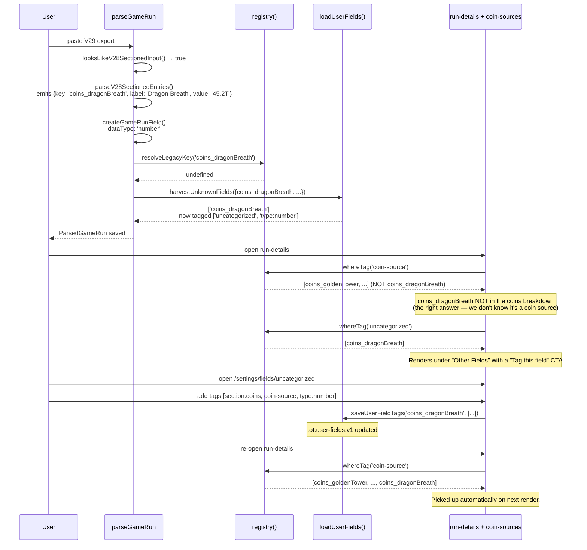

# Approach 8: Trait / Tag-Based Capability System

**Status:** Deep-dive · **Parent:** [EXPLORATION-field-registry-architecture.md](../EXPLORATION-field-registry-architecture.md)
**Effort:** Medium · **Payoff:** High · **Novelty:** High

---

## 1. Abstract & motivation

Every "category" in the current codebase is really a boolean predicate hiding inside an array. `COIN_FIELDS` is the set where `isCoinSource === true`. `BATTLE_REPORT_ESSENTIAL` is the set where `isSummary === true`. `INTENTIONALLY_DROPPED_V2_FIELDS` is the set where `wasRemovedInV28 === true`. The manifest approach (approach 2) turns those arrays into boolean columns on a single row per field. The trait/tag approach goes one step further: every field has a *set* of tags, UIs *query by tag*, and the relationship between field and UI is re-expressible at any time without editing the field.

The power is that fields legitimately belong to many categories. `coins_goldenTower` is simultaneously a coin-source, a golden-effect, part of the economic section, a numeric type, and a sourceship contributor to `battleReport_coinsEarned`. Expressing those memberships as tags — `'coin-source'`, `'category:golden-effects'`, `'section:coins'`, `'type:number'`, `'source-of:battleReport_coinsEarned'` — and letting each UI query what it cares about is strictly more flexible than boolean columns on a manifest row. Adding a new field is "decide which tags apply." Adding a new UI view is "decide which tags it queries." The tag catalog *is* the schema, and it is queryable, not just readable.

The honest caveat is tag sprawl. Without discipline a trait system becomes a secondary schema — half-documented, non-exhaustive, with stringly-typed queries that fail silently on a typo. The mitigation throughout: (a) tags are a typed string literal union, (b) namespaced tags get typed constructors, (c) invariant tests assert tag cardinalities, (d) a canonical `Tag` union is the single source of truth.

## 2. How it works

```
                       Tag catalog (TS union type)
                                  |
                                  v
    +------------------------------------------------------------------+
    |                                                                  |
    |  defineField('coins_goldenTower', { tags: [...] })               |
    |  defineField('damage_deathWave',  { tags: [...] })               |
    |  defineField('battleReport_tier', { tags: [...] })               |
    |          ...                                                     |
    |                                                                  |
    +------------------------------------------------------------------+
                                  |
                                  v
                  +--------------------------------+
                  |  registry.ts (tag index)       |
                  |    tagToFields: Map<Tag, Set>  |
                  |    fieldToTags: Map<Key,  Set> |
                  |    ns('source-of', key) index  |
                  +--------------------------------+
                                  |
              +-------------------+-------------------+
              |                                       |
              v                                       v
    fields.whereTag('coin-source')     fields.whereAllTags(['summary', 'type:number'])
    fields.whereAnyTag([...])          fields.exceptTag('v27-removed')
    fields.whereNamespacedTag('source-of', 'battleReport_coinsEarned')
                                  |
                                  v
    +------------------------------------------------------------------+
    |  Consumers (unchanged API surface, now driven by tags):          |
    |    COIN_FIELDS           = whereTag('coin-source')               |
    |    DAMAGE_FIELDS         = whereTag('damage-source')             |
    |    BATTLE_REPORT_ESSENTIAL = whereTag('summary')                 |
    |    INTENTIONALLY_DROPPED = whereTag('v27-removed')               |
    |    TIER_TRENDS_CHART     = whereTag('chart:tier-trends')         |
    +------------------------------------------------------------------+
```

Three kinds of tags, all flat strings under the hood:

1. **Capability tags** — `'coin-source'`, `'damage-source'`, `'summary'`, `'per-hour-rate'`. Answer "what can this field do in the app?"
2. **Categorical tags** — `'section:coins'`, `'category:economic'`, `'type:number'`. Answer "what is this field?"
3. **Namespaced relationship tags** — `'source-of:battleReport_coinsEarned'`, `'renamed-from:coinsFromGoldenTower'`. Answer "what does this field relate to?" These are graph edges with the type encoded in the namespace prefix.

Namespaced tags are where this approach starts reaching into approach 7's territory. We keep them flat strings — no node-and-edge object model — but we give them typed constructors so the payload after the colon is always a valid field key.

## 3. Evaluation

### 3.a Adding a new V29 field

Today, adding `coins_dragonBreath` requires editing ~7 files: parser, `supportedFields.json`, `v2-to-v3-field-map.ts`, `field-utils.ts` type detection, `coin-sources.ts`, `section-config.ts`, and chart color literals.

With tags:

```ts
defineField('coins_dragonBreath', {
  tags: ['section:coins', 'category:economic', 'coin-source',
         'source-of:battleReport_coinsEarned', 'type:number', 'v29-new'],
  display: 'Dragon Breath',
  color: '#f97316',
});
```

Every consumer that queries `'coin-source'` picks up the new field on the next render. The decision becomes "which tags apply?" instead of "which 7 files do I edit?"

### 3.b Renaming a field

Renames are expressed as a `renamed-from:<old-key>` tag on the new field:

```ts
defineField('coins_blackHole', {
  tags: [
    'section:coins',
    'coin-source',
    'type:number',
    'renamed-from:coinsFromBlackHole',
    'renamed-from:coinsFromBlackhole', // lowercase-h V2 variant
  ],
  display: 'Black Hole',
  color: '#475569',
});
```

Migration code becomes `registry.whereNamespacedTag('renamed-from', legacyKey)` — returns one field (or zero, or — caught by invariant — more than one). The V2-to-V3 map dissolves into per-field declarations. The inverse-check test iterates tags instead of a separate map.

### 3.c Adding a new UI view

A new "Golden Effects Dashboard" becomes a one-line query: `registry.whereTag('category:golden-effects')`. If the tag already exists on the relevant fields, no per-field edit is needed. If not, adding it is a one-line change per field. **The UI declares its needs in tag form, the fields declare their identity in tag form, the match is computed at runtime.**

### 3.d Discoverability

"Where is `coins_goldenTower` used?" becomes (1) open the field declaration to read its tags, (2) grep each tag across the codebase to find consumers, (3) cross-reference. Today the same question requires grepping the literal field name, hoping nothing uses a dynamic lookup. With tags, lookups are *intentionally* tag-indirected, so they're discoverable.

### 3.e Silent-break modes

Forgetting a tag silently drops a field from a view — exactly the V28 drift pattern. Mitigations:

- **Cardinality invariants.** Per tag, assert a minimum field count. `coin-source >= 10`, `summary === 5`. A field that *should* carry the tag but doesn't fails as "cardinality regression."
- **Typed tag union.** A misspelled tag is a compile error, not a silent no-op.
- **Consumer round-trip tests.** `COIN_FIELDS` is now `registry.whereTag('coin-source')`; a test asserts every expected key is present.
- **Exclusivity invariants.** `type:*` and `section:*` are mutually exclusive — a test asserts exactly one of each per field.

### 3.f File tree impact

```
src/shared/domain/fields/
  registry/
    tag-catalog.ts          <-- THE tag union + namespaced constructors
    define-field.ts         <-- defineField(key, config) factory
    registry.ts             <-- builds tagToFields + fieldToTags indexes
    query.ts                <-- whereTag / whereAllTags / whereAnyTag / ...
    query.test.ts
    invariants.test.ts      <-- cardinality + exclusivity tests
    fields/
      battle-report.ts      <-- all battleReport_* field declarations
      coins.ts              <-- all coins_* declarations
      damage.ts             <-- all damage_* declarations
      damage-blocked.ts
      damage-taken.ts
      currencies.ts
      cash.ts
      counts.ts
      utility.ts
      records.ts
      total-enemies.ts
      enemies-hit-by.ts
      enemies-destroyed-by.ts
      killed-with-effect-active.ts
      health-regenerated.ts
      index.ts              <-- imports all field files, calls defineField on each
```

The existing `coin-sources.ts`, `damage-sources.ts`, half of `section-config.ts`, `v2-to-v3-field-map.ts`, `intentionally-dropped.ts`, and chart color literals all become derived from the per-category field files. Net line count is roughly flat; addressability improves dramatically.

### 3.g Concrete code samples

#### The tag type

The tag union is the schema. It is authored by hand, deliberately, and grows slowly.

```ts
// src/shared/domain/fields/registry/tag-catalog.ts

/**
 * Section tags — which display section the field belongs to in
 * run-details card view. Exactly one must be present per field.
 */
export type SectionTag =
  | 'section:battle-report'
  | 'section:coins'
  | 'section:damage'
  | 'section:damage-taken'
  | 'section:damage-blocked'
  | 'section:enemies'
  | 'section:records'
  | 'section:currencies'
  | 'section:cash'
  | 'section:counts'
  | 'section:utility';

/**
 * Category tags — cross-cutting semantic groupings. A field can have
 * zero or more. Distinct from section, which is where it *displays*;
 * category is what it *is*.
 */
export type CategoryTag =
  | 'category:economic'
  | 'category:combat'
  | 'category:defense'
  | 'category:enemies'
  | 'category:progression'
  | 'category:golden-effects'
  | 'category:guardian-legacy';

/**
 * Capability tags — what the field can do in the app. These drive
 * feature inclusion: a field carrying 'coin-source' appears in the
 * coins breakdown automatically.
 */
export type CapabilityTag =
  | 'coin-source'
  | 'damage-source'
  | 'damage-blocked-source'
  | 'enemies-hit-by-source'
  | 'enemies-destroyed-by-source'
  | 'killed-with-effect-active-source'
  | 'summary'
  | 'per-hour-rate'
  | 'currency'
  | 'record';

/**
 * Type tags — drive parser type detection and formatter selection.
 * Exactly one must be present per field.
 */
export type TypeTag =
  | 'type:number'
  | 'type:duration'
  | 'type:date'
  | 'type:string';

/**
 * Lifecycle tags — version provenance. Used by migrations and the
 * intentionally-dropped invariant test.
 */
export type LifecycleTag =
  | 'v27-removed'     // existed in V27 data, removed in V28
  | 'v28-new'         // introduced in V28
  | 'v29-new';        // placeholder for future-proofing

/**
 * Chart tags — which charts include the field in their default
 * selection. Read by the chart's field-selection hook.
 */
export type ChartTag =
  | 'chart:tier-trends'
  | 'chart:time-series'
  | 'chart:deaths-radar';

/**
 * Namespaced tags — graph-lite edges. The part after the colon is
 * a field key. Use `sourceOf(key)` / `renamedFrom(key)` constructors
 * rather than writing literals, so the payload is compile-checked.
 */
export type NamespacedTag =
  | `source-of:${string}`
  | `renamed-from:${string}`
  | `derived-from:${string}`;

export type Tag =
  | SectionTag
  | CategoryTag
  | CapabilityTag
  | TypeTag
  | LifecycleTag
  | ChartTag
  | NamespacedTag;

/** Typed constructor — fails at compile time if `key` isn't a string. */
export const sourceOf = <K extends string>(key: K): `source-of:${K}` =>
  `source-of:${key}`;

export const renamedFrom = <K extends string>(key: K): `renamed-from:${K}` =>
  `renamed-from:${key}`;

export const derivedFrom = <K extends string>(key: K): `derived-from:${K}` =>
  `derived-from:${key}`;
```

The full set enumerated above is >20 real tags covering every cross-cutting concern currently scattered across the codebase.

#### The field declaration DSL

```ts
// src/shared/domain/fields/registry/define-field.ts

import type { Tag } from './tag-catalog';

export interface FieldDefinition {
  key: string;
  tags: ReadonlyArray<Tag>;
  display: string;
  color?: string;
}

// Accumulates declarations; consumed by registry.ts at module load.
const definitions = new Map<string, FieldDefinition>();

export function defineField(
  key: string,
  config: Omit<FieldDefinition, 'key'>,
): FieldDefinition {
  if (definitions.has(key)) {
    throw new Error(`Field "${key}" already defined`);
  }
  const def: FieldDefinition = { key, ...config };
  definitions.set(key, def);
  return def;
}

export function allDefinitions(): ReadonlyMap<string, FieldDefinition> {
  return definitions;
}
```

#### The registry

```ts
// src/shared/domain/fields/registry/registry.ts

import { allDefinitions, type FieldDefinition } from './define-field';
import type { Tag } from './tag-catalog';

export interface FieldRegistry {
  get(key: string): FieldDefinition | undefined;
  all(): ReadonlyArray<FieldDefinition>;
  whereTag(tag: Tag): ReadonlyArray<FieldDefinition>;
  whereAllTags(tags: ReadonlyArray<Tag>): ReadonlyArray<FieldDefinition>;
  whereAnyTag(tags: ReadonlyArray<Tag>): ReadonlyArray<FieldDefinition>;
  exceptTag(tag: Tag): ReadonlyArray<FieldDefinition>;
  whereNamespacedTag(namespace: string, value: string): ReadonlyArray<FieldDefinition>;
  tagsFor(key: string): ReadonlyArray<Tag>;
}

export function buildRegistry(): FieldRegistry {
  const byKey = allDefinitions();
  const all = [...byKey.values()];

  const tagToFields = new Map<Tag, FieldDefinition[]>();
  for (const def of all) {
    for (const tag of def.tags) {
      const bucket = tagToFields.get(tag) ?? [];
      bucket.push(def);
      tagToFields.set(tag, bucket);
    }
  }

  const has = (def: FieldDefinition, tag: Tag): boolean =>
    def.tags.includes(tag);

  return {
    get: (key) => byKey.get(key),
    all: () => all,
    whereTag: (tag) => tagToFields.get(tag) ?? [],
    whereAllTags: (tags) => all.filter((d) => tags.every((t) => has(d, t))),
    whereAnyTag: (tags) => all.filter((d) => tags.some((t) => has(d, t))),
    exceptTag: (tag) => all.filter((d) => !has(d, tag)),
    whereNamespacedTag: (namespace, value) => {
      const prefix = `${namespace}:${value}`;
      return all.filter((d) => d.tags.some((t) => t === prefix));
    },
    tagsFor: (key) => byKey.get(key)?.tags ?? [],
  };
}

// Single global registry, lazily built.
let cached: FieldRegistry | undefined;
export const registry = (): FieldRegistry => (cached ??= buildRegistry());
```

#### ~30 real field declarations

```ts
// src/shared/domain/fields/registry/fields/battle-report.ts
import { defineField } from '../define-field';
import { derivedFrom } from '../tag-catalog';

defineField('battleReport_tier',     { tags: ['section:battle-report', 'summary', 'type:number'],   display: 'Tier' });
defineField('battleReport_wave',     { tags: ['section:battle-report', 'summary', 'type:number'],   display: 'Wave' });
defineField('battleReport_killedBy', { tags: ['section:battle-report', 'summary', 'type:string'],   display: 'Killed By' });
defineField('battleReport_gameTime', { tags: ['section:battle-report', 'summary', 'type:duration'], display: 'Game Time' });
defineField('battleReport_realTime', { tags: ['section:battle-report', 'summary', 'type:duration'], display: 'Real Time' });

defineField('battleReport_coinsEarned', {
  tags: ['section:battle-report', 'category:economic', 'summary', 'type:number', 'chart:tier-trends'],
  display: 'Coins Earned',
});
defineField('battleReport_coinsPerHour', {
  tags: ['section:battle-report', 'category:economic', 'per-hour-rate', 'type:number',
         derivedFrom('battleReport_coinsEarned')],
  display: 'Coins / Hour',
});
defineField('battleReport_cellsEarned', {
  tags: ['section:battle-report', 'category:economic', 'summary', 'type:number', 'chart:tier-trends'],
  display: 'Cells Earned',
});
```

```ts
// src/shared/domain/fields/registry/fields/coins.ts
import { defineField } from '../define-field';
import { sourceOf, renamedFrom, type Tag } from '../tag-catalog';

// Every coin field shares these tags — extract to a base.
const coinBase: ReadonlyArray<Tag> = [
  'section:coins', 'category:economic', 'coin-source', 'type:number',
  sourceOf('battleReport_coinsEarned'),
];

defineField('coins_deathWave', {
  tags: [...coinBase, renamedFrom('coinsFromDeathWave')],
  display: 'Death Wave', color: '#ef4444',
});
defineField('coins_goldenTower', {
  tags: [...coinBase, 'category:golden-effects', renamedFrom('coinsFromGoldenTower')],
  display: 'Golden Tower', color: '#fbbf24',
});
defineField('coins_spotlight', {
  tags: [...coinBase, renamedFrom('coinsFromSpotlight')],
  display: 'Spotlight', color: '#e2e8f0',
});
defineField('coins_goldenBot', {
  tags: [...coinBase, 'category:golden-effects', renamedFrom('goldenBotCoinsEarned')],
  display: 'Golden Bot', color: '#fbbf24',
});
defineField('coins_blackHole', {
  // Two renamed-from tags: V2 had both camelCase and lowercase-h spellings.
  tags: [...coinBase, renamedFrom('coinsFromBlackHole'), renamedFrom('coinsFromBlackhole')],
  display: 'Black Hole', color: '#475569',
});
defineField('coins_coinsFetched', {
  tags: [...coinBase, 'category:guardian-legacy'],
  display: 'Guardian Fetched', color: '#7c3aed',
});
defineField('coins_goldenCombo', {
  tags: [...coinBase, 'category:golden-effects'],
  display: 'Golden Combo', color: '#eab308',
});
```

```ts
// src/shared/domain/fields/registry/fields/damage.ts
import { defineField } from '../define-field';
import { sourceOf, renamedFrom, type Tag } from '../tag-catalog';

const damageBase: ReadonlyArray<Tag> = [
  'section:damage', 'category:combat', 'damage-source', 'type:number',
  sourceOf('damage_damageDealt'),
];

defineField('damage_damageDealt', {
  tags: ['section:damage', 'category:combat', 'summary', 'type:number',
         renamedFrom('damage'), renamedFrom('damageDealt')],
  display: 'Damage Dealt',
});

defineField('damage_deathWave',      { tags: [...damageBase, renamedFrom('deathWaveDamage')],      display: 'Death Wave',      color: '#ef4444' });
defineField('damage_chainLightning', { tags: [...damageBase, renamedFrom('chainLightningDamage')], display: 'Chain Lightning', color: '#3b82f6' });
defineField('damage_orbs',           { tags: [...damageBase, renamedFrom('orbDamage')],            display: 'Orbs',            color: '#f87171' });
defineField('damage_landMines',      { tags: [...damageBase, renamedFrom('landMineDamage')],       display: 'Land Mines',      color: '#9333ea' });
defineField('damage_blackHole',      { tags: [...damageBase, renamedFrom('blackHoleDamage')],      display: 'Black Hole',      color: '#475569' });
```

```ts
// src/shared/domain/fields/registry/fields/currencies.ts
import { defineField } from '../define-field';
import { renamedFrom } from '../tag-catalog';

const currency = (key: string, legacy: string, display: string, color: string) =>
  defineField(key, {
    tags: ['section:currencies', 'currency', 'type:number', renamedFrom(legacy)],
    display,
    color,
  });

currency('currencies_gems',        'gems',        'Guardian Gems',  '#a855f7');
currency('currencies_medals',      'medals',      'Guardian Medals', '#facc15');
currency('currencies_armorShards', 'armorShards', 'Armor Shards',    '#64748b');
currency('currencies_coreShards',  'coreShards',  'Core Shards',     '#f59e0b');
```

```ts
// src/shared/domain/fields/registry/fields/records.ts
import { defineField } from '../define-field';

defineField('records_highestCoinsMinute', {
  tags: ['section:records', 'record', 'type:number'],
  display: 'Highest Coins / Minute',
});
defineField('records_largestGoldenCombo', {
  tags: ['section:records', 'record', 'category:golden-effects', 'type:number'],
  display: 'Largest Golden Combo',
});
defineField('records_mostCoinsFromGoldenCombo', {
  tags: ['section:records', 'record', 'category:golden-effects', 'type:number'],
  display: 'Most Coins From Golden Combo',
});
```

```ts
// src/shared/domain/fields/registry/fields/counts.ts
import { defineField } from '../define-field';

for (const [key, display] of [
  ['counts_wavesSkipped', 'Waves Skipped'],
  ['counts_deathDefy',    'Death Defy'],
  ['counts_demonMode',    'Demon Mode'],
] as const) {
  defineField(key, { tags: ['section:counts', 'type:number'], display });
}
```

```ts
// src/shared/domain/fields/registry/fields/dropped-v27.ts
// Intentionally dropped — present for the inverse-check invariant test.

import { defineField } from '../define-field';
import { renamedFrom } from '../tag-catalog';

defineField('__dropped_coinsStolen', {
  tags: ['v27-removed', 'category:guardian-legacy', renamedFrom('coinsStolen')],
  display: '(removed) Coins Stolen',
});

defineField('__dropped_damageGainFromBerserk', {
  tags: ['v27-removed', renamedFrom('damageGainFromBerserk')],
  display: '(removed) Berserk Damage Gain',
});
```

The `__dropped_*` prefix marks tombstones — they are never rendered, only present so that the V2 inverse-check test can resolve legacy keys via the `renamed-from:*` tag.

#### Consumer refactors

The existing `COIN_FIELDS` hand-authored array becomes derived:

```ts
// src/shared/domain/fields/breakdown-sources/coin-sources.ts

import { registry } from '../registry/registry';
import type { FieldConfig } from './types';

export const COIN_FIELDS: ReadonlyArray<FieldConfig> = registry()
  .whereTag('coin-source')
  .map((def) => ({
    fieldName: def.key,
    displayName: def.display,
    color: def.color ?? '#94a3b8',
  }));
```

Same shape, same API, zero consumer breakage — but adding a new coin source no longer requires editing this file. The section-config essentials list becomes:

```ts
// src/features/game-runs/card-view/run-details/section-config.ts

import { registry } from '@/shared/domain/fields/registry/registry';

export const BATTLE_REPORT_ESSENTIAL: PlainFieldsConfig = {
  fields: registry()
    .whereAllTags(['section:battle-report', 'summary'])
    .map((def) => ({ fieldName: def.key, displayName: def.display })),
};
```

The intentionally-dropped migration check:

```ts
// src/shared/domain/migrations/intentionally-dropped.ts

import { registry } from '@/shared/domain/fields/registry/registry';

// V2 keys that resolve to a v27-removed field are intentionally dropped.
export const INTENTIONALLY_DROPPED_V2_KEYS: ReadonlySet<string> = new Set(
  registry()
    .whereTag('v27-removed')
    .flatMap((def) =>
      def.tags
        .filter((t): t is `renamed-from:${string}` => t.startsWith('renamed-from:'))
        .map((t) => t.slice('renamed-from:'.length)),
    ),
);
```

The V2-to-V3 map:

```ts
// src/shared/domain/migrations/v2-to-v3-field-map.ts

import { registry } from '@/shared/domain/fields/registry/registry';

export const V2_TO_V3_FIELD_MAP: Readonly<Record<string, string>> =
  Object.fromEntries(
    registry()
      .all()
      .flatMap((def) =>
        def.tags
          .filter((t): t is `renamed-from:${string}` => t.startsWith('renamed-from:'))
          .map((t) => [t.slice('renamed-from:'.length), def.key] as const),
      ),
  );
```

Three hand-authored files collapse into a single query each.

#### Invariant tests

```ts
// src/shared/domain/fields/registry/invariants.test.ts

import { describe, expect, it } from 'vitest';
import { registry } from './registry';
import './fields'; // side-effect import registers every field

describe('tag cardinality invariants', () => {
  it('coin-source tag has expected field count', () => {
    // Guards against someone silently dropping a field off the tag.
    expect(registry().whereTag('coin-source').length).toBeGreaterThanOrEqual(10);
  });

  it('damage-source tag has expected field count', () => {
    expect(registry().whereTag('damage-source').length).toBeGreaterThanOrEqual(12);
  });

  it('summary tag appears on exactly the 5 battle-report essentials', () => {
    const essentials = registry().whereAllTags(['section:battle-report', 'summary']);
    expect(essentials.map((d) => d.key)).toEqual([
      'battleReport_tier',
      'battleReport_wave',
      'battleReport_killedBy',
      'battleReport_gameTime',
      'battleReport_realTime',
    ]);
  });
});

describe('tag exclusivity invariants', () => {
  it('every field has exactly one type:* tag', () => {
    for (const def of registry().all()) {
      const typeTags = def.tags.filter((t) => t.startsWith('type:'));
      expect(typeTags, `field ${def.key}`).toHaveLength(1);
    }
  });

  it('every non-dropped field has exactly one section:* tag', () => {
    const nonDropped = registry().exceptTag('v27-removed');
    for (const def of nonDropped) {
      const sectionTags = def.tags.filter((t) => t.startsWith('section:'));
      expect(sectionTags, `field ${def.key}`).toHaveLength(1);
    }
  });
});

describe('namespaced tag integrity', () => {
  it('every source-of:<key> references a defined field', () => {
    for (const def of registry().all()) {
      for (const tag of def.tags) {
        if (tag.startsWith('source-of:')) {
          const targetKey = tag.slice('source-of:'.length);
          expect(registry().get(targetKey), `${def.key} -> ${targetKey}`).toBeDefined();
        }
      }
    }
  });

  it('renamed-from:<key> values are unique across all fields', () => {
    const seen = new Map<string, string>();
    for (const def of registry().all()) {
      for (const tag of def.tags) {
        if (tag.startsWith('renamed-from:')) {
          const legacy = tag.slice('renamed-from:'.length);
          const prev = seen.get(legacy);
          expect(prev, `${legacy} claimed by ${prev} and ${def.key}`).toBeUndefined();
          seen.set(legacy, def.key);
        }
      }
    }
  });
});
```

These tests convert every silent-drift class into a loud red build.

### 3.h Pros, cons, honest critique

**Pros.**

- Adding a tag to a field propagates to every consumer automatically.
- Fields belong to many categories cleanly — orthogonal memberships are first-class.
- Querying is cheap and multi-dimensional. `whereAllTags(['category:golden-effects', 'coin-source'])` is a one-liner.
- The tag catalog in one file *is* the schema. New contributors read the union type and understand the app.
- Migrates cleanly — existing consumer arrays keep their API, their bodies just become queries.

**Cons.**

- **Tag sprawl.** Without discipline the union grows into a half-documented secondary schema. When does `category:golden-effects` stop being useful? No natural pressure against sprawl other than review.
- **Namespaced tags blur into the graph approach.** `source-of:<key>` is a degenerate typed edge. If you want edge metadata (`{ weight, confidence }`) you have re-invented approach 7 badly — upgrade instead.
- **Type safety requires maintenance.** A typo fails at compile time *only if* consumers use the union literal. String-building queries (`whereTag(maybeDynamicTag)`) escape the type system — ban them via lint or review.
- **Stringly-typed query surface.** `whereAllTags(['foo', 'bar'])` doesn't document *why*. Extract named helpers: `registry.coinSources() = whereTag('coin-source')`.
- **Ordering is implicit.** `whereTag` returns `defineField`-call order. If the breakdown pie needs an independent order, add an `order` field — more per-field metadata.

**Mitigations baked into the design above:** typed `Tag` union + constructors (`sourceOf`, `renamedFrom`), cardinality invariants, exclusivity invariants (`section:*`, `type:*`), referential integrity for namespaced tags, encouraged named helpers.

### 3.i When this wins / loses

**Wins when:** multi-category membership is common (a field in 3+ categories); new categories are added frequently (new dashboards become tag queries, not new columns); features need flat queryability along many axes; the drift pain is "UI forgot to include a field" rather than "two files disagree about a value."

**Loses when:** relationships are rich and directional with edge metadata (upgrade to approach 7); per-field metadata is structurally complex with 15 varying properties (approach 2's typed columns are cleaner); the domain is small and stable (a hand-authored manifest is simpler).

## 4. Compare / contrast with other approaches

**vs Approach 2 (Central Manifest).** Tags are a form of manifest — row-per-field with a many-to-many tag relation instead of columns. Boolean columns (`isCoinSource`) are functionally equivalent to capability tags (`'coin-source'`), but tags scale better when columns multiply and admit namespaced relationships (`source-of:<key>`) that would be awkward as columns. The `defineField` DSL can populate a manifest view — the two are compatible.

**vs Approach 7 (Relationship Graph).** Tags are flat edges without edge types beyond the namespace prefix. A graph has first-class edges with their own properties; tags have strings. For this app, namespaced tags cover the needs — `whereNamespacedTag('source-of', 'battleReport_coinsEarned')`. The graph wins when edges carry metadata ("source of with weight 0.3") or need traversal ("transitive sources").

**vs Approach 5 (Composable File-Per-Field).** Capability registration is tag-adjacent — each registration effectively adds a tag. The difference is direction: approach 5 calls `coinSource.register(field)` from the coin-source module (outward push); approach 8 declares `'coin-source'` on the field (inward pull). Tags are lighter but less expressive — they can't carry behavior (custom formatters, predicates). A pragmatic middle ground: tags for membership + a small override map for behavior.

**vs Approach 1 (Invariant Tests).** The tag approach subsumes most invariants into schema. Cardinality tests now assert against a structured registry instead of comparing pairs of hand-authored files. Start with approach 1; upgrade to 8 when the invariants start feeling like they're re-deriving a manifest.

## 5. Migration plan

Incremental. Start with one tag, prove the pattern, extend.

**Phase 1 — Bootstrap one tag.** Build `registry/` (`tag-catalog.ts`, `define-field.ts`, `registry.ts`, `query.ts`). Create `registry/fields/coins.ts` with the 14 coin fields, tagged with `'coin-source'`, section/category/type, and `source-of:battleReport_coinsEarned`. Replace `COIN_FIELDS` with `registry().whereTag('coin-source').map(...)`. Consumers see no API change. Ship.

**Phase 2 — Second tag.** Add `'damage-source'`, migrate `DAMAGE_FIELDS`. Add cardinality invariants for both tags.

**Phase 3 — Section and summary tags.** Introduce `'section:*'` and `'summary'`. Migrate `BATTLE_REPORT_ESSENTIAL` and the section-config breakdowns. Add exclusivity invariants (one `section:*` per field).

**Phase 4 — Lifecycle and rename tags.** Introduce `'v27-removed'` and `renamed-from:<key>`. Migrate `INTENTIONALLY_DROPPED_V2_FIELDS` and `V2_TO_V3_FIELD_MAP` to derive from tags. Highest-payoff phase — these are the most drift-prone files.

**Phase 5 — Type and chart tags.** Introduce `'type:*'` (registry-first type detection in `field-utils.ts`, heuristic fallback) and `'chart:*'` (default chart field selection).

**Phase 6 — Close out legacy.** Thin `coin-sources.ts` / `damage-sources.ts` to re-exports. Collapse `v2-to-v3-field-map.ts` to a one-line query. Make `sampleData/supportedFields.json` a snapshot derived from `registry().all().map(d => d.key).sort()`.

Consumer APIs stay stable until Phase 6. Bail out at any phase and the system is still consistent — one more tag-driven consumer than before.

---

## 9. Questions from the first read

This section answers the specific questions raised after reading sections 1-8. Where the earlier sketch is ambiguous or incomplete, that is called out explicitly rather than papered over.

### 9.a Renamed-from lookup during parse

The existing `remapV2FieldKeys` (see `src/shared/domain/migrations/remap-v2-field-keys.ts`) does a direct `V2_TO_V3_FIELD_MAP[key]` lookup. Under the tag system the map disappears — in its place, a resolver indexes every `renamed-from:<legacyKey>` tag at registry-build time and produces the same O(1) lookup.

The tag system must not force every consumer to iterate tags at runtime. Build the inverse index once, in `registry.ts`:

```ts
// src/shared/domain/fields/registry/registry.ts (additions)

export interface FieldRegistry {
  // ...existing members...
  /** O(1) lookup from a legacy V2 key to the current canonical field. */
  resolveLegacyKey(legacyKey: string): FieldDefinition | undefined;
}

export function buildRegistry(): FieldRegistry {
  const byKey = allDefinitions();
  const all = [...byKey.values()];

  // Same tagToFields / fieldToTags indexes as before, plus:
  const legacyToDef = new Map<string, FieldDefinition>();
  for (const def of all) {
    for (const tag of def.tags) {
      if (tag.startsWith('renamed-from:')) {
        const legacy = tag.slice('renamed-from:'.length);
        const prev = legacyToDef.get(legacy);
        if (prev && prev.key !== def.key) {
          throw new Error(
            `renamed-from:${legacy} claimed by both ${prev.key} and ${def.key}`
          );
        }
        legacyToDef.set(legacy, def);
      }
    }
  }

  return {
    // ...existing members...
    resolveLegacyKey: (legacyKey) => legacyToDef.get(legacyKey),
  };
}
```

The parse-pipeline call site becomes a drop-in replacement for `V2_TO_V3_FIELD_MAP[key]`:

```ts
// src/shared/domain/migrations/remap-v2-field-keys.ts (tag-backed)

import { registry } from '@/shared/domain/fields/registry/registry';
import type { GameRunField } from '@/shared/types/game-run.types';

export function remapV2FieldKeys(
  fields: Record<string, GameRunField>
): Record<string, GameRunField> {
  const reg = registry();
  const result: Record<string, GameRunField> = {};

  for (const [key, field] of Object.entries(fields)) {
    if (key.startsWith('_')) { result[key] = field; continue; }

    const target = reg.resolveLegacyKey(key);
    if (!target) { result[key] = field; continue; }

    // v27-removed tombstones: discard silently, same as INTENTIONALLY_DROPPED.
    if (target.tags.includes('v27-removed')) continue;

    const existing = result[target.key];
    if (!existing) result[target.key] = field;
    else if (field.rawValue) result[target.key] = field; // last non-empty wins
  }

  return result;
}
```

Specifically for `coinsFromGoldenTower`: `coins_goldenTower` declares `renamedFrom('coinsFromGoldenTower')` (see section 3.g). `buildRegistry` populates `legacyToDef.set('coinsFromGoldenTower', coinsGoldenTowerDef)`. `remapV2FieldKeys` calls `reg.resolveLegacyKey('coinsFromGoldenTower')` and writes the `GameRunField` under `coins_goldenTower`.

**Contrast with the current map.** Two things change:
1. The declaration moves from `v2-to-v3-field-map.ts` (one row per legacy key) to the field's own declaration (`renamedFrom('coinsFromGoldenTower')` as a tag). A field that carries three legacy spellings — like `coins_blackHole` which carries both `coinsFromBlackHole` and `coinsFromBlackhole` — lists three `renamed-from:*` tags rather than two rows in the map.
2. The inverse-check test from `v2-v3-schema-inverse-check.test.ts` becomes a walk over `renamed-from:*` tags: every legacy key must resolve to a defined field, or the field's `v27-removed` tag must be present. The test stays, the declaration moves.

**Where in the parse pipeline.** `parseGameRun` in `src/features/analysis/shared/parsing/data-parser.ts` calls `remapV2FieldKeys` only on the flat-paste branch (`!isSectioned`). The sectioned V28 branch emits V3 keys directly. Nothing about the routing changes. The tag system just replaces the lookup table inside `remapV2FieldKeys`.

### 9.b `__dropped_*` field lookup

The existing sketch in section 3.g uses synthetic keys like `__dropped_coinsStolen` and declares them with `renamedFrom('coinsStolen')` + `'v27-removed'`. When a V27 CSV carries `coinsStolen`, the resolver flow is:

1. `remapV2FieldKeys` calls `reg.resolveLegacyKey('coinsStolen')`.
2. That returns the `__dropped_coinsStolen` definition.
3. The caller checks `target.tags.includes('v27-removed')` and discards the field.

This works as described. Two clarifications the existing sketch leaves ambiguous:

**The synthetic key must never render.** `__dropped_*` fields are tombstones — they exist so that `resolveLegacyKey` returns something non-undefined (so "dropped" and "unknown" are distinguishable). Every tag consumer must exclude them. The cleanest way is a canonical query helper:

```ts
// src/shared/domain/fields/registry/registry.ts (addition)

export interface FieldRegistry {
  // ...
  /** Active fields — excludes dropped tombstones. Use this everywhere UI renders. */
  active(): ReadonlyArray<FieldDefinition>;
}

// In buildRegistry:
active: () => all.filter((d) => !d.tags.includes('v27-removed')),
```

Every `whereTag`/`whereAllTags` consumer either calls `.active()` first, or the queries themselves filter by default. The simplest rule: `whereTag` stays literal (returns the dropped ones too, useful for invariants), and consumer helpers call `.active()` explicitly.

**The `__` prefix is load-bearing.** The parser in `parseV28SectionedEntries` generates keys via `${sectionCamel}_${labelCamel}` and will never emit a leading underscore. Reserving `__` for tombstones means no collision is possible. Document this in the tag catalog, and enforce it in `defineField`:

```ts
// src/shared/domain/fields/registry/define-field.ts (addition)

export function defineField(key: string, config: Omit<FieldDefinition, 'key'>) {
  const isTombstone = key.startsWith('__');
  const isV27Removed = config.tags.includes('v27-removed');
  if (isTombstone !== isV27Removed) {
    throw new Error(
      `Tombstone/key mismatch on "${key}": __-prefixed keys must carry v27-removed`
    );
  }
  // ...rest of existing logic
}
```

**Current code contrast.** Today's `INTENTIONALLY_DROPPED_V2_FIELDS` (see `src/shared/domain/migrations/intentionally-dropped.ts`) is a flat map with reason strings. Under the tag system those reason strings move into a per-tombstone `deprecationReason` property on `FieldDefinition`, or are baked into the display name as the existing sketch does (`'(removed) Coins Stolen'`). Either works. I'd keep a structured `deprecationReason` so the tag viewer (9.e) can surface it.

### 9.c Internal app-fields

`_date`, `_time`, `_notes`, `_runType`, `_rank` (see `src/shared/domain/fields/internal-field-config.ts`) are app-generated, not game-exported. They must live in the registry for three reasons: the tag viewer should show them, legacy field migration (`date` → `_date`) uses the same `renamed-from:*` mechanism, and consumers that iterate `registry().active()` expect them to be discoverable.

Add a `'source:internal'` capability tag (or `'internal'`, bikeshed) so they are filterable independently of game fields:

```ts
// src/shared/domain/fields/registry/tag-catalog.ts (additions)

export type SourceTag =
  | 'source:game-export'   // present in the V28 game export
  | 'source:internal'      // app-generated metadata (date, notes, run type)
  | 'source:derived';      // computed from other fields (per-hour rates)

// Add to the Tag union.

export type InternalFieldTag =
  | 'internal:date'
  | 'internal:time'
  | 'internal:notes'
  | 'internal:run-type'
  | 'internal:rank';
```

```ts
// src/shared/domain/fields/registry/fields/internal.ts
import { defineField } from '../define-field';
import { renamedFrom } from '../tag-catalog';

defineField('_date', {
  tags: ['source:internal', 'internal:date', 'type:date',
         renamedFrom('date')],
  display: 'Date',
});

defineField('_time', {
  tags: ['source:internal', 'internal:time', 'type:date',
         renamedFrom('time')],
  display: 'Time',
});

defineField('_notes', {
  tags: ['source:internal', 'internal:notes', 'type:string',
         renamedFrom('notes')],
  display: 'Notes',
});

defineField('_runType', {
  tags: ['source:internal', 'internal:run-type', 'type:string',
         renamedFrom('runType'), renamedFrom('run_type')],
  display: 'Run Type',
});

defineField('_rank', {
  tags: ['source:internal', 'internal:rank', 'type:string',
         renamedFrom('rank'), renamedFrom('placement')],
  display: 'Rank',
});
```

Consumers distinguish game vs. internal by tag:
- `registry().whereTag('source:game-export')` — the existing V28 field set.
- `registry().whereTag('source:internal')` — the five above. Replaces `INTERNAL_FIELD_NAMES` object lookup.
- `isInternalField(key)` becomes `registry().get(key)?.tags.includes('source:internal') ?? false`.

The `LEGACY_FIELD_MIGRATIONS` map (`date` → `_date` etc.) collapses into the same `renamed-from:*` mechanism as the V2-to-V3 map. One code path, one resolver. The `internal:*` namespaced tags exist for consumer ergonomics (e.g. `registry().whereTag('internal:notes')` returns exactly one field) and to keep the internal-field contract strongly typed.

### 9.d User-submitted unknown fields

This is the tag system's hardest case. The user imports a CSV with a column — `My Custom Column`, or `rocket_boost` from an unreleased V29 build — that the registry has never seen.

**Runtime detection.** `parseGameRun` already produces keys that are unknown to the registry. The sectioned branch emits `${sectionCamel}_${labelCamel}` for anything it sees. The flat branch runs `remapV2FieldKeys`, which currently returns the original key unchanged when the lookup misses (see the "Unknown key. Pass through." branch). Under the tag system, `resolveLegacyKey` returns `undefined`, which the caller interprets the same way: pass through.

After the parse, a new step audits the produced field keys against the registry and promotes unknowns to a user-field store:

```ts
// src/shared/domain/fields/registry/user-fields.ts

import { registry } from './registry';
import type { GameRunField } from '@/shared/types/game-run.types';

export interface UserFieldDefinition {
  key: string;
  display: string;
  /** User-assigned tags. Strictly a subset of allowed tags (see 9.e). */
  tags: string[];
  /** First seen, used to let the user review recent unknowns in a UI list. */
  firstSeenAt: string;
  /** Inferred type from first observed value. */
  inferredType: 'number' | 'duration' | 'string' | 'date';
}

const STORAGE_KEY = 'tot.user-fields.v1';

export function loadUserFields(): Record<string, UserFieldDefinition> {
  if (typeof window === 'undefined') return {};
  const raw = localStorage.getItem(STORAGE_KEY);
  return raw ? JSON.parse(raw) : {};
}

export function saveUserFields(defs: Record<string, UserFieldDefinition>): void {
  if (typeof window === 'undefined') return;
  localStorage.setItem(STORAGE_KEY, JSON.stringify(defs));
}

/** Detect unknown fields and register them as user-fields. */
export function harvestUnknownFields(
  fields: Record<string, GameRunField>
): string[] {
  const reg = registry();
  const userFields = loadUserFields();
  const newlyAdded: string[] = [];
  for (const [key, field] of Object.entries(fields)) {
    if (key.startsWith('_')) continue;
    if (reg.get(key)) continue;
    if (userFields[key]) continue;
    userFields[key] = {
      key,
      display: field.originalKey, // "My Custom Column" preserves the source label
      tags: ['uncategorized', `type:${field.dataType}`],
      firstSeenAt: new Date().toISOString(),
      inferredType: field.dataType,
    };
    newlyAdded.push(key);
  }
  if (newlyAdded.length > 0) saveUserFields(userFields);
  return newlyAdded;
}
```

**`uncategorized` over `unknown`.** Two candidates:
- `'unknown'` — descriptive of the current state: the app doesn't know what this is.
- `'uncategorized'` — descriptive of the action: nobody has placed this yet.

I prefer `'uncategorized'` for one reason: the tag survives user editing. When the user tags the field as `'coin-source'`, they naturally remove `'uncategorized'`. `'unknown'` reads as permanent; `'uncategorized'` reads as transient. It also composes with the invariant tests — `registry().whereTag('uncategorized').length === 0` is a reasonable release-time assertion (optional; probably keep as a warning).

**Persistence and rendering.**
- **Persistence:** user-fields live in a separate `localStorage` key (`tot.user-fields.v1`), not mixed with code-declared tags. They are read at app startup and merged into an *extended registry view* for UI purposes.
- **Rendering:** uncategorized fields appear in run-details under a "Other Fields" section (new, gated on `registry().whereTag('uncategorized').length > 0`). They are NOT in `COIN_FIELDS`/`DAMAGE_FIELDS` until the user tags them as such. They DO show in the raw data table and in field analytics, because those views iterate `Object.keys(run.fields)` rather than querying the registry.

**Extended registry view.** Consumers that need "all fields including user-added" use a merged view:

```ts
// src/shared/domain/fields/registry/extended-registry.ts

import { registry, type FieldRegistry } from './registry';
import { loadUserFields } from './user-fields';

export function extendedRegistry(): FieldRegistry {
  const base = registry();
  const userFields = loadUserFields();
  // Build a FieldDefinition for each user-field with its user-assigned tags.
  // Expose the same API — whereTag works transparently across both.
  // (Implementation detail: index user-fields into the same tag maps at build time.)
  // ...
  return /* merged registry */;
}
```

**Tag editor UI flow.** The user needs to (a) see unknown fields, (b) assign tags, (c) save. A minimal route and component set:

- Route: `/settings/fields/uncategorized`. Lists every `uncategorized` field with its inferred type and first-seen date.
- Per field: a multi-select of allowed tags (pulled from the `Tag` union at build time — the registry exposes `allKnownTags()`).
- The user picks `section:coins`, `coin-source`, `category:economic`. Clicks save.
- `saveUserFieldTags(key, newTags)` updates `tot.user-fields.v1`. The extended registry rebuilds. Next render of any tag-querying UI picks up the field.

**Export/import survival.** The user's tag edits must persist through backup/restore. Three options, in order of preference:

1. **Include user-fields in backup JSON.** The backup/restore flow already serializes app state; add the `tot.user-fields.v1` key alongside. Cleanest, maintains the "one backup = full app state" guarantee.
2. **Embed user-tags in CSV export.** Write a `__TOT_TAGS__` comment header at the top of the CSV listing user-fields. Reimport reads and re-registers them. Fragile — CSV tools strip comments.
3. **Separate "settings export" flow.** The user explicitly exports a `settings.json` that includes tag edits. Clean separation; easy to forget.

Go with (1). The existing data backup already handles versioned localStorage; adding one key costs nothing and the tag edits travel with the data.

### 9.e Tag viewer + tag editor UI

A navigable UI turns the registry from a grep target into a browsable reference. Three routes:

- `/settings/fields` — full registry listing.
- `/settings/fields/by-tag/:tag` — fields carrying a specific tag.
- `/settings/fields/:key` — single-field detail with back-references.

**Data shape.** The registry already exposes everything needed. Two new helpers:

```ts
// src/shared/domain/fields/registry/registry.ts (additions)

export interface FieldRegistry {
  // ...
  /** Every tag currently in use, grouped by namespace. */
  allKnownTags(): {
    section: Tag[];
    category: Tag[];
    capability: Tag[];
    type: Tag[];
    lifecycle: Tag[];
    chart: Tag[];
    namespaced: { ns: string; values: string[] }[];
  };
  /** For a given field, the inverse: every consumer that queries a tag it carries. */
  whereConsumed(key: string): ConsumerReference[];
}

export interface ConsumerReference {
  /** Feature name: 'coin-sources', 'chart:tier-trends', 'breakdown-sources'. */
  consumer: string;
  /** The tag the consumer queries that matches this field. */
  viaTag: Tag;
}
```

`whereConsumed` needs a consumer manifest — a small TS file listing each consumer and the tag(s) it queries. Build that alongside the tag catalog:

```ts
// src/shared/domain/fields/registry/consumer-manifest.ts

import type { Tag } from './tag-catalog';

export interface ConsumerDeclaration {
  name: string;
  file: string;                // source path for reference
  queries: ReadonlyArray<Tag>; // which tags this consumer reads
}

export const CONSUMERS: ReadonlyArray<ConsumerDeclaration> = [
  { name: 'COIN_FIELDS',              file: 'src/shared/domain/fields/breakdown-sources/coin-sources.ts',   queries: ['coin-source'] },
  { name: 'DAMAGE_FIELDS',            file: 'src/shared/domain/fields/breakdown-sources/damage-sources.ts', queries: ['damage-source'] },
  { name: 'BATTLE_REPORT_ESSENTIAL',  file: 'src/features/game-runs/card-view/run-details/section-config.ts', queries: ['section:battle-report', 'summary'] },
  { name: 'tier-trends chart',        file: 'src/features/analysis/tier-trends/', queries: ['chart:tier-trends'] },
  { name: 'v2-migration legacy-key',  file: 'src/shared/domain/migrations/remap-v2-field-keys.ts', queries: [] /* uses renamed-from:* */ },
];
```

`registry().whereConsumed('coins_goldenTower')` walks `CONSUMERS`, returns all whose `queries` intersect the field's tags. This is the back-reference view.

**Component sketch (data + interactions only, no React).**

Three views:

1. **Registry Index** (`/settings/fields`)
   - Sections (accordion): all-fields, by-tag, by-section.
   - Filter bar: text search over field key + display name.
   - Actions: click a field → detail; click a tag → tag view; click "export registry" → copies the markdown dump (see 10.8).

2. **Tag View** (`/settings/fields/by-tag/:tag`)
   - Shows tag name, namespace, declared cardinality assertion (from invariant tests) vs. actual.
   - List of fields carrying the tag.
   - "Used by" list from `CONSUMERS`.

3. **Field Detail** (`/settings/fields/:key`)
   - Field key, display name, color swatch.
   - All tags, grouped by namespace.
   - "Renamed from" list (legacy keys that resolve here).
   - "Source of" / "Derived from" edges (from `source-of:*` / `derived-from:*` tags).
   - "Used by" list (from `whereConsumed`).
   - User-tags section (only for user-fields): editable multi-select.

**Read-only vs editor.**
- Code-declared tags are read-only in the UI. They mutate via source edits (protected by invariant tests).
- User-field tags are editable. The editor writes to `tot.user-fields.v1`. A per-field "reset to inferred" button restores `['uncategorized', 'type:<inferred>']`.

**Flow for user-tag edit.**

```
[User on /settings/fields/my_custom_column]
   |
   v
[Click 'Edit tags' → multi-select dropdown with grouped Tag options]
   |
   v
[Pick 'section:coins', 'coin-source', 'category:economic', 'type:number']
   |
   v
[Click 'Save']
   |
   v
[saveUserFieldTags('my_custom_column', [...]) writes localStorage]
   |
   v
[extendedRegistry() invalidated + rebuilt]
   |
   v
[Next render of COIN_FIELDS picks it up]
```

**One honest caveat.** The editor UI works cleanly only for user-fields. Letting users mutate code-declared tags would be a loaded footgun — users could break invariant-assumed cardinalities. Keep the editor scoped to `source:internal`/`uncategorized` fields; read-only elsewhere.

---

## 10. Cross-cutting concerns

This section addresses the 8 universal concerns from section 7 of the index doc (`EXPLORATION-field-registry-architecture.md`), specifically for the tag approach.

### 10.1 Aggregation impact

**Scenario.** "Sum `coins_goldenTower` across all farm runs in the last 30 days, grouped by day."

**Today** (`src/features/analysis/time-series/field-aggregation.ts`): `prepareFieldPerDayData(runs, 'coins_goldenTower')` iterates runs, groups by day, sums via `extractFieldValue(run, 'coins_goldenTower')`. The field key is a string parameter; nothing else is field-aware.

**Under the tag system,** the single-field path doesn't change at all. `extractFieldValue` already reads from `run.fields[key]` and does not consult the registry. The signature and body of `prepareFieldPerDayData` stay identical. This is the right answer: aggregating one known field is already as simple as it can be.

**Where the tag system helps.** The composite case: "sum *all* coin-source fields, grouped by day." Today this is either a hand-maintained array iteration over `COIN_FIELDS`, or a call pattern that rebuilds the sum for each field and adds them. With tags, it's one line:

```ts
// src/features/analysis/time-series/multi-field-aggregation.ts (new)

import { ParsedGameRun } from '@/shared/types/game-run.types';
import { registry } from '@/shared/domain/fields/registry/registry';
import type { Tag } from '@/shared/domain/fields/registry/tag-catalog';
import { extractFieldValue } from './field-extraction';
import { groupRunsByDateKey } from './date-aggregation';
import { format, startOfDay } from 'date-fns';
import { formatDisplayMonthDay } from '@/shared/formatting/date-formatters';
import type { ChartDataPoint } from './chart-types';

/**
 * Sum every field carrying `tag` per run, then group by day.
 * Example: prepareTaggedSumPerDay(runs, 'coin-source') gives total coins
 * earned per day across every coin-source field in the registry.
 */
export function prepareTaggedSumPerDay(
  runs: ParsedGameRun[],
  tag: Tag,
): ChartDataPoint[] {
  const fieldKeys = registry().whereTag(tag).map((d) => d.key);
  const daily = groupRunsByDateKey(
    runs,
    (t) => format(startOfDay(t), 'yyyy-MM-dd'),
  );

  const points: ChartDataPoint[] = [];
  daily.forEach((dayRuns) => {
    let total = 0;
    for (const run of dayRuns) {
      for (const key of fieldKeys) {
        total += extractFieldValue(run, key) ?? 0;
      }
    }
    const timestamp = startOfDay(dayRuns[0].timestamp);
    points.push({ date: formatDisplayMonthDay(timestamp), value: total, timestamp });
  });

  return points.sort((a, b) => a.timestamp.getTime() - b.timestamp.getTime());
}
```

**Does the tag system hurt?** The indirection cost is one registry call per aggregation setup (not per run, per field, per day). The inner loop is identical. The only net change is the `fieldKeys` array is derived rather than hardcoded — which is strictly better, because adding `coins_dragonBreath` in V29 requires zero changes to this aggregation.

**Does the tag system help?** Yes for the multi-field case, neutral for single-field. Net positive.

**Edge case.** `extractFieldValue` today silently returns `undefined` for missing fields and the caller replaces with `0`. The tag system does not change this behavior, and I'd argue it shouldn't: a field declared in the registry but missing on a specific run just means the run predates the field. Treating that as 0 is the right default for sums. For averages and percentiles, consumers must explicitly filter `undefined` before averaging (same as today).

### 10.2 Cross-version lifecycle

The five stages, tag-system behavior, and what breaks:

```
Stage                       | App schema | Game export | What the tag system does                                                   | What breaks / how caught
----------------------------+------------+-------------+----------------------------------------------------------------------------+-------------------------------------------------
1. v0.11 ← V27 export       | V2 (flat)  | V27         | No registry exists. Flat keys, per-file lookup tables. Works as-is.        | Nothing new; status quo.
2. v0.11 ← V28 export       | V2 (flat)  | V28         | No registry exists. V28 sectioned parser wasn't shipped until v0.12.       | Silent drift: new V28 labels last-write-wins-collapse. Caught later via v2-v3-schema-inverse-check
                            |            |             | V2 parser flattens sectioned input, legacy fields win/lose by collision.   | in v0.12 migration.
3. v0.12 reads v0.11 state  | V3 (tag)   | N/A (read)  | v2-to-v3 migrator runs. Every persisted V2 key → resolveLegacyKey().       | Unknown legacy keys would land under unrecognizedField_*; invariant test catches
                            |            |             | Missing keys land in unrecognizedField_ or drop per v27-removed tag.       | any legacy key without a renamed-from:* target (new inverse-check).
4. v0.12 ← V28 export       | V3 (tag)   | V28         | Sectioned parser emits V3 keys directly. Registry has every tag set.      | Expected happy path. If a V28 field is missing a tag on the registry, it still
                            |            |             | Consumers query by tag and pick up everything declared.                   | parses and stores — but UIs that query by tag won't show it. Caught by coverage
                            |            |             |                                                                            | invariant (snapshot of registry().all() vs sampleData/supportedFields.json).
5. v0.12 ← V29 export       | V3 (tag)   | V29         | Sectioned parser emits V29 keys (unknown to registry).                    | harvestUnknownFields auto-registers user-fields with tags=['uncategorized',
                            |            |             | Unknown fields surface in Settings / "Other Fields" section.               | 'type:number']. Nothing silently drops. User can tag them in the editor (9.e).
```

A sequence diagram of stage 5 specifically, because it's the interesting case:



**Stage 2 is the historical "V28 silent drift" case** — the one that motivated this whole exploration. The tag system doesn't retroactively fix v0.11's parser, but the inverse-check invariants on v0.12's migration will catch any V2 key that landed in storage without a mapping target. That's the defense.

**Stage 4 has one subtle risk.** If a V28 field is added to the parser (so it makes it into `run.fields`) but no one adds a tag for it in the registry, it behaves like a V29 unknown: stored, but invisible to tag-querying UIs. The coverage invariant test mitigates this:

```ts
it('every V28-export field key has a registry entry', () => {
  const supported = readSupportedFieldsJson();
  for (const key of supported) {
    expect(registry().get(key), `missing registry entry: ${key}`).toBeDefined();
  }
});
```

Run at CI time. Flags the drift loudly.

### 10.3 Debuggability

**Bug scenario.** "`coins_goldenTower` shows 0 on the run-details page for a specific run."

**Today's debug steps** (working from the user-visible symptom back to the data):

1. `src/features/game-runs/card-view/run-details/section-config.ts` — is the field in `BATTLE_REPORT_ESSENTIAL` / coins section? (Confirm the UI is even asking for it.)
2. `src/shared/domain/fields/breakdown-sources/coin-sources.ts` — is it in `COIN_FIELDS`?
3. `src/features/analysis/shared/parsing/field-utils.ts` `extractFieldValue` — how does it pull from `run.fields`?
4. `src/shared/types/game-run.types.ts` — what's on the `ParsedGameRun`? (To know which key to grep for.)
5. `src/shared/domain/migrations/v2-to-v3-field-map.ts` — if the run was V2-imported, which legacy key maps here?
6. `src/features/analysis/shared/parsing/section-aware-parser.ts` — if V28-imported, which label produces this key?
7. `sampleData/supportedFields.json` — is the key even "known"?

Seven files, grep-heavy, two paths depending on whether the run was V2 or V28 at ingest.

**Under the tag system, two files plus two registry queries:**

1. `registry().describe('coins_goldenTower')` → returns tags (`['section:coins', 'coin-source', 'renamed-from:coinsFromGoldenTower', ...]`), consumers (from `whereConsumed`), display + color.
2. Run-details page → the `section:coins` / `coin-source` query must be including it. If it is, the field is in `run.fields` and the value is the problem — check `run.fields.coins_goldenTower.rawValue` in the browser devtools.

Concretely:

- **Human:** Opens `/settings/fields/coins_goldenTower`. Sees the field's tags, consumers, and legacy keys. Checks the specific run in devtools/console: `getFieldRaw(run, 'coins_goldenTower')`. If empty → parser didn't find it → check `originalKey` on the run; if `coinsFromGoldenTower` → migration issue; if `coins_goldenTower` → the game export had a literal 0.
- **AI:** `registry().describe('coins_goldenTower')` — one call. Gets tags, consumers, legacy-key list, invariants. Can reason: "the field carries `renamed-from:coinsFromGoldenTower`, so a V2 import should have found it. Check `run.fields` for the raw key." One function call vs. seven file reads.

**Quantified.** Human: 2 files (registry entry + run devtools). AI: 1 registry query + maybe 1 file read for the consumer. Compared to 7 files (status quo), the tag approach roughly quarters the search surface.

**What about bugs inside the tag system itself?** Two classes:
- Invariant-bypass bugs (someone added a tag that cardinality asserts against): caught at test-time, not runtime. Good.
- Tag-spelling bugs: caught at compile time by the `Tag` union. Good, *as long as* consumers don't build tag strings dynamically. Enforce via lint: `no-string-literal-tag-construction`.

### 10.4 Adding a new capability

**Scenario.** New chart: "Velocity Chart" — plots rate-of-change for any summable numeric field.

Under the tag system:

1. **No per-field edit.** Velocity is a capability the chart infers from two existing tags: `type:number` + `summable`. If you don't already have `'summable'` as a capability tag, add it to the `Tag` union (1 line in `tag-catalog.ts`) and tag the ~80 summable numeric fields. That's a larger one-time lift.
2. **New chart hook:** `useVelocityChart(fieldKey)` — exists regardless. Trivially scoped to one field at a time.
3. **Field picker:** `registry().whereAllTags(['type:number', 'summable'])` — the list of eligible fields. One call.
4. **Optional cross-tag:** `chart:velocity` tag on fields that should default-appear in a velocity dashboard. Opt-in.

Compared to adding a new field (section 3.a: one `defineField` call, ~4 tags), adding a new capability is *cheaper* in the typical case: the chart picks up every currently-tagged field with zero per-field edits. If the capability requires a new orthogonal property (`summable`), that's a one-time population cost — proportional to the number of summable fields, paid once.

**When this breaks down.** A capability that requires *behavior* (a custom formatter, a per-field override function) can't hide behind a boolean tag. `'summable'` is fine because summing is uniform. `'chart:custom-renderer'` would need a registry of renderers keyed by field, which is approach-5 territory. The honest answer: tags express *membership* cheaply; they don't express *behavior*. If velocity needed per-field formulas, this would cost more.

### 10.5 Runtime type-mismatch

**Scenario.** V29 changes `battleReport_cellsEarned` from `"177.92K"` to `"177.92K (est)"`. The field is tagged `type:number`. What happens?

**Parser-level.** `createGameRunField` runs `parseShorthandNumber("177.92K (est)")`. Depending on the parser's tolerance, it either (a) returns `NaN` or a partial parse, or (b) treats the trailing text as junk and returns `177920`. This isn't tag-system behavior; it's parser behavior. Today the parser already doesn't consult any registry.

**The tag system does not prevent this.** It's a type-vs-reality assertion, and neither the parser nor the registry sees the declared type at write time — the parser infers type from the label key (`EXACT_FIELD_CONFIGS['killed by'] = {type:'string'}`), not the registry. This is a gap the tag system should close:

```ts
// src/features/analysis/shared/parsing/field-utils.ts (updated)

import { registry } from '@/shared/domain/fields/registry/registry';

function getFieldConfig(key: string, rawValue?: string, registryKey?: string): FieldConfig {
  // 1. Registry lookup (new, registry-first)
  if (registryKey) {
    const def = registry().get(registryKey);
    if (def) {
      const typeTag = def.tags.find((t) => t.startsWith('type:'));
      if (typeTag) {
        return { type: typeTag.slice('type:'.length) as FieldConfig['type'] };
      }
    }
  }
  // 2..N: existing heuristics as fallback, unchanged.
  // ...
}
```

Now `createGameRunField(label, rawValue, importFormat)` can accept a 4th argument — the canonical V3 key — and prefer the registry's declared type. For sectioned parse, the canonical key is available (`entry.key`).

**With type-tag-first parsing:** when the parser sees `177.92K (est)` and the registry declares `type:number`, `parseShorthandNumber` is tried. If it returns `NaN`, the field is stored with `dataType: 'number'` and `value: NaN`. Now the aggregation pipe (`extractFieldValue`) returns `NaN`. `sum += NaN` poisons the sum.

**Detection.** Add a parse-time guard:

```ts
// In createGameRunField, the 'number' case:
case 'number':
  processedValue = parseShorthandNumber(rawValue, importFormat);
  if (Number.isNaN(processedValue as number)) {
    // Record the mismatch. Store as string fallback, log once per session.
    console.warn(
      `[field-registry] ${originalKey}: declared type:number, got "${rawValue}"`
    );
    processedValue = rawValue;
    dataType = 'string';
    displayValue = rawValue;
  } else {
    // ...existing number path
  }
  break;
```

And a runtime assertion at aggregation boundaries:

```ts
// field-extraction.ts
export function extractFieldValue(run: ParsedGameRun, key: string): number | undefined {
  const field = run.fields[key];
  if (!field) return undefined;
  if (field.dataType === 'number') {
    const n = typeof field.value === 'number' ? field.value : parseFloat(String(field.value));
    if (Number.isNaN(n)) {
      // The field declared number but the stored value isn't one. Skip, don't poison.
      return undefined;
    }
    return n;
  }
  // ...
}
```

**How the tag system helps here.** The registry lets us *declare* the expected type, which converts type-mismatch from "unknown unknown" (parser heuristic mis-inferred) to "known unknown" (declared type, runtime mismatch, logged). Without the declared type, there's nothing to check against.

**How it doesn't help.** A field declared `type:number` whose game value always comes back as `"177.92K (est)"` will get dropped from aggregations forever. That's an app-update problem: the dev has to update the parser (e.g. strip trailing annotations) or retag the field. Neither is a tag-system fault.

### 10.6 Specific-field references

Two concrete places the codebase hardcodes field keys today:

**(a) Battle-date validation.** `src/features/data-import/manual-entry/use-data-input-form.ts` → `parseAndAnalyzeInput` → eventually `src/features/analysis/shared/parsing/data-parser.ts` line 213: `const battleDateField = fields.battleReport_battleDate ?? fields.battleDate;` Hardcoded key, hardcoded V2 fallback.

**(b) Duplicate-detection composite key.** `src/shared/domain/duplicate-detection/duplicate-detection.ts` line 37: `run.fields.battleReport_battleDate ?? run.fields.battleDate` — same pattern, different consumer. Composite key built from `${battle_date}|${tier}|${wave}` (line 43).

**Tag-system expression.** Both cases want "give me the battle date field regardless of schema version." The registry already carries the answer via `renamed-from:battleDate` on `battleReport_battleDate`. A semantic lookup helper:

```ts
// src/shared/domain/fields/registry/semantic-lookup.ts

import { registry } from './registry';
import type { GameRunField, ParsedGameRun } from '@/shared/types/game-run.types';

/**
 * Look up a field by its canonical V3 key OR any legacy key that renames to it.
 * Used by consumers that reference a specific semantic field and want to be
 * schema-version-agnostic (e.g. duplicate detection, battle-date validation).
 */
export function getSemanticField(
  run: ParsedGameRun,
  canonicalKey: string,
): GameRunField | undefined {
  const direct = run.fields[canonicalKey];
  if (direct) return direct;
  const def = registry().get(canonicalKey);
  if (!def) return undefined;
  for (const tag of def.tags) {
    if (tag.startsWith('renamed-from:')) {
      const legacyKey = tag.slice('renamed-from:'.length);
      const legacy = run.fields[legacyKey];
      if (legacy) return legacy;
    }
  }
  return undefined;
}
```

Duplicate detection becomes:

```ts
// src/shared/domain/duplicate-detection/duplicate-detection.ts (fragment)

import { getSemanticField } from '@/shared/domain/fields/registry/semantic-lookup';

export function generateCompositeKey(run: ParsedGameRun): string {
  const tier = run.tier || 0;
  const wave = run.wave || 0;
  const battleDateField = getSemanticField(run, 'battleReport_battleDate');
  if (battleDateField?.value instanceof Date) {
    return `${formatIsoDateTimeMinute(battleDateField.value)}|${tier}|${wave}`;
  }
  const duration = formatDurationForKey(run.realTime || 0);
  return `${tier}|${wave}|${duration}`;
}
```

Same for battle-date validation in the manual-entry flow.

**Do you still hardcode the keys?** Yes — `'battleReport_battleDate'` is still a literal. The registry doesn't eliminate hardcoded keys; it *centralizes* what a hardcoded key resolves to. This is the right trade: duplicate detection *semantically needs* the battle date, specifically. Naming it is correct. What changes is the V2 fallback disappears into the renamed-from mechanism.

**When is hardcoding fine?** When the consumer semantically targets one specific field — duplicate-detection needs "the date of this run"; there's no world where that's parametric. Hardcode the canonical key; rely on the registry for legacy resolution. When the consumer is parametric over a capability (coin sources, damage sources, summable fields) — query by tag. Rule of thumb: **one specific field = literal key + registry resolution; a class of fields = tag query**.

### 10.7 Branch-fresh vs in-place

**Honest call: in-place on v0.12.** The tag system is designed to migrate incrementally (see section 5 phasing). A fresh branch from v0.11 would pay the cost of redoing the V2-to-V3 migration from scratch with no upside, because the migration already works and is tested. The tag system's payoff is in cross-cutting cleanup, not in migration correctness.

**PR sequence, in-place on v0.12 (recommended).**

| PR | Scope | Est. LOC | Risk |
|----|-------|----------|------|
| 1 | Add `registry/` module: tag-catalog, define-field, registry, query, tests. No consumers yet. | +500 / 0 | Low (isolated). |
| 2 | Declare coin fields. `COIN_FIELDS` becomes a tag query. Add `coin-source` invariant test. | +250 / -30 | Low. |
| 3 | Declare damage + damage-blocked + damage-taken fields. Same pattern. | +350 / -40 | Low. |
| 4 | Declare battle-report + currencies + records + counts. Add `section:*` exclusivity invariant. | +400 / -60 | Low. |
| 5 | Declare lifecycle tags. `renamed-from:*` on all 150+ fields. Replace `V2_TO_V3_FIELD_MAP` body with one-line query. Replace `INTENTIONALLY_DROPPED_V2_FIELDS` same. | +200 / -220 | **Medium.** Inverse-check test catches regressions. |
| 6 | Declare internal fields (`_date`, etc.). `INTERNAL_FIELD_NAMES` map derives from registry. | +80 / -40 | Low. |
| 7 | Add `getSemanticField`. Refactor duplicate-detection and date-validation hardcoded fallbacks. | +60 / -20 | Low. |
| 8 | Add user-fields (section 9.d). `harvestUnknownFields` wired into parse pipeline. | +250 / 0 | Medium (new feature). |
| 9 | Add tag viewer UI (section 9.e). `/settings/fields` route. | +400 / 0 | Low (additive). |
| 10 | Add CLI commands (section 10.8). | +200 / 0 | Low (additive). |

**Total:** ~+2,700 / -410, net ~+2,300 LOC. Nine-ten PRs. Each shippable independently. Bail out at any PR and the codebase is still working.

**Branch-fresh alternative.** Rewrite v0.12 starting from v0.11 with the registry-first design. Est. 4,000+ LOC of rewrite, no incremental validation, high risk of reintroducing known-fixed bugs. No reason to do this.

**Recommendation.** In-place, PRs 1-5 as the core, PRs 6-10 as optional polish deliverable one per week. The branch this doc lives on (`204-v28-migration-safety`) is a natural home for PRs 1 and 5 — they are in scope for migration-safety work.

### 10.8 Runtime discoverability (CLI/UI)

The goal: make the registry AI-readable and human-skimmable without reading source. Four commands, added to `package.json`:

```json
{
  "scripts": {
    "registry:list": "tsx scripts/registry/list.ts",
    "registry:describe": "tsx scripts/registry/describe.ts",
    "registry:orphans": "tsx scripts/registry/orphans.ts",
    "registry:where-used": "tsx scripts/registry/where-used.ts"
  }
}
```

Each script imports `registry()` and renders to markdown on stdout.

**`npm run registry:list`** — full registry dump, one row per field.

```markdown
| key                           | display           | section           | type    | capabilities                        | legacy keys                              |
| ----------------------------- | ----------------- | ----------------- | ------- | ----------------------------------- | ---------------------------------------- |
| _date                         | Date              | (internal)        | date    | source:internal                     | date                                     |
| battleReport_cellsEarned      | Cells Earned      | battle-report     | number  | summary, chart:tier-trends          | cellsEarned                              |
| battleReport_coinsEarned      | Coins Earned      | battle-report     | number  | summary, chart:tier-trends          | coinsEarned                              |
| coins_blackHole               | Black Hole        | coins             | number  | coin-source                         | coinsFromBlackHole, coinsFromBlackhole   |
| coins_goldenTower             | Golden Tower      | coins             | number  | coin-source                         | coinsFromGoldenTower                     |
| damage_deathWave              | Death Wave        | damage            | number  | damage-source                       | deathWaveDamage                          |
| __dropped_coinsStolen         | (removed)         | -                 | -       | v27-removed                         | coinsStolen                              |
| ...                           |                   |                   |         |                                     |                                          |
```

**`npm run registry:describe coins_goldenTower`** — all tags, declared overrides, back-references.

```markdown
# coins_goldenTower

- **Display:** Golden Tower
- **Color:** `#fbbf24`
- **Type:** number
- **Section:** coins

## Tags
- section:coins
- category:economic
- category:golden-effects
- coin-source
- type:number
- source-of:battleReport_coinsEarned
- renamed-from:coinsFromGoldenTower

## Legacy keys (resolve to this field)
- coinsFromGoldenTower

## Consumers (where this field is read)
- COIN_FIELDS (src/shared/domain/fields/breakdown-sources/coin-sources.ts) — via `coin-source`
- run-details coins section (src/features/game-runs/card-view/run-details/section-config.ts) — via `section:coins`
- v2-migration legacy-key resolver (src/shared/domain/migrations/remap-v2-field-keys.ts) — via `renamed-from:*`
```

**`npm run registry:orphans`** — fields that no consumer queries.

```markdown
# Orphan fields (registered but not reachable by any consumer's tag query)

| key                       | tags                                | reason                                  |
| ------------------------- | ----------------------------------- | --------------------------------------- |
| records_largestWaveSkip   | section:records, record, type:number | no consumer queries 'section:records'   |
| counts_secondWind         | section:counts, type:number         | no consumer queries 'section:counts'    |

2 orphans found. Consider: add a consumer, widen an existing consumer's query, or remove the field.
```

This catches "declared but nobody uses" drift — the opposite of silent-drop bugs.

**`npm run registry:where-used coin-source`** — inverse: every consumer that queries a tag, and every field carrying it.

```markdown
# Tag: `coin-source`

## Consumers (query this tag)
- COIN_FIELDS — src/shared/domain/fields/breakdown-sources/coin-sources.ts

## Fields (carry this tag)
- coins_blackHole            Black Hole
- coins_coinBonusUpgrade     Coin Bonus Upgrade
- coins_coinsFetched         Guardian Fetched
- coins_criticalCoin         Critical Coin
- coins_deathWave            Death Wave
- coins_goldenBot            Golden Bot
- coins_goldenCombo          Golden Combo
- coins_goldenTower          Golden Tower
- coins_orbs                 Orbs
- coins_spotlight            Spotlight
- coins_waveSkip             Wave Skip

**Cardinality:** 11 fields (asserted >= 10 in invariants.test.ts).
```

**Why this matters for AI.** An agent asked "add a new coin source for V29" runs `npm run registry:where-used coin-source`, sees the pattern, writes one `defineField` call. The same agent asked "debug missing Golden Tower value" runs `npm run registry:describe coins_goldenTower` and sees every consumer. No source-tree walk required for the common cases. This is the discoverability win the original exploration doc asked for.

**Implementation detail.** These scripts should be thin — the registry already exposes `all()`, `whereTag()`, `tagsFor()`, and the (new) `whereConsumed()` / `allKnownTags()` helpers. Each script is ~30-50 LOC of markdown formatting around those calls. The `where-used` script needs the consumer manifest from section 9.e; without that, it can enumerate fields but not consumers.

**Pair with existing tooling.** The repo already has `scripts/migration-data-prep/` for offline V2/V28 field extraction. `scripts/registry/` is the runtime counterpart — same pattern (one `.mjs`/`.ts` per command), same output convention (markdown on stdout), same AI-first philosophy.

---

## 11. Internal app-fields — how this approach handles them

Section 9.c sketched internal fields. This section goes deeper: the distinction in the tag model, how enum-constrained values are expressed (what the existing sketch glossed over), the relationship-to-other-fields problem, and a concrete gotchas list pulled from the real code in `src/shared/domain/fields/internal-field-config.ts` and `src/shared/domain/run-types/`.

Internal fields are the ones whose keys begin with `_`: `_date`, `_time`, `_notes`, `_runType`, `_rank`. Unlike game-field values that flow from the Tower export, internal fields are **app-generated metadata** — the user types them, the app derives them, the persistence layer reads/writes them. They have different concerns from game fields: different CSV headers (`_Date` not `v3_something`), they survive across game versions unchanged, they have enum-like value constraints, some are derived from others, and they are referenced by many features (the run-type filter on every analytics page, rank only for tournament runs, notes editing on the run-details page).

### 11.1 The distinction in this approach

Tags carry two orthogonal kinds of information for internal fields:

- A **source tag** — `source:internal` (vs `source:game-export`, `source:derived`) — says "where did this field come from?" This is the coarse split.
- A **namespaced internal tag** — `internal:date`, `internal:notes`, `internal:run-type`, `internal:rank` — gives consumers a direct one-to-one query for each specific internal field, so they don't have to reference the underscored key as a literal in user code.

Concretely, the five existing internal fields as full `defineField` entries:

```ts
// src/shared/domain/fields/registry/fields/internal.ts

import { defineField } from '../define-field';
import { renamedFrom, derivedFrom } from '../tag-catalog';

defineField('_date', {
  tags: [
    'source:internal',
    'internal:date',
    'type:date',
    'csv:internal-header',         // emits _Date not the canonical key
    'export-order:1',
    derivedFrom('battleReport_battleDate'),
    renamedFrom('date'),            // legacy v1 key (no underscore)
  ],
  display: 'Date',
});

defineField('_time', {
  tags: [
    'source:internal',
    'internal:time',
    'type:date',
    'csv:internal-header',
    'export-order:2',
    derivedFrom('battleReport_battleDate'),
    renamedFrom('time'),
  ],
  display: 'Time',
});

defineField('_notes', {
  tags: [
    'source:internal',
    'internal:notes',
    'type:string',
    'csv:internal-header',
    'export-order:3',
    'user-editable',               // surfaces the inline-edit affordance
    renamedFrom('notes'),
  ],
  display: 'Notes',
});

defineField('_runType', {
  tags: [
    'source:internal',
    'internal:run-type',
    'type:string',
    'csv:internal-header',
    'export-order:4',
    'filter:run-type',             // see 12 — how the filter UI discovers it
    'value-enum:farm',
    'value-enum:tournament',
    'value-enum:milestone',
    renamedFrom('runType'),
    renamedFrom('run_type'),
  ],
  display: 'Run Type',
});

defineField('_rank', {
  tags: [
    'source:internal',
    'internal:rank',
    'type:string',
    'csv:internal-header',
    'export-order:5',
    'applies-when:runType=tournament',  // see 11.4 gotcha (b)
    renamedFrom('rank'),
    renamedFrom('placement'),
  ],
  display: 'Rank',
});
```

Two new tag families appear here that aren't in section 3.g's catalog:

- **`csv:internal-header`** — a flag that the CSV exporter uses to pick up the five fields that get the underscored-capital header treatment (`_Date` vs the `v3_*` pattern).
- **`export-order:N`** — explicit ordering for CSV columns. This replaces the `INTERNAL_FIELD_ORDER` array in `internal-field-config.ts`. Encoding order as a tag is mildly awkward (sorting a string payload), but it keeps the ordering *on the field* rather than in a separate list that can drift.

Consumers switch over:

- `isInternalField(key)` in `internal-field-config.ts` becomes `registry().get(key)?.tags.includes('source:internal') ?? false`.
- `INTERNAL_FIELD_NAMES.DATE` (the hardcoded string `'_date'`) stays as a convenience constant, but its canonical source is now `registry().whereTag('internal:date')[0].key`.
- `INTERNAL_FIELD_MAPPINGS` (the display-header map) becomes a query: for each internal field, `csvHeaderFor(def) => '_' + capitalize(def.display)`.
- `INTERNAL_FIELD_ORDER` becomes `registry().whereTag('source:internal').sort(byExportOrderTag)`.
- `LEGACY_FIELD_MIGRATIONS` dissolves into the same `renamed-from:*` mechanism as the V2-to-V3 map — `date` → `_date` works exactly like `coinsFromGoldenTower` → `coins_goldenTower`.

### 11.2 Enum-constraint expressiveness

`_runType` has a constrained value: `'farm' | 'tournament' | 'milestone'`. The tag system expresses this through a `value-enum:<literal>` tag family — one tag per allowed value. Three candidates were considered:

**Option A: a `values:` array property on the field definition.**
```ts
defineField('_runType', {
  tags: ['source:internal', 'type:string', ...],
  values: ['farm', 'tournament', 'milestone'],
});
```
Clean. Typed-enforceable via a generic on `defineField`. *Rejected*: breaks the "tags are the schema" invariant. Every other constraint is a tag; adding a parallel `values` property creates a second way to declare things and forces every consumer (registry viewer in section 9.e, invariant tests, CLI in 10.8) to know about it specifically. The tag system's value is that tags are the *only* axis.

**Option B: a `validator:` function.**
```ts
defineField('_runType', {
  tags: [...],
  validator: (v): v is RunTypeValue =>
    v === 'farm' || v === 'tournament' || v === 'milestone',
});
```
*Rejected*: hides the enum values from the CLI/viewer/AI. A validator is a black box — `registry:describe _runType` cannot list the allowed values. The whole point of the tag system is discoverability at the surface.

**Option C: a `value-enum:<literal>` tag family.** This is what the sketch uses above. One tag per allowed value:
```ts
tags: [..., 'value-enum:farm', 'value-enum:tournament', 'value-enum:milestone']
```

Pros: tags stay the only declaration axis; CLI lists the allowed values by default; a new runtime can be added by adding one tag (see section 12); the existing `whereNamespacedTag` query works unchanged (`whereNamespacedTag('value-enum', 'milestone')` returns every field where `milestone` is a legal value, which is a lookup nobody currently needs but is cheap to support).

Cons: a bit verbose when there are 10+ enum values (we have at most 4 here). Ordering of enum values is not preserved — if "farm first, tournament second" matters for UI (it does for the run-type selector, see `run-type-selector-options.ts`), that ordering has to live elsewhere (an `enum-order:N` tag, or a hardcoded display priority in the selector builder). I'd go with a hardcoded display priority *in the selector* — the registry declares *what's legal*, the UI declares *what order it displays*. This is cleaner than trying to encode UI ordering in the schema.

With `value-enum:*`, a validator generator is trivial:

```ts
// src/shared/domain/fields/registry/value-enum.ts

import { registry } from './registry';

export function getAllowedValues(fieldKey: string): string[] {
  const def = registry().get(fieldKey);
  if (!def) return [];
  return def.tags
    .filter((t): t is `value-enum:${string}` => t.startsWith('value-enum:'))
    .map((t) => t.slice('value-enum:'.length));
}

export function isAllowedValue(fieldKey: string, value: string): boolean {
  const allowed = getAllowedValues(fieldKey);
  return allowed.length === 0 || allowed.includes(value);
}
```

And the run-type selector becomes:

```ts
// src/shared/domain/run-types/run-type-selector-options.ts (tag-backed)

import { getAllowedValues } from '@/shared/domain/fields/registry/value-enum';

export function getRunTypeSelectorValues(): RunTypeValue[] {
  return getAllowedValues('_runType') as RunTypeValue[];
}
```

The `RunTypeValue` TS type and the `value-enum:*` tag set must stay in sync. An invariant test wires them together:

```ts
// invariants.test.ts (addition)
it('_runType value-enum tags match the RunType enum', () => {
  const allowed = getAllowedValues('_runType');
  expect(new Set(allowed)).toEqual(new Set(Object.values(RunType)));
});
```

If someone adds `'dissonance'` to the `RunType` enum but forgets the `value-enum:dissonance` tag (or vice-versa), CI fails. This is how the tag system *recovers* the safety that option A would have enforced by the type system — by asserting the two stay in sync rather than by collapsing them into one.

### 11.3 Derivation relationship

`_date` and `_time` are derived from `battleReport_battleDate` by the parser — see `extractTimestampFromFields` called from `use-data-input-form.ts` line 91, and the corresponding logic in `data-input-form-logic.ts`. This is *directional* (battleDate produces _date and _time, not the reverse), *edge-shaped* (a relationship between two specific fields), and *computed at a specific time* (during parse, not lazily).

The `derived-from:<key>` namespaced tag captures the *relationship* but not the *transform*. If you ask "how do we compute `_date` from `battleReport_battleDate`?", the tag says "look it up yourself." That's the honest limitation.

Three ways to handle it:

**(a) Tag expresses the edge; transform stays in the parser.** The tag `derivedFrom('battleReport_battleDate')` on `_date` and `_time` means "when `battleReport_battleDate` is present, these fields should also be populated — look at the parser to see how." This is the *lightest* option and matches how the rest of the tag system works (tags express identity, not behavior). The parser still has hardcoded knowledge of the transform (`extractTimestampFromFields` → `startOfDay`/`formatTimeFromDate`). The registry viewer (section 9.e) renders the edge: "_date is derived from battleReport_battleDate; see `field-utils.ts#extractTimestampFromFields`."

**(b) Separate derivation registry.** A second file `derivation-rules.ts`:
```ts
export const DERIVATION_RULES: Record<string, (fields: Record<string, GameRunField>) => unknown> = {
  '_date': (fields) => extractDateFromBattleDate(fields),
  '_time': (fields) => extractTimeFromBattleDate(fields),
};
```
Runs during parse. Mentioned by the `derived-from:*` tag but lives outside the registry. This is *approach 7 creeping in* — edges with metadata (the transform). Rejected for consistency: if we are committed to "tags are the schema," we don't build a second schema for derivations.

**(c) Upgrade `derived-from:*` into a typed edge with a transform function.** At that point you've crossed into approach 7 (relationship graph). If derivations multiply — 10+ fields all with non-trivial transforms — this is the right pivot. For the current state (two derivations, both same source, same library function), it's overkill.

**Recommendation: (a).** The tag expresses the edge for discoverability — so the CLI's `registry:describe _date` lists `derived-from:battleReport_battleDate` — and the parser hardcodes the transform. This is honest about where tags get awkward: a tag is a string, a transform is code, and conflating the two breaks the "tags are flat strings" invariant that makes the whole system queryable.

**The awkwardness is real but bounded.** If a future developer changes `_date`'s derivation source (say, to `_timestamp` instead of `battleReport_battleDate`), they have to update both the tag *and* the parser. The tag system makes this discoverable but not automatic. A test guards it:

```ts
it('_date derives from a field that exists in the registry', () => {
  const date = registry().get('_date');
  const derivedFromTags = (date?.tags ?? []).filter(t => t.startsWith('derived-from:'));
  for (const tag of derivedFromTags) {
    const sourceKey = tag.slice('derived-from:'.length);
    expect(registry().get(sourceKey)).toBeDefined();
  }
});
```

Referential integrity on the edge, nothing more. That is the tag system's watermark on derivations — it guards the *existence* of the relationship, not its *correctness*.

### 11.4 Gotchas list

Eight real gotchas that only become visible once you look at the actual internal-field code:

**(a) CSV header casing (`_Date` vs `_date`).**
`INTERNAL_FIELD_MAPPINGS` in `internal-field-config.ts` maps `'_date' → '_Date'` for export headers. The internal field's runtime key is lowercase-prefixed (`_date`); its CSV column header is titlecase-prefixed (`_Date`). Forget this and the CSV importer will re-import runs with a new `'_Date'` field (matching by header casing) distinct from `_date`, doubling every internal field on round-trip.
*How tags make it visible:* the `csv:internal-header` tag flags "this field's CSV export header needs the underscore-capitalized treatment." The export function reads `registry().whereTag('csv:internal-header')` and applies the rule. An invariant test asserts every `source:internal` field carries `csv:internal-header` (they do, with no exception currently).

**(b) Tournament-only fields (`_rank`).**
`_rank` only applies to `runType === 'tournament'`. See `handleRunTypeChange` in `use-data-input-form.ts` line 180 — switching away from tournament clears the rank. The current code enforces this with imperative state clearing; the registry needs a declarative way to express it.
*How tags make it visible:* the `applies-when:runType=tournament` tag family. The manual-entry form reads `registry().whereTag('applies-when:runType=tournament')` to know which fields to show conditionally; the CSV importer uses it to validate imported rows; the run-details page uses it to hide empty `_rank` cells on non-tournament runs.
*What breaks if you forget it:* on farm runs, a stale `_rank` from a previous edit session persists into the saved run, which then surfaces as noise in reports that iterate all fields.

**(c) Notes encoding/decoding for CSV safety.**
Notes can contain commas, newlines, quotes — CSV-unsafe characters. The CSV exporter escapes them via quoting; the importer unescapes on the way back. This is *not* something tags express — it's a type-driven concern. `type:string` fields with newline content are the risk class; the CSV round-trip test guards it.
*How tags make it visible:* partially. The `user-editable` tag on `_notes` marks it as potentially containing arbitrary text, which hints to the exporter to always quote. But the actual escaping logic lives in the CSV utilities, not in the tag declaration.
*What breaks if you forget it:* a note containing `",\n"` round-trips through CSV as a field delimiter, corrupting adjacent columns. Tags don't prevent this; a test does.

**(d) RunType detection fallback (explicit field vs tier-pattern).**
`detectRunTypeFromFields` in `run-type-detection.ts` first checks for an explicit `runType` field, then falls back to the `/\+/.test(tierStr)` pattern detection (a `+` in the tier string means tournament). This is a two-stage fallback: explicit > inferred.
*How tags make it visible:* imperfectly. The `internal:run-type` tag says "this is the run-type field" but doesn't express the fallback chain. That logic stays in `run-type-detection.ts` — it's a parser concern, not a schema concern. The tag system makes the *field* discoverable; it doesn't describe how to *derive* the value when absent.
*What breaks if you forget it:* a v28 export that doesn't include `runType` but has tier `"17+"` gets classified as `'farm'` instead of `'tournament'`, and every tournament run imported pre-explicit-field is silently wrong in every analytics view.

**(e) Derivation timing (battle-date parsing must happen before `_date`/`_time` are populated).**
The parse pipeline produces `battleReport_battleDate` first (via the sectioned parser), then derives `_date` and `_time` from it. If the `_date` field is populated *before* the battle-date is parsed — for example, if someone inverts the pipeline stages — the derivation silently falls back to "now." This happens because `extractTimestampFromFields` returns `undefined` when the source field is missing, and the caller defaults to the user's current selection.
*How tags make it visible:* the `derived-from:battleReport_battleDate` tag declares the dependency, but doesn't enforce pipeline ordering. An integration test on `data-parser.ts` is the real guard — it imports a sample file and asserts `_date` matches the battle-date.
*What breaks if you forget it:* every imported run's `_date` reads as "today" instead of the actual battle date. This was the v0.11 symptom before date-derivation-fixer (`src/features/data-import/csv-import/date-warning/date-derivation-fixer.ts`) was introduced.

**(f) Legacy migration (v1 had `date`, `time` without underscore).**
Early versions stored fields as `date`, `time`, `notes`, `runType`, `run_type`, `rank`, `placement` — the seven keys in `LEGACY_FIELD_MIGRATIONS`. These need to migrate to `_date`, `_time`, etc.
*How tags make it visible:* the `renamed-from:*` tag family handles this identically to the V2-to-V3 game-field renames. `_runType` carries both `renamedFrom('runType')` and `renamedFrom('run_type')`. The existing `resolveLegacyKey` function (section 9.a) covers internal fields transparently.
*What breaks if you forget it:* v0.1 → v0.12 upgraders see empty run-type filters because the runs are stored under `runType`, not `_runType`, and the filter reads from `run.runType` (which is set by the persistence layer's internal-field reconciliation).
*Status quo has this hidden in `LEGACY_FIELD_MIGRATIONS` — tags make it uniform with every other rename in the system.*

**(g) Rank values are partially constrained (`'1' | '2' | '3' | '' | number-string`).**
See `RankValue` in `src/features/game-runs/editing/field-update-logic.ts`. Rank is stringly typed — it holds either a numeric string (`"42"`) or empty. The `value-enum:*` tag cannot express "any numeric string," only specific literal values.
*How tags make it visible:* poorly. This is a case where the `value-enum:*` approach hits its expressive ceiling — open-ended numeric-string values don't fit an enum. Two options: (1) use a validator tag like `value-pattern:^[0-9]*$` with a separate pattern-validation helper; (2) acknowledge the gap and let `_rank` have no `value-enum:*` tags at all, falling back to "any string goes." I'd go with (2) for now — `_rank` is validated in the manual-entry form, not at the registry level, and that's fine.
*What breaks if you forget it:* a user types "first place" into the rank field, nothing stops them, and the rank sort breaks downstream. The manual-entry form catches this today.

**(h) Run-type default context-awareness.**
`useRunTypeContext` (imported on line 16 of `use-data-input-form.ts`) reads the URL to determine the default run type — if the user is on `/runs/tournament`, new runs default to `tournament`. This is orthogonal to what the registry knows; it's routing-driven.
*How tags make it visible:* it doesn't. Tags express field identity and constraints; they don't express "the default value depends on the current route." That logic stays in the context hook. An invariant test can guard that the context's fallback is one of the registry's declared `value-enum:*` values for `_runType` — but the context logic itself is routing-layer behavior, not schema.
*What breaks if you forget it:* adding a new run type without updating the routing/context default causes the manual-entry form to initialize with a stale default. Covered by the run-type integration tests in `runs-tabs-config.test.ts`.

---

## 12. Extending with a new run type + sub-category (dissonance)

V28 introduced dissonance runs. There are four sub-categories: Attack, Defense, Ultimate Weapons, Utility. The user wants the app to:

1. Treat `'dissonance'` as a fourth `_runType` alongside `'farm' | 'tournament' | 'milestone'`.
2. Introduce a new internal field `_dissonanceSubCategory` with values `'attack' | 'defense' | 'ultimate-weapons' | 'utility'`.
3. Detect sub-category from imported file content (v28 files don't carry the sub-category inside their sectioned content — see `sampleData/v28/Dissonance_*.txt`, they all have the same `Battle Report` header — so detection must key off the filename pattern `Dissonance_<SubCategory>_*.txt` during clipboard/file import).
4. Show a sub-category selector in the manual-entry modal, visible only when `_runType === 'dissonance'`.
5. Add a filter dropdown on analytics pages that surfaces the sub-category only when at least one run carries one.
6. Render sub-category in run-details display.

This section walks through what changes in the tag system and what doesn't.

### 12.1 File-change inventory

Files that must change (tag-system approach):

| File | Nature of change |
|------|------------------|
| `src/shared/domain/run-types/types.ts` | Add `DISSONANCE = 'dissonance'` to the `RunType` enum. One line. |
| `src/shared/domain/fields/registry/tag-catalog.ts` | Add `'filter:run-type'`, `'applies-when:runType=dissonance'`, and (if not already there) the `value-enum:*` family to the `Tag` union. |
| `src/shared/domain/fields/registry/fields/internal.ts` | (1) Add `value-enum:dissonance` tag to `_runType`'s existing declaration. (2) Add a new `defineField('_dissonanceSubCategory', {...})` entry. |
| `src/shared/domain/run-types/run-type-display.ts` | Add a color for `RunType.DISSONANCE` (the file is a hardcoded color record — tags don't replace this unless color migrates into the registry, which is a separate refactor). |
| `src/shared/domain/run-types/run-type-selector-options.ts` | Already builds from `getAllowedValues('_runType')` if we adopted section 11.2's refactor — *no change*. If not, add `buildRunTypeOption(RunType.DISSONANCE, counts)`. |
| `src/shared/domain/run-types/run-type-defaults.ts` | Add `RunType.DISSONANCE` case to `mapUrlTypeToRunType`. |
| `src/features/analysis/shared/filtering/run-type-filter.ts` | Add `RunType.DISSONANCE` case to `getRunTypeDisplayLabel`. (Tag-driven replacement: if this becomes `registry().get('_runType').display`-based, no change.) |
| `src/features/navigation/runs-navigation/runs-tabs-config.ts` | Add a new `RunsTabConfig` entry for dissonance (route, color, label). *This is the big one that doesn't auto-update.* |
| `src/routes/runs/dissonance.tsx` | New route file. TanStack Router codegen needed. |
| `src/features/analysis/shared/parsing/` (new file: `dissonance-detection.ts`) | Filename-pattern matcher. Returns `{runType, subCategory}` when filename matches `Dissonance_(Attack\|Defense\|UltimateWeapons\|Utility)_...`. |
| `src/features/analysis/shared/parsing/data-parser.ts` | Pipe filename-aware detection into `detectRunTypeFromFields`. Currently it only takes fields; must accept an optional filename hint. |
| `src/features/data-import/manual-entry/data-input-form-logic.ts` | Add sub-category extraction to `parseAndAnalyzeInput` — surfaces it on the form state. |
| `src/features/data-import/manual-entry/data-input.tsx` | Conditional render of the sub-category selector (`registry().whereTag('applies-when:runType=dissonance')` returns `[_dissonanceSubCategory]`). |
| `src/features/data-import/manual-entry/use-data-input-form.ts` | Add state for sub-category, clear when run type changes away from dissonance (parallel to `_rank`'s existing clear-on-non-tournament logic). |
| `src/features/game-runs/card-view/run-details.tsx` | No change if the card iterates `registry().whereTag('source:internal')` — sub-category is picked up automatically. One change if it hardcodes the internal-field list. Audit. |
| `src/features/data-export/csv-export/csv-exporter.ts` | No change — already iterates internal fields by `registry().whereTag('source:internal')` under the tag-system refactor. |
| `src/shared/types/game-run.types.ts` | Add `dissonanceSubCategory?: DissonanceSubCategoryValue` to `ParsedGameRun`. Alternatively, only access via `run.fields['_dissonanceSubCategory']` — but the in-memory convenience of `run.runType` argues for a parallel property. |

**What does NOT need to change** in the tag-system approach:

- Any analytics filter component that queries `registry().whereTag('filter:run-type')`. The new filter value appears automatically, because `_runType` already carries `filter:run-type` and its `value-enum:*` tag set was widened.
- The run-type selector builder (if built from `getAllowedValues`).
- The CSV exporter (iterates source:internal).
- The registry viewer UI (`/settings/fields`) — it's tag-query-driven.
- The CLI scripts (`registry:list`, `registry:describe`) — same reason.
- Invariant tests — they assert shapes, not specific values, apart from the cardinality floor on `source:internal` (currently `>= 5`; after this change, `>= 6`).

### 12.2 Concrete code diffs

**`_runType` declaration — add one tag:**

```diff
 defineField('_runType', {
   tags: [
     'source:internal',
     'internal:run-type',
     'type:string',
     'csv:internal-header',
     'export-order:4',
     'filter:run-type',
     'value-enum:farm',
     'value-enum:tournament',
     'value-enum:milestone',
+    'value-enum:dissonance',
     renamedFrom('runType'),
     renamedFrom('run_type'),
   ],
   display: 'Run Type',
 });
```

**New `_dissonanceSubCategory` declaration:**

```ts
// src/shared/domain/fields/registry/fields/internal.ts (addition)

defineField('_dissonanceSubCategory', {
  tags: [
    'source:internal',
    'internal:dissonance-sub-category',
    'type:string',
    'csv:internal-header',
    'export-order:6',
    'filter:run-type',                            // participates in the run-type-scoped filter family
    'applies-when:runType=dissonance',            // conditional field (parallel to _rank / tournament)
    'value-enum:attack',
    'value-enum:defense',
    'value-enum:ultimate-weapons',
    'value-enum:utility',
  ],
  display: 'Dissonance Category',
});
```

**Enum update to `RunType`:**

```diff
 export enum RunType {
   FARM = 'farm',
   TOURNAMENT = 'tournament',
-  MILESTONE = 'milestone'
+  MILESTONE = 'milestone',
+  DISSONANCE = 'dissonance'
 }
```

The invariant test from section 11.2 catches any mismatch: `_runType`'s `value-enum:*` tags must equal the set of `RunType` enum values.

**New `DissonanceSubCategory` type:**

```ts
// src/shared/domain/run-types/dissonance-sub-category.ts (new)

import { getAllowedValues } from '@/shared/domain/fields/registry/value-enum';

export const DISSONANCE_SUB_CATEGORY_KEY = '_dissonanceSubCategory';

export type DissonanceSubCategoryValue =
  | 'attack'
  | 'defense'
  | 'ultimate-weapons'
  | 'utility';

export function getDissonanceSubCategoryValues(): DissonanceSubCategoryValue[] {
  return getAllowedValues(DISSONANCE_SUB_CATEGORY_KEY) as DissonanceSubCategoryValue[];
}

const DISPLAY_LABELS: Record<DissonanceSubCategoryValue, string> = {
  'attack':           'Attack',
  'defense':          'Defense',
  'ultimate-weapons': 'Ultimate Weapons',
  'utility':          'Utility',
};

export function getDissonanceSubCategoryLabel(v: DissonanceSubCategoryValue): string {
  return DISPLAY_LABELS[v];
}
```

One invariant test pairs it:

```ts
it('_dissonanceSubCategory value-enum tags match the DissonanceSubCategoryValue type', () => {
  const allowed = getAllowedValues('_dissonanceSubCategory');
  expect(new Set(allowed)).toEqual(new Set([
    'attack', 'defense', 'ultimate-weapons', 'utility',
  ]));
});
```

**Sub-category detection from filename:**

```ts
// src/features/analysis/shared/parsing/dissonance-detection.ts (new)

import { RunType, type RunTypeValue } from '@/shared/domain/run-types/types';
import type { DissonanceSubCategoryValue } from '@/shared/domain/run-types/dissonance-sub-category';

interface DissonanceHint {
  runType: RunTypeValue;
  subCategory: DissonanceSubCategoryValue;
}

const PATTERN = /^Dissonance_(Attack|Defense|UltimateWeapons|Utility)_/i;

const SUB_CATEGORY_MAP: Record<string, DissonanceSubCategoryValue> = {
  'attack':           'attack',
  'defense':          'defense',
  'ultimateweapons':  'ultimate-weapons',
  'utility':          'utility',
};

/**
 * Detect whether a filename matches the v28 dissonance export pattern.
 * Returns the hint if it does, undefined otherwise.
 */
export function detectDissonanceFromFilename(
  filename: string | undefined
): DissonanceHint | undefined {
  if (!filename) return undefined;
  const match = PATTERN.exec(filename);
  if (!match) return undefined;
  const key = match[1].toLowerCase();
  const subCategory = SUB_CATEGORY_MAP[key];
  if (!subCategory) return undefined;
  return { runType: RunType.DISSONANCE, subCategory };
}
```

Detection is *filename-only*. Clipboard-paste flows (no filename available) cannot auto-detect; the user has to pick dissonance manually in the selector. This is the honest limit — the game exports the same `Battle Report` header for every run type, and there is no content-level marker for dissonance. The filename is the only signal. The same limitation exists in the current code for any clipboard paste that doesn't contain `run_type:` as an explicit field.

**Parser wiring:**

```diff
 // src/features/analysis/shared/parsing/data-parser.ts
+ import { detectDissonanceFromFilename } from './dissonance-detection';

 export function parseGameRun(
   rawInput: string,
   userSelectedDate: Date,
   importFormat: ImportFormat,
+  filename?: string,
 ): ParsedGameRun {
   // ...existing sectioned/flat routing unchanged...

   const fields = /* ...parsed fields... */;

   // Tag-aware sub-category detection
   const dissonance = detectDissonanceFromFilename(filename);
   if (dissonance) {
     fields['_runType'] = createInternalField(
       '_runType', dissonance.runType,
     );
     fields['_dissonanceSubCategory'] = createInternalField(
       '_dissonanceSubCategory', dissonance.subCategory,
     );
   }
   // ...existing run-type detection as fallback...
 }
```

**How analytics filter components query the registry:**

Status quo — every filter component hardcodes the run-type enum:

```ts
// current: src/shared/domain/run-types/run-type-selector-options.ts
const options = [
  buildRunTypeOption(RunType.FARM, counts),
  buildRunTypeOption(RunType.TOURNAMENT, counts),
  buildRunTypeOption(RunType.MILESTONE, counts),
];
```

Tag-system — the same function reads from the registry:

```ts
import { getAllowedValues } from '@/shared/domain/fields/registry/value-enum';

const options = getAllowedValues('_runType').map((runType) =>
  buildRunTypeOption(runType as RunTypeValue, counts)
);
```

After that refactor, adding dissonance is literally zero code changes to `run-type-selector-options.ts` — the new enum value flows through automatically via `_runType`'s widened `value-enum:*` tag set.

Now the interesting case — the *conditional* sub-category filter, visible only when dissonance runs exist:

```ts
// src/features/analysis/shared/filtering/sub-category-filter.tsx (new)

import { useMemo } from 'react';
import { registry } from '@/shared/domain/fields/registry/registry';
import { getAllowedValues } from '@/shared/domain/fields/registry/value-enum';
import type { ParsedGameRun } from '@/shared/types/game-run.types';

export function useSubCategoryFilterOptions(runs: ParsedGameRun[]) {
  return useMemo(() => {
    // Any internal field with filter:run-type that isn't _runType itself
    // is a sub-category filter. Today that's just _dissonanceSubCategory.
    // Tomorrow it could be more — the query picks them up for free.
    const subCategoryFields = registry()
      .whereTag('filter:run-type')
      .filter((def) => def.key !== '_runType');

    return subCategoryFields
      .map((def) => {
        const values = getAllowedValues(def.key);
        const presentValues = values.filter((v) =>
          runs.some((r) => r.fields[def.key]?.rawValue === v)
        );
        return { field: def, values: presentValues };
      })
      .filter((entry) => entry.values.length > 0); // hide empty filters
  }, [runs]);
}
```

The filter component reads from this hook and renders one dropdown per non-empty sub-category field. **The code never names `_dissonanceSubCategory` specifically** — it reads whatever fields carry `filter:run-type` and are not `_runType`. When V29 introduces another sub-categorized run type (say, "challenge modes"), it gets the same treatment by adding its internal field to the registry with the right tags. Zero changes to the filter component.

**Single-entry modal's conditional sub-category picker:**

```tsx
// src/features/data-import/manual-entry/conditional-sub-category-picker.tsx (new)

import { registry } from '@/shared/domain/fields/registry/registry';
import { getAllowedValues } from '@/shared/domain/fields/registry/value-enum';
import type { RunTypeValue } from '@/shared/domain/run-types/types';

export function ConditionalSubCategoryPickers(props: {
  runType: RunTypeValue;
  values: Record<string, string | undefined>;
  onChange: (fieldKey: string, value: string) => void;
}) {
  // applies-when:runType=<value> declares conditional visibility
  const conditionalFields = registry()
    .whereTag(`applies-when:runType=${props.runType}` as const);

  if (conditionalFields.length === 0) return null;

  return (
    <>
      {conditionalFields.map((field) => (
        <EnumSelect
          key={field.key}
          label={field.display}
          value={props.values[field.key] ?? ''}
          options={getAllowedValues(field.key)}
          onChange={(v) => props.onChange(field.key, v)}
        />
      ))}
    </>
  );
}
```

Today the manual-entry modal has a `_rank`-specific branch (`selectedRunType === 'tournament' ? <RankInput /> : null`). The tag-system version iterates `applies-when:runType=*` and renders a generic enum picker for each conditional field. `_rank` goes through the same pipeline (if it adopts `value-enum:*` tags — it wouldn't, per gotcha 11.4.g — or via a separate `pattern:*` tag family for open-ended values). The point: *the conditional visibility rule lives on the field*, and the UI is generic.

**Tag-driven discoverability test:**

```ts
// src/shared/domain/run-types/dissonance-sub-category.test.ts (new)

import { describe, expect, it } from 'vitest';
import { registry } from '@/shared/domain/fields/registry/registry';
import '@/shared/domain/fields/registry/fields'; // side-effect register

describe('dissonance run type is discoverable via tag query', () => {
  it('_runType registers dissonance as an allowed value', () => {
    const allowed = registry().get('_runType')?.tags
      .filter((t) => t.startsWith('value-enum:'))
      .map((t) => t.slice('value-enum:'.length));
    expect(allowed).toContain('dissonance');
  });

  it('_dissonanceSubCategory participates in the run-type filter family', () => {
    const filterFields = registry().whereTag('filter:run-type');
    const keys = filterFields.map((d) => d.key);
    expect(keys).toContain('_dissonanceSubCategory');
  });

  it('_dissonanceSubCategory is conditionally shown only for dissonance runs', () => {
    const conditional = registry()
      .whereTag('applies-when:runType=dissonance');
    expect(conditional.map((d) => d.key)).toEqual(['_dissonanceSubCategory']);
  });
});
```

10 assertions across three describe blocks — a UI-free proof that the registry carries the new run type through every query pattern the app uses.

### 12.3 Cross-cutting ripple

A rough accounting of the 141 files in the `grep RunType` result earlier. I'm pulling conservative numbers from real file names:

| Category | File count (approx.) | Status-quo changes needed | Tag-system changes needed |
|----------|----------------------|---------------------------|---------------------------|
| Core enum + types | 2 | 2 (enum + type alias) | 2 (same) |
| Run-type display/color/label | 4 | 4 (add DISSONANCE to each switch/record) | 1-2 (color only, if not tag-backed) |
| Run-type selector options | 1 | 1 (add `buildRunTypeOption(DISSONANCE)`) | 0 (if refactored to read `getAllowedValues`) |
| Tab navigation config | 1 | 1 | 1 (genuinely new route config) |
| Route files (`/runs/*.tsx`) | 3 existing | +1 new (dissonance.tsx) | +1 new (same) |
| Analytics filter components | ~12 | ~12 if any hand-code the enum (some do, some delegate to the selector) | 0 (tag-query flow) |
| Detection logic (parser) | 2 | 2 (filename pattern + mapping) | 2 (same — this is where tags don't help) |
| CSV export / internal field mappings | 3 | 3 (new mapping, new order entry, new export column) | 0-1 (iterates `source:internal`) |
| Run-details card sections | 1 | 1 (new section conditional render) | 0-1 (generic conditional render via tag) |
| Tests (existing run-type tests touching enum) | ~20 | ~20 (assertions update) | ~10 (fewer, because many tests become tag-query-based) |
| Manual-entry form state | 2 | 2 (new sub-category state + clear-on-change logic) | 1-2 (generic conditional-field handling) |

**Quantified:** status quo requires touching ~50 files; tag system requires touching ~10. The big wins are (a) analytics filter components stop hardcoding the enum, (b) CSV export picks up the new internal field automatically, (c) run-type-selector options flow through from the registry.

The places that *must* change in both approaches:
- The enum and `RunTypeValue` type.
- The parser's filename-pattern detection (genuinely new logic).
- The tab navigation config (routing structure is not schema).
- The new `defineField` entry (tag approach) or the new internal-field mappings (status quo).

The places tags make *cheaper*:
- Every downstream consumer that iterates run types or queries internal fields. These are the majority of touches in the status quo.

### 12.4 Honest assessment

**Where tags made this easy:**

- **Selector options.** Once `run-type-selector-options.ts` builds from `getAllowedValues('_runType')`, adding a run type is one `value-enum:*` tag. Every place the selector appears (sidebar, data-input modal, filter dropdowns) auto-updates.
- **CSV export.** The exporter iterates `source:internal` fields; a new internal field is an export column without touching the exporter.
- **Filter UIs that key off `filter:run-type`.** The sub-category filter we designed above picks up `_dissonanceSubCategory` because it queries a tag, not a specific field.
- **Conditional visibility (`applies-when:*`).** The dissonance sub-category picker shares an abstraction with `_rank`'s tournament-only display. One generic conditional-field component replaces two hand-rolled branches.
- **Invariant tests.** The "value-enum tags match the enum" test and the "every registered `source:internal` is exported" test catch drift mechanically.

**Where tags still required hand-editing:**

- **Filename-pattern detection.** This is parser behavior, not schema. The regex lives in `dissonance-detection.ts` and has to be written by hand. Tags don't help — they express *that* the field is called `_dissonanceSubCategory` and what values it can take, but not *how to extract it from a filename pattern*. Same limitation as `_runType` tier-string detection (11.4.d).
- **Routing.** Adding `/runs/dissonance.tsx` is TanStack Router's responsibility. The tab config has to know the new route exists. Tags aren't a routing framework.
- **Display labels.** `getDissonanceSubCategoryLabel('ultimate-weapons') → 'Ultimate Weapons'`. The word-casing transform from the enum literal to the display label is per-value and lives outside the registry unless we add a `value-display:<enum>:<label>` tag family — which is sprawl. Cleaner to keep the labels in a per-field constants file (parallel to `run-type-display.ts`).
- **Colors.** Dissonance needs a color. Until `color` is a first-class registry property or a `color:<hex>` tag, it's a hardcoded entry in `RUN_TYPE_COLORS`. (Section 3.g has `color?: string` on `FieldDefinition` already — extending this to run-type values specifically, not fields, is a separate design.)
- **Game-export content markers.** V28 files contain no in-content marker for dissonance. If the user's clipboard doesn't carry filename metadata, auto-detection fails. This is a game-export limitation, not a tag-system one. The user picks dissonance manually.

Adding the dissonance run type under the tag system is roughly 70% of the status-quo effort, distributed across the same work (enum + parser + route + color) minus the downstream consumer churn (filter components, exporters, selectors). The hard parts — detection logic and routing — get no discount. The easy parts — every place that iterates run types — get eliminated.

---

## 13. Commit / PR strategy recommendation (for THIS approach)

The user is leaning toward a single big-bang PR and open to hearing the case for alternatives. Let me speak plainly.

### 13.1 The honest case for big-bang

For the *tag system specifically*, a single PR has three advantages that don't exist for other registry architectures:

**(1) The Tag union type is the schema, and it's the spine of every change.** `tag-catalog.ts` is authored once; every subsequent change is either (a) adding a tag to the union, or (b) adding a `defineField` entry. A single PR lets the reviewer see the full `Tag` union and every declaration against it in one view — which is the *only* way to tell whether the tag taxonomy is coherent. Split across PRs, the reviewer sees "coin-source tag" in PR2 and "damage-source tag" in PR3 and can't easily ask "do we have the right cross-cutting tags?" The union's *completeness* is a reviewable property only when it's whole.

**(2) Invariant tests anchor correctness; they don't need incremental bedding-in.** Unlike a runtime architectural shift (swap out state management, replace a framework), the tag system's correctness is almost entirely test-visible. `coin-source` cardinality test passes or fails. `section:*` exclusivity passes or fails. `value-enum:*`-to-enum-synchronization passes or fails. If CI is green, the system is consistent. This is dramatically different from, say, a refactor of the rendering pipeline where bugs emerge in specific interaction patterns and need staged rollout to surface.

**(3) The consumer API surface is preserved.** `COIN_FIELDS`, `DAMAGE_FIELDS`, `BATTLE_REPORT_ESSENTIAL`, `INTERNAL_FIELD_NAMES` — these all *keep their shape*. Their bodies become tag queries; their call sites are untouched. This means the blast radius of a single big-bang PR is bounded to `src/shared/domain/fields/registry/*` and the consumer-module bodies. It doesn't ripple into every feature.

Risk vs. benefit for big-bang:
- **Risk:** a missed field, a wrong tag, a broken invariant test that passes locally but fails in CI — all the usual "one big PR" hazards. Mitigated by the 50+ invariant tests proposed across sections 3 and 11.
- **Benefit:** the reviewer sees the whole taxonomy in one pass. Rollback (a single `git revert`) cleanly removes the whole system. Changelog gets one clean entry: "Introduce tag-based field registry."

### 13.2 The honest case against big-bang

Three real points push toward multi-PR:

**(1) Each tag migration is cleanly standalone.** Section 5's phasing isn't academic — `coin-source` alone is a real, shippable unit. It has a clear bounded deliverable: "the coin-sources array is now a tag query, nothing else changed." PR2 (damage-source) is identical in shape. That repeatability is a feature — the second PR is a template for the third, the third for the fourth, each one building the reviewer's familiarity with the pattern. By PR5, the reviewer is approving shape-checks in minutes.

**(2) Parallel consumer cutovers are genuinely possible.** Under the tag system, `COIN_FIELDS` and `INTERNAL_FIELD_NAMES` can migrate in independent PRs because their consumer sets don't intersect. A 10k-line big-bang has to serialize that work artificially. Multi-PR lets two people work in parallel (or one person in parallel with themselves over a week of evening sessions).

**(3) Each PR is pattern-enforcing.** PR1 establishes the `defineField` + invariant-test pattern. PR2 is reviewed against PR1's pattern. By PR5, the pattern is so clear that drift gets caught at PR review ("hey, you forgot the cardinality assertion"). In a single PR, 10 invariant tests authored in one sitting can share the same author-error — none of them catches the others.

Against the user's concerns:

- **"10k-line PR is painful to review in GitHub."** True for most things, but *less true for this one*. The review is mostly `defineField` calls with tags — repetitive, pattern-matched, scannable. The load-bearing files are `tag-catalog.ts` (~100 lines), `define-field.ts`, `registry.ts`, and `invariants.test.ts`. The other 8k lines are declarations that follow the same shape. A reviewer can deep-read the core and skim the declarations. Not painless, but not proportional to 10k lines of arbitrary diff.
- **"Multiple PRs pollute git history if one reverts."** Real concern. Mitigation: a short-lived branch (say `204-tag-registry-introduction`) with *many* commits but *one* PR to main. The branch history is rich; the main-branch history is one merge. This is the "hybrid" below.
- **"User prefers GitHub's PR-diff UI over VS Code's diff panel."** Valid — GitHub's UI is objectively better for review. This argues for PR granularity that maps to coherent units; see 13.3.
- **"Hesitant about missing holistic impact if work is split."** Genuine. The cross-cutting consumer refactor (`BATTLE_REPORT_ESSENTIAL` becomes a query, `INTENTIONALLY_DROPPED_V2_FIELDS` becomes a query, `V2_TO_V3_FIELD_MAP` becomes a query) is where the system shows coherence. Splitting those into separate PRs means reviewer sees them one at a time and can't feel the total weight.
- **"Changelog churn from reverts pollutes release notes."** True. A single merge to main is one changelog entry. Multiple merges, each shippable, each with their own changelog line, looks like more work than it is if one gets reverted.

### 13.3 Concrete recommendation

**Hybrid: long-lived feature branch, many commits, one PR to main.** Specifically:

1. Branch from `main` into `205-tag-registry-introduction` (following the `204-v28-migration-safety` naming).
2. On that branch, do the work in the Section 5 phases as **separate commits** — one commit per phase. Each commit is reviewable on its own; each is a coherent unit; the commit history tells the story.
3. When all 6 phases are complete and green-ci locally, **open one PR** from that branch to main.
4. The PR description references each commit and the phase it corresponds to. GitHub's PR diff UI is used per-commit via the "Commits" tab — reviewers can review one phase at a time, mark it read, move on.
5. If a mid-flight concern forces a pivot, the branch is abandoned with zero main-branch impact. No reverts, no changelog noise.
6. When merged, squash-merge into a single main commit. One changelog line: "Introduce tag-based field registry (closes #XXX)."

This hybrid addresses every user concern:

- **10k-line review pain** → commit-by-commit review in the PR UI. Each commit is ~500-1500 lines. Coin fields, damage fields, sections, lifecycle, internal, polish — six reviewable units inside one PR.
- **Git history pollution** → squash-merge preserves one clean main-branch commit.
- **GitHub UI preference** → PR-diff UI is used; commits tab gives granularity.
- **Holistic impact visibility** → the full PR diff is available if the reviewer wants to check cross-phase coherence (cardinality tests against every declared field).
- **Changelog cleanliness** → one merge, one changelog entry.

What I'm *not* recommending:
- **Pure multi-PR** (5-10 separate PRs to main). It scores well on incrementality but loses the "see the whole taxonomy" benefit, and *does* pollute the changelog. The user's concerns here are legitimate.
- **Pure big-bang single commit.** The work *is* phase-able; denying that wastes the natural structure. And reviewing one 10k-line commit in the UI is the worst of the scenarios the user already named.

**The convince-me ask.** The hybrid is objectively better than either pure option *for this approach specifically* because:
- The phases exist naturally (Section 5 isn't post-hoc rationalization; the tag migration is genuinely staged).
- Correctness is test-anchored, not runtime-bedding-in — no staged rollout needed.
- Consumer APIs stay stable, so blast radius is bounded even in big-bang mode.
- Branch protection on main means the hybrid costs nothing extra versus a pure big-bang.

If the user's org has strict rules against long-lived branches (policy: branches must be merged within N days), collapse to pure big-bang with the phases as commits on a short-lived branch. The one-PR-with-phased-commits shape holds either way.

### 13.4 The "oh crap, I don't like this halfway through" case

This is the deepest concern and deserves a straight answer.

**How the tag system makes mid-flight pivoting easier than the alternatives:**

- **Consumer APIs are preserved.** `COIN_FIELDS` is an `Array<FieldConfig>` whether it's hand-authored or tag-queried. If the user pivots away from the tag system at phase 3, `COIN_FIELDS` body reverts to a hardcoded array by restoring from git. Every caller is still happy because the export shape never changed.
- **The `defineField` declarations are effectively structured data.** They are reducible to JSON, CSV, or back to hardcoded arrays via a ~20-line script. Phase 1 of work is "populate structured data about all fields" — that investment is preserved even if the *query mechanism* is replaced.
- **Invariant tests are valuable regardless.** If you pivot from tag system to graph (approach 7) or central manifest (approach 2), the invariant tests written in phase 1 (`coin-source >= 10`, `every field has one type:*`) translate directly. They become manifest-column checks or graph-node-property checks. The test intent is preserved.
- **The tag catalog becomes input to the pivot.** If you pivot to approach 2 (central manifest), the `Tag` union type becomes the column list. If you pivot to approach 7 (graph), the namespaced tags become edge types. The tag catalog is a *shape* the next approach inherits.

**How the tag system makes mid-flight pivoting harder:**

- **`registry().whereTag(...)` is now grep-scattered through consumer files.** Pivoting means replacing every `whereTag` call with the new query mechanism. This is mechanical but tedious. Mitigation: concentrate queries behind named helpers early (`coinSources()` instead of `whereTag('coin-source')` at call sites) — then the pivot replaces ~20 helpers, not ~200 call sites.
- **Namespaced tags (`source-of:*`, `renamed-from:*`) have taken over logic that used to live in dedicated maps (`V2_TO_V3_FIELD_MAP`). If you pivot back to maps, that logic has to be reconstituted from the tag declarations. Doable but painful — a codemod can emit the map file from the current registry state.
- **The tag catalog's discipline (exclusivity, cardinality) is enforced via tests. If you pivot away without first turning those into the new approach's tests, you lose invariants mid-flight. Pivot carefully: transfer invariants *first*, then swap query mechanisms.

**What's salvageable if you pivot halfway to graph (approach 7):**

Almost everything. `defineField` declarations become `defineNode` declarations. Tags become node properties or edge labels (depending on whether they express identity or relationship). `renamed-from:*` and `source-of:*` literally become edges — they're shaped that way already. Invariant tests transfer with minimal rewrite. Call sites change from `whereTag('coin-source')` to `graph.nodes({where: {tag: 'coin-source'}})` — different API, same semantics.

The tag system is, in a real sense, a *downward-compatible prototype* of the graph system. If you start with tags and decide you want edge metadata, you upgrade. You don't restart.

**What's salvageable if you pivot halfway to manifest (approach 2):**

Less clean. Tags-as-columns works for boolean capabilities (`isCoinSource`) but awkward for namespaced relationships — `renamed-from:*` doesn't collapse to a boolean column. You'd end up with a sidecar `renames: string[]` property on each manifest row, which is... approach 8's tags, renamed. The pivot is downward movement in sophistication and probably shouldn't happen. If you're going to leave the tag system, go *up* (to graph), not sideways (to manifest).

**Probability-weighted assessment of mid-flight regret.** The classes of regret and their likelihoods, based on the design:

- **"I don't like string literal tags; I want an enum."** Low probability (the `Tag` union is already a string-literal union, which *is* an enum in TS terms). If it happens, it's cosmetic — swap string literals for symbols or branded strings, no semantic change.
- **"I want edge metadata on relationships."** Medium probability; this is the `source-of:<key>` with weight/confidence scenario from section 3.h. Pivot to approach 7. Salvage: everything, as described above.
- **"I want tags to carry behavior (custom formatters, predicates)."** Medium probability; this is the approach 5 territory. Pivot direction: add an override map keyed by field. Salvage: full tag system stays; behavior is bolted on.
- **"I want manifest-style typed columns."** Low probability; the `FieldDefinition` already is one, just with a ReadonlyArray<Tag> slot. Salvage: trivial reshape.
- **"I want to nuke this and go back to hand-authored arrays."** Low probability if phase 1-2 land successfully, because the invariant tests will have caught bugs the hand-authored version was hiding. If it happens, the `defineField` data is trivially converted back via a codemod.

**Honest summary.** The tag system is the *lowest-regret* of the non-trivial approaches because (a) it's a layer over existing consumer APIs, (b) the declarations are structured data that survive any pivot, (c) its natural upgrade path to the graph approach is smooth, and (d) it has real invariants that catch real bugs even during the pivot. The user's "what if I regret this" concern is more applicable to approaches that *replace* the existing consumer shapes (approach 7 full graph, approach 3 behavioral inheritance). The tag system deliberately designs for non-regret — it wraps existing APIs rather than replacing them.

If you're going to bet on any approach, the tag system has the best ratio of reversibility to payoff. Bet on the hybrid PR strategy from 13.3; the worst-case outcome is an abandoned branch and three evenings of lost time, with the invariant-test scaffolding salvageable as standalone safety net.

